This document will cover the process of evaluating start conditions in the Camunda BPMN engine, which includes:

1. Instantiating the process
2. Evaluating start conditions by process definition ID
3. Evaluating conditions
4. Finding conditional start event subscriptions by tenant ID
5. Configuring parameter objects
6. Configuring event subscription queries

```mermaid
graph TD;
subgraph engine/src/main/java/org/camunda/bpm/engine/impl/cmd
  execute:::mainFlowStyle --> instantiateProcess
end
subgraph engine/src/main/java/org/camunda/bpm/engine/impl
  execute:::mainFlowStyle --> evaluateStartCondition
end
subgraph engine/src/main/java/org/camunda/bpm/engine/impl/cmd
  instantiateProcess --> getProcessDefinition
end
subgraph engine/src/main/java/org/camunda/bpm/engine/impl/persistence/deploy/cache
  getProcessDefinition --> findDeployedProcessDefinitionById
end
subgraph engine/src/main/java/org/camunda/bpm/engine/impl
  evaluateStartCondition:::mainFlowStyle --> evaluateConditionStartByProcessDefinitionId
end
subgraph engine/src/main/java/org/camunda/bpm/engine/impl
  evaluateStartCondition:::mainFlowStyle --> evaluateConditionStartByEventSubscription
end
subgraph engine/src/main/java/org/camunda/bpm/engine/impl
  evaluateConditionStartByProcessDefinitionId --> evaluateCondition
end
subgraph engine/src/main/java/org/camunda/bpm/engine/impl
  evaluateConditionStartByProcessDefinitionId --> findConditionalStartEventActivities
end
subgraph engine/src/main/java/org/camunda/bpm/engine/impl/persistence/deploy/cache
  evaluateConditionStartByProcessDefinitionId --> findDeployedProcessDefinitionById
end
subgraph engine/src/main/java/org/camunda/bpm/engine/impl
  evaluateCondition --> getProperties
end
subgraph engine/src/main/java/org/camunda/bpm/engine/impl/core/variable/scope
  evaluateCondition --> initializeVariableStore
end
subgraph engine/src/main/java/org/camunda/bpm/engine/impl
  findConditionalStartEventActivities --> getDeclarationsForScope
end
subgraph engine/src/main/java/org/camunda/bpm/engine/impl/persistence/deploy/cache
  findDeployedProcessDefinitionById --> findDeployedDefinitionById
end
subgraph engine/src/main/java/org/camunda/bpm/engine/impl
  evaluateConditionStartByEventSubscription:::mainFlowStyle --> evaluateCondition
end
subgraph engine/src/main/java/org/camunda/bpm/engine/impl
  evaluateConditionStartByEventSubscription:::mainFlowStyle --> findConditionalStartEventSubscriptions
end
subgraph engine/src/main/java/org/camunda/bpm/engine/impl
  getProperties --> execute
end
subgraph engine/src/main/java/org/camunda/bpm/engine/impl/core/variable/scope
  initializeVariableStore --> addVariable
end
subgraph engine/src/main/java/org/camunda/bpm/engine/impl/persistence/entity
  findConditionalStartEventSubscriptions:::mainFlowStyle --> findConditionalStartEventSubscriptionByTenantId
end
subgraph engine/src/main/java/org/camunda/bpm/engine/impl/persistence/entity
  findConditionalStartEventSubscriptions:::mainFlowStyle --> findConditionalStartEventSubscription
end
subgraph engine/src/main/java/org/camunda/bpm/engine/impl/persistence/entity
  findConditionalStartEventSubscriptionByTenantId --> configureParameterizedQuery
end
subgraph engine/src/main/java/org/camunda/bpm/engine/impl/persistence/entity
  findConditionalStartEventSubscription:::mainFlowStyle --> configurParameterObject
end
subgraph engine/src/main/java/org/camunda/bpm/engine/impl/persistence/entity
  configurParameterObject:::mainFlowStyle --> configureConditionalEventSubscriptionQuery
end
subgraph engine/src/main/java/org/camunda/bpm/engine/impl/persistence/entity
  configurParameterObject:::mainFlowStyle --> configureQuery
end
subgraph engine/src/main/java/org/camunda/bpm/engine/impl/persistence/entity
  configureQuery:::mainFlowStyle --> configureEventSubscriptionQuery
end
subgraph engine/src/main/java/org/camunda/bpm/engine/impl/persistence/entity
  configureEventSubscriptionQuery:::mainFlowStyle --> configureQuery
end
subgraph engine/src/main/java/org/camunda/bpm/engine/impl/persistence/entity
  configureQuery:::mainFlowStyle --> enableQueryAuthCheck
end
  enableQueryAuthCheck:::mainFlowStyle --> ...

 classDef mainFlowStyle color:#000000,fill:#7CB9F4
  classDef rootsStyle color:#000000,fill:#00FFF4
```



<SwmSnippet path="/engine/src/main/java/org/camunda/bpm/engine/impl/cmd/EvaluateStartConditionCmd.java" line="75">

---

# Instantiating the Process

The `instantiateProcess` function is used to create a new instance of a process. It takes the process definition and the start event from the result of the start condition evaluation, and creates a new process instance with these parameters.

```java
  protected ProcessInstance instantiateProcess(CommandContext commandContext, ConditionHandlerResult result) {
    ProcessDefinitionEntity processDefinitionEntity = result.getProcessDefinition();

    ActivityImpl startEvent = processDefinitionEntity.findActivity(result.getActivity().getActivityId());
    ExecutionEntity processInstance = processDefinitionEntity.createProcessInstance(builder.getBusinessKey(), startEvent);
    processInstance.start(builder.getVariables());

    return processInstance;
  }
```

---

</SwmSnippet>

<SwmSnippet path="/engine/src/main/java/org/camunda/bpm/engine/impl/runtime/DefaultConditionHandler.java" line="86">

---

# Evaluating Start Conditions by Process Definition ID

The `evaluateConditionStartByProcessDefinitionId` function is used to evaluate the start conditions for a process by its definition ID. It checks if the process definition is not suspended and if there are any conditional start event activities. If there are, it evaluates the conditions for these activities.

```java
  protected List<ConditionHandlerResult> evaluateConditionStartByProcessDefinitionId(CommandContext commandContext, ConditionSet conditionSet,
      String processDefinitionId) {
    DeploymentCache deploymentCache = commandContext.getProcessEngineConfiguration().getDeploymentCache();
    ProcessDefinitionEntity processDefinition = deploymentCache.findDeployedProcessDefinitionById(processDefinitionId);

    List<ConditionHandlerResult> results = new ArrayList<ConditionHandlerResult>();

    if (processDefinition != null && !processDefinition.isSuspended()) {
      List<ActivityImpl> activities = findConditionalStartEventActivities(processDefinition);
      if (activities.isEmpty()) {
        throw LOG.exceptionWhenEvaluatingConditionalStartEventByProcessDefinition(processDefinitionId);
      }
      for (ActivityImpl activity : activities) {
        if (evaluateCondition(conditionSet, activity)) {
          results.add(new ConditionHandlerResult(processDefinition, activity));
        }
      }
    }
    return results;
  }
```

---

</SwmSnippet>

<SwmSnippet path="/engine/src/main/java/org/camunda/bpm/engine/impl/runtime/DefaultConditionHandler.java" line="121">

---

# Evaluating Conditions

The `evaluateCondition` function is used to evaluate the conditions for a given activity. It creates a temporary execution entity and initializes it with the variables from the condition set. It then checks if the conditional event definition variable name is null or if it is contained in the condition set variables. If it is, it tries to evaluate the condition with the temporary execution entity.

```java
  protected boolean evaluateCondition(ConditionSet conditionSet, ActivityImpl activity) {
    ExecutionEntity temporaryExecution = new ExecutionEntity();
    if (conditionSet.getVariables() != null) {
      temporaryExecution.initializeVariableStore(conditionSet.getVariables());
    }
    temporaryExecution.setProcessDefinition(activity.getProcessDefinition());

    ConditionalEventDefinition conditionalEventDefinition = activity.getProperties().get(BpmnProperties.CONDITIONAL_EVENT_DEFINITION);
    if (conditionalEventDefinition.getVariableName() == null || conditionSet.getVariables().containsKey(conditionalEventDefinition.getVariableName())) {
      return conditionalEventDefinition.tryEvaluate(temporaryExecution);
    } else {
      return false;
    }
  }
```

---

</SwmSnippet>

<SwmSnippet path="/engine/src/main/java/org/camunda/bpm/engine/impl/persistence/entity/EventSubscriptionManager.java" line="294">

---

# Finding Conditional Start Event Subscriptions by Tenant ID

The `findConditionalStartEventSubscriptionByTenantId` function is used to find all conditional start event subscriptions for a given tenant ID. It configures a parameterized query with the tenant ID and selects the conditional start event subscriptions by tenant ID from the database.

```java
  /**
   * @param tenantId
   * @return the conditional start event subscriptions with the given tenant id
   *
   */
  @SuppressWarnings("unchecked")
  public List<EventSubscriptionEntity> findConditionalStartEventSubscriptionByTenantId(String tenantId) {
    Map<String, String> parameters = new HashMap<String, String>();
    parameters.put("tenantId", tenantId);

    configureParameterizedQuery(parameters);
    return getDbEntityManager().selectList("selectConditionalStartEventSubscriptionByTenantId", parameters);
  }
```

---

</SwmSnippet>

<SwmSnippet path="/engine/src/main/java/org/camunda/bpm/engine/impl/persistence/entity/EventSubscriptionManager.java" line="320">

---

# Configuring Parameter Objects

The `configurParameterObject` function is used to configure the parameter object for the query. It calls the `configureConditionalEventSubscriptionQuery` function from the authorization manager and the `configureQuery` function from the tenant manager.

```java
  protected void configurParameterObject(ListQueryParameterObject parameter) {
    getAuthorizationManager().configureConditionalEventSubscriptionQuery(parameter);
    getTenantManager().configureQuery(parameter);
  }
```

---

</SwmSnippet>

<SwmSnippet path="/engine/src/main/java/org/camunda/bpm/engine/impl/persistence/entity/AuthorizationManager.java" line="639">

---

# Configuring Event Subscription Queries

The `configureEventSubscriptionQuery` function is used to configure the event subscription query. It creates a composite permission check for the process instance and process definition, and adds this permission check to the authorization check of the query.

```java
  // event subscription query //////////////////////////////

  public void configureEventSubscriptionQuery(EventSubscriptionQueryImpl query) {
    configureQuery(query);
    CompositePermissionCheck permissionCheck = new PermissionCheckBuilder()
            .disjunctive()
            .atomicCheck(PROCESS_INSTANCE, "RES.PROC_INST_ID_", READ)
            .atomicCheck(PROCESS_DEFINITION, "PROCDEF.KEY_", READ_INSTANCE)
            .build();
    addPermissionCheck(query.getAuthCheck(), permissionCheck);
  }
```

---

</SwmSnippet>

&nbsp;

*This is an auto-generated document by Swimm AI 🌊 and has not yet been verified by a human*

<SwmMeta version="3.0.0" repo-id="Z2l0aHViJTNBJTNBQ2l0aS1jYW11bmRhJTNBJTNBZ2lsYWRuYXZvdA==" repo-name="Citi-camunda" doc-type="flows"><sup>Powered by [Swimm](/)</sup></SwmMeta>
