This document will cover the process of updating the suspension state in the Camunda BPMN engine. The process includes the following steps:

1. Updating the suspension state
2. Configuring the query parameters
3. Checking authorization
4. Updating the authorization entity

```mermaid
graph TD;
subgraph engine/src/main/java/org/camunda/bpm/engine/impl/persistence/entity
  updateSuspensionState:::mainFlowStyle --> updateStartTimerJobSuspensionStateByProcessDefinitionKey
end
subgraph engine/src/main/java/org/camunda/bpm/engine/impl/persistence/entity
  updateSuspensionState:::mainFlowStyle --> updateStartTimerJobSuspensionStateByProcessDefinitionKeyAndTenantId
end
subgraph engine/src/main/java/org/camunda/bpm/engine/impl/persistence/entity
  updateSuspensionState:::mainFlowStyle --> updateJobDefinitionSuspensionStateById
end
subgraph engine/src/main/java/org/camunda/bpm/engine/impl/persistence/entity
  updateSuspensionState:::mainFlowStyle --> updateJobDefinitionSuspensionStateByProcessDefinitionId
end
subgraph engine/src/main/java/org/camunda/bpm/engine/impl/persistence/entity
  updateSuspensionState:::mainFlowStyle --> updateStartTimerJobSuspensionStateByProcessDefinitionId
end
subgraph engine/src/main/java/org/camunda/bpm/engine/impl/persistence/entity
  updateStartTimerJobSuspensionStateByProcessDefinitionKey --> update
end
subgraph engine/src/main/java/org/camunda/bpm/engine/impl/persistence/entity
  update --> checkAuthorization
end
subgraph engine/src/main/java/org/camunda/bpm/engine/impl/db/entitymanager
  update --> merge
end
subgraph engine/src/main/java/org/camunda/bpm/engine/impl/persistence/entity
  updateStartTimerJobSuspensionStateByProcessDefinitionKeyAndTenantId --> update
end
subgraph engine/src/main/java/org/camunda/bpm/engine/impl/persistence/entity
  updateJobDefinitionSuspensionStateById --> update
end
subgraph engine/src/main/java/org/camunda/bpm/engine/impl/persistence/entity
  updateJobDefinitionSuspensionStateById --> configureParameterizedQuery
end
subgraph engine/src/main/java/org/camunda/bpm/engine/impl/persistence/entity
  configureParameterizedQuery --> configureQuery
end
subgraph engine/src/main/java/org/camunda/bpm/engine/impl/persistence/entity
  updateJobDefinitionSuspensionStateByProcessDefinitionId --> update
end
subgraph engine/src/main/java/org/camunda/bpm/engine/impl/persistence/entity
  updateJobDefinitionSuspensionStateByProcessDefinitionId --> configureParameterizedQuery
end
subgraph engine/src/main/java/org/camunda/bpm/engine/impl/persistence/entity
  updateStartTimerJobSuspensionStateByProcessDefinitionId:::mainFlowStyle --> update
end
subgraph engine/src/main/java/org/camunda/bpm/engine/impl/persistence/entity
  updateStartTimerJobSuspensionStateByProcessDefinitionId:::mainFlowStyle --> configureParameterizedQuery
end
subgraph engine/src/main/java/org/camunda/bpm/engine/impl/db/entitymanager
  merge --> putMerged
end
subgraph engine/src/main/java/org/camunda/bpm/engine/impl/persistence/entity
  configureParameterizedQuery:::mainFlowStyle --> configureQuery
end
subgraph engine/src/main/java/org/camunda/bpm/engine/impl/persistence/entity
  configureQuery:::mainFlowStyle --> configureJobQuery
end
subgraph engine/src/main/java/org/camunda/bpm/engine/impl/persistence/entity
  configureJobQuery:::mainFlowStyle --> configureQuery
end
subgraph engine/src/main/java/org/camunda/bpm/engine/impl/persistence/entity
  configureQuery:::mainFlowStyle --> enableQueryAuthCheck
end
subgraph engine/src/main/java/org/camunda/bpm/engine/impl/persistence/entity
  enableQueryAuthCheck:::mainFlowStyle --> isRevokeAuthCheckEnabled
end
subgraph engine/src/main/java/org/camunda/bpm/engine/impl/persistence/entity
  isRevokeAuthCheckEnabled:::mainFlowStyle --> filterAuthenticatedGroupIds
end
subgraph engine/src/main/java/org/camunda/bpm/engine/impl/persistence/entity
  filterAuthenticatedGroupIds:::mainFlowStyle --> getAllGroups
end
  getAllGroups:::mainFlowStyle --> ...

 classDef mainFlowStyle color:#000000,fill:#7CB9F4
  classDef rootsStyle color:#000000,fill:#00FFF4
```



<SwmSnippet path="/engine/src/main/java/org/camunda/bpm/engine/impl/cmd/AbstractSetJobDefinitionStateCmd.java" line="1">

---

# Updating the Suspension State

The `updateSuspensionState` function is the entry point for this process. It calls several other functions to update the suspension state of different entities such as jobs and job definitions.

```java
/*
 * Copyright Camunda Services GmbH and/or licensed to Camunda Services GmbH
 * under one or more contributor license agreements. See the NOTICE file
 * distributed with this work for additional information regarding copyright
 * ownership. Camunda licenses this file to you under the Apache License,
 * Version 2.0; you may not use this file except in compliance with the License.
 * You may obtain a copy of the License at
 *
 *     http://www.apache.org/licenses/LICENSE-2.0
 *
```

---

</SwmSnippet>

<SwmSnippet path="/engine/src/main/java/org/camunda/bpm/engine/impl/persistence/entity/JobManager.java" line="380">

---

# Configuring the Query Parameters

The `configureParameterizedQuery` function is used to set up the parameters for the query that will update the suspension state. It is called by `updateSuspensionState`.

```java
  public void updateStartTimerJobSuspensionStateByProcessDefinitionKey(String processDefinitionKey, SuspensionState suspensionState) {
    Map<String, Object> parameters = new HashMap<>();
    parameters.put("processDefinitionKey", processDefinitionKey);
    parameters.put("isProcessDefinitionTenantIdSet", false);
    parameters.put("suspensionState", suspensionState.getStateCode());
    parameters.put("handlerType", TimerStartEventJobHandler.TYPE);
    getDbEntityManager().update(JobEntity.class, "updateJobSuspensionStateByParameters", configureParameterizedQuery(parameters));
  }
```

---

</SwmSnippet>

<SwmSnippet path="/engine/src/main/java/org/camunda/bpm/engine/impl/persistence/entity/AuthorizationManager.java" line="181">

---

# Checking Authorization

The `checkAuthorization` function is used to verify that the current user has the necessary permissions to update the suspension state. It is called by the `update` function.

```java
  public void update(AuthorizationEntity authorization) {
    checkAuthorization(UPDATE, AUTHORIZATION, authorization.getId());
    getDbEntityManager().merge(authorization);
  }
```

---

</SwmSnippet>

<SwmSnippet path="/engine/src/main/java/org/camunda/bpm/engine/impl/persistence/entity/AuthorizationManager.java" line="181">

---

# Updating the Authorization Entity

The `update` function is used to update the authorization entity after the suspension state has been updated. It calls the `checkAuthorization` function to ensure the user has the necessary permissions.

```java
  public void update(AuthorizationEntity authorization) {
    checkAuthorization(UPDATE, AUTHORIZATION, authorization.getId());
    getDbEntityManager().merge(authorization);
  }
```

---

</SwmSnippet>

&nbsp;

*This is an auto-generated document by Swimm AI 🌊 and has not yet been verified by a human*

<SwmMeta version="3.0.0" repo-id="Z2l0aHViJTNBJTNBQ2l0aS1jYW11bmRhJTNBJTNBZ2lsYWRuYXZvdA==" repo-name="Citi-camunda" doc-type="flows"><sup>Powered by [Swimm](/)</sup></SwmMeta>
