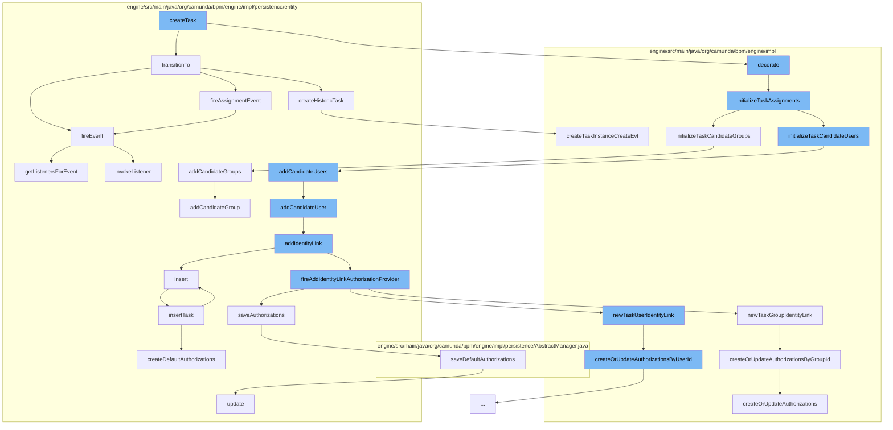

This document will cover the process of task creation and assignment in the Camunda BPMN engine, which includes:

1. Creating a new task
2. Initializing task assignments
3. Adding candidate users and groups
4. Transitioning the task to a new state.



<SwmSnippet path="/engine/src/main/java/org/camunda/bpm/engine/impl/cmmn/execution/CmmnExecution.java" line="1">

---

# Creating a new task

The `createTask` function is the entry point for task creation. It calls the `transitionTo` and `decorate` functions to set the initial state of the task and decorate it with additional properties.

```java
/*
 * Copyright Camunda Services GmbH and/or licensed to Camunda Services GmbH
 * under one or more contributor license agreements. See the NOTICE file
 * distributed with this work for additional information regarding copyright
 * ownership. Camunda licenses this file to you under the Apache License,
 * Version 2.0; you may not use this file except in compliance with the License.
 * You may obtain a copy of the License at
 *
 *     http://www.apache.org/licenses/LICENSE-2.0
 *
```

---

</SwmSnippet>

<SwmSnippet path="/engine/src/main/java/org/camunda/bpm/engine/impl/task/TaskDecorator.java" line="145">

---

# Initializing task assignments

The `initializeTaskAssignments` function is responsible for setting the assignee, candidate users, and candidate groups for the task.

```java
  protected void initializeTaskAssignments(TaskEntity task, VariableScope variableScope) {
    // assignee
    initializeTaskAssignee(task, variableScope);
    // candidateUsers
    initializeTaskCandidateUsers(task, variableScope);
    // candidateGroups
    initializeTaskCandidateGroups(task, variableScope);
  }
```

---

</SwmSnippet>

<SwmSnippet path="/engine/src/main/java/org/camunda/bpm/engine/impl/persistence/entity/TaskEntity.java" line="794">

---

# Adding candidate users and groups

The `addCandidateUsers` and `addCandidateGroups` functions are used to add candidate users and groups to the task. These candidates are potential assignees for the task.

```java
  @Override
  public void addCandidateUsers(Collection<String> candidateUsers) {
    for (String candidateUser : candidateUsers) {
      addCandidateUser(candidateUser);
    }
  }
```

---

</SwmSnippet>

<SwmSnippet path="/engine/src/main/java/org/camunda/bpm/engine/impl/persistence/entity/TaskEntity.java" line="1178">

---

# Transitioning the task to a new state

The `transitionTo` function is used to transition the task to a new state. Depending on the new state, different events are fired and different actions are taken.

```java
  public boolean transitionTo(TaskState state) {
    this.lifecycleState = state;
    this.taskState = this.lifecycleState.taskState;

    switch (state) {
    case STATE_CREATED:
      CommandContext commandContext = Context.getCommandContext();
      if (commandContext != null) {
        commandContext.getHistoricTaskInstanceManager().createHistoricTask(this);
      }
      return fireEvent(TaskListener.EVENTNAME_CREATE) && fireAssignmentEvent();

    case STATE_COMPLETED:
      return fireEvent(TaskListener.EVENTNAME_COMPLETE) && TaskState.STATE_COMPLETED.equals(this.lifecycleState);

    case STATE_DELETED:
      return fireEvent(EVENTNAME_DELETE);

    case STATE_INIT:
    default:
      throw new ProcessEngineException(String.format("Task %s cannot transition into state %s.", id, state));
```

---

</SwmSnippet>

&nbsp;

*This is an auto-generated document by Swimm AI 🌊 and has not yet been verified by a human*

<SwmMeta version="3.0.0" repo-id="Z2l0aHViJTNBJTNBQ2l0aS1jYW11bmRhJTNBJTNBZ2lsYWRuYXZvdA==" repo-name="Citi-camunda" doc-type="flows"><sup>Powered by [Swimm](/)</sup></SwmMeta>
