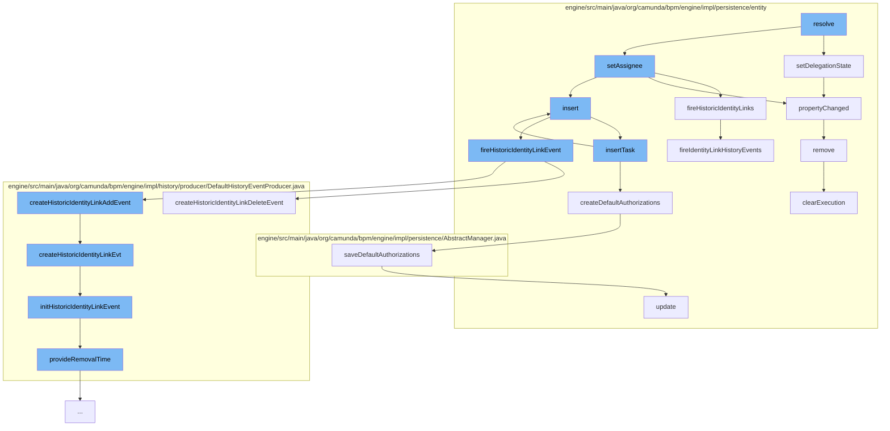

This document will cover the process of task delegation and authorization in Camunda BPM engine. We'll cover:

1. Setting the delegation state
2. Firing historic identity links
3. Inserting a task
4. Creating default authorizations
5. Firing historic identity link event
6. Updating authorizations
7. Removing an execution



<SwmSnippet path="/engine/src/main/java/org/camunda/bpm/engine/impl/persistence/entity/TaskEntity.java" line="1545">

---

# Setting the delegation state

The `setDelegationState` function is used to set the delegation state of a task. It calls the `propertyChanged` function to track the change in delegation state.

```java
  @Override
  public void setDelegationState(DelegationState delegationState) {
    propertyChanged(DELEGATION, this.delegationState, delegationState);
    this.delegationState = delegationState;
  }
```

---

</SwmSnippet>

<SwmSnippet path="/engine/src/main/java/org/camunda/bpm/engine/impl/persistence/entity/TaskEntity.java" line="1658">

---

# Firing historic identity links

The `fireHistoricIdentityLinks` function is used to fire historic identity link events. It iterates over the identity link changes and fires the appropriate history events.

```java
  public void fireHistoricIdentityLinks() {
    for (PropertyChange propertyChange : identityLinkChanges) {
      String oldValue = propertyChange.getOrgValueString();
      String propertyName = propertyChange.getPropertyName();
      if (oldValue != null) {
        fireIdentityLinkHistoryEvents(oldValue, null, propertyName, HistoryEventTypes.IDENTITY_LINK_DELETE);
      }
      String newValue = propertyChange.getNewValueString();
      if (newValue != null) {
        fireIdentityLinkHistoryEvents(newValue, null, propertyName, HistoryEventTypes.IDENTITY_LINK_ADD);
      }
    }
    identityLinkChanges.clear();
  }
```

---

</SwmSnippet>

<SwmSnippet path="/engine/src/main/java/org/camunda/bpm/engine/impl/persistence/entity/TaskManager.java" line="41">

---

# Inserting a task

The `insertTask` function is used to insert a new task into the database. It also calls the `createDefaultAuthorizations` function to create default authorizations for the task.

```java
  public void insertTask(TaskEntity task) {
    getDbEntityManager().insert(task);
    createDefaultAuthorizations(task);
  }
```

---

</SwmSnippet>

<SwmSnippet path="/engine/src/main/java/org/camunda/bpm/engine/impl/persistence/entity/TaskManager.java" line="199">

---

# Creating default authorizations

The `createDefaultAuthorizations` function is used to create default authorizations for a task. It checks if authorization is enabled and then creates the authorizations.

```java
  // helper ///////////////////////////////////////////////////////////

  protected void createDefaultAuthorizations(TaskEntity task) {
    if(isAuthorizationEnabled()) {
      ResourceAuthorizationProvider provider = getResourceAuthorizationProvider();
      AuthorizationEntity[] authorizations = provider.newTask(task);
      saveDefaultAuthorizations(authorizations);
    }
  }
```

---

</SwmSnippet>

<SwmSnippet path="/engine/src/main/java/org/camunda/bpm/engine/impl/persistence/entity/IdentityLinkEntity.java" line="204">

---

# Firing historic identity link event

The `fireHistoricIdentityLinkEvent` function is used to fire a historic identity link event. It checks if the history level allows for the event to be produced and then creates the appropriate history event.

```java
  public void fireHistoricIdentityLinkEvent(final HistoryEventType eventType) {
    ProcessEngineConfigurationImpl processEngineConfiguration = Context.getProcessEngineConfiguration();

    HistoryLevel historyLevel = processEngineConfiguration.getHistoryLevel();
    if(historyLevel.isHistoryEventProduced(eventType, this)) {

      HistoryEventProcessor.processHistoryEvents(new HistoryEventProcessor.HistoryEventCreator() {
        @Override
        public HistoryEvent createHistoryEvent(HistoryEventProducer producer) {
          HistoryEvent event = null;
          if (HistoryEvent.IDENTITY_LINK_ADD.equals(eventType.getEventName())) {
            event = producer.createHistoricIdentityLinkAddEvent(IdentityLinkEntity.this);
          } else if (HistoryEvent.IDENTITY_LINK_DELETE.equals(eventType.getEventName())) {
            event = producer.createHistoricIdentityLinkDeleteEvent(IdentityLinkEntity.this);
          }
          return event;
        }
      });

    }
  }
```

---

</SwmSnippet>

<SwmSnippet path="/engine/src/main/java/org/camunda/bpm/engine/impl/persistence/entity/AuthorizationManager.java" line="181">

---

# Updating authorizations

The `update` function is used to update an authorization. It checks if the user has the necessary permissions to update the authorization and then updates it in the database.

```java
  public void update(AuthorizationEntity authorization) {
    checkAuthorization(UPDATE, AUTHORIZATION, authorization.getId());
    getDbEntityManager().merge(authorization);
  }
```

---

</SwmSnippet>

<SwmSnippet path="/engine/src/main/java/org/camunda/bpm/engine/impl/persistence/entity/ExecutionEntity.java" line="1019">

---

# Removing an execution

The `remove` function is used to remove an execution. It removes all tasks, variable instances, jobs, and incidents related to the execution and then deletes the execution from the database.

```java
  // customized persistence behavior /////////////////////////////////////////

  @Override
  public void remove() {
    super.remove();

    // removes jobs, incidents and tasks, and
    // clears the variable store
    clearExecution();

    // remove all event subscriptions for this scope, if the scope has event
    // subscriptions:
    removeEventSubscriptions();

    // finally delete this execution
    Context.getCommandContext().getExecutionManager().deleteExecution(this);
  }
```

---

</SwmSnippet>

&nbsp;

*This is an auto-generated document by Swimm AI 🌊 and has not yet been verified by a human*

<SwmMeta version="3.0.0" repo-id="Z2l0aHViJTNBJTNBQ2l0aS1jYW11bmRhJTNBJTNBZ2lsYWRuYXZvdA==" repo-name="Citi-camunda" doc-type="flows"><sup>Powered by [Swimm](/)</sup></SwmMeta>
