This document will cover the process of task delegation in the Camunda BPMN engine. The process includes:

1. Executing the delegate task command
2. Updating the task entity
3. Assigning the task
4. Inserting the task
5. Creating default authorizations
6. Updating the authorization
7. Firing assignment event

```mermaid
graph TD;
subgraph engine/src/main/java/org/camunda/bpm/engine/impl/persistence/entity
  execute:::mainFlowStyle --> triggerUpdateEvent
end
subgraph engine/src/main/java/org/camunda/bpm/engine/impl/persistence/entity
  execute:::mainFlowStyle --> delegate
end
subgraph engine/src/main/java/org/camunda/bpm/engine/impl/persistence/entity
  triggerUpdateEvent --> fireAssignmentEvent
end
subgraph engine/src/main/java/org/camunda/bpm/engine/impl/persistence/entity
  triggerUpdateEvent --> fireEvent
end
subgraph engine/src/main/java/org/camunda/bpm/engine/impl/persistence/entity
  fireAssignmentEvent --> fireEvent
end
subgraph engine/src/main/java/org/camunda/bpm/engine/impl/persistence/entity
  fireEvent --> getListenersForEvent
end
subgraph engine/src/main/java/org/camunda/bpm/engine/impl/persistence/entity
  fireEvent --> invokeListener
end
subgraph engine/src/main/java/org/camunda/bpm/engine/impl/persistence/entity
  delegate:::mainFlowStyle --> setOwner
end
subgraph engine/src/main/java/org/camunda/bpm/engine/impl/persistence/entity
  delegate:::mainFlowStyle --> setDelegationState
end
subgraph engine/src/main/java/org/camunda/bpm/engine/impl/persistence/entity
  delegate:::mainFlowStyle --> setAssignee
end
subgraph engine/src/main/java/org/camunda/bpm/engine/impl/persistence/entity
  setOwner --> fireHistoricIdentityLinks
end
subgraph engine/src/main/java/org/camunda/bpm/engine/impl/persistence/entity
  setOwner --> propertyChanged
end
subgraph engine/src/main/java/org/camunda/bpm/engine/impl/persistence/entity
  fireHistoricIdentityLinks --> fireIdentityLinkHistoryEvents
end
subgraph engine/src/main/java/org/camunda/bpm/engine/impl/persistence/entity
  propertyChanged --> remove
end
subgraph engine/src/main/java/org/camunda/bpm/engine/impl/persistence/entity
  setDelegationState --> propertyChanged
end
subgraph engine/src/main/java/org/camunda/bpm/engine/impl/persistence/entity
  setAssignee:::mainFlowStyle --> fireHistoricIdentityLinks
end
subgraph engine/src/main/java/org/camunda/bpm/engine/impl/persistence/entity
  setAssignee:::mainFlowStyle --> propertyChanged
end
subgraph engine/src/main/java/org/camunda/bpm/engine/impl/persistence/entity
  setAssignee:::mainFlowStyle --> insert
end
subgraph engine/src/main/java/org/camunda/bpm/engine/impl/persistence/entity
  remove --> clearExecution
end
subgraph engine/src/main/java/org/camunda/bpm/engine/impl/persistence/entity
  insert:::mainFlowStyle --> insertTask
end
subgraph engine/src/main/java/org/camunda/bpm/engine/impl/persistence/entity
  insertTask:::mainFlowStyle --> createDefaultAuthorizations
end
subgraph engine/src/main/java/org/camunda/bpm/engine/impl/persistence/entity
  insertTask:::mainFlowStyle --> insert
end
subgraph engine/src/main/java/org/camunda/bpm/engine/impl/persistence/AbstractManager.java
  createDefaultAuthorizations --> saveDefaultAuthorizations
end
subgraph engine/src/main/java/org/camunda/bpm/engine/impl/persistence/entity
  saveDefaultAuthorizations --> update
end
subgraph engine/src/main/java/org/camunda/bpm/engine/impl/persistence/entity
  insert:::mainFlowStyle --> fireHistoricIdentityLinkEvent
end
subgraph engine/src/main/java/org/camunda/bpm/engine/impl
  fireHistoricIdentityLinkEvent:::mainFlowStyle --> createHistoricIdentityLinkDeleteEvent
end
subgraph engine/src/main/java/org/camunda/bpm/engine/impl
  fireHistoricIdentityLinkEvent:::mainFlowStyle --> createHistoricIdentityLinkAddEvent
end
subgraph engine/src/main/java/org/camunda/bpm/engine/impl
  createHistoricIdentityLinkAddEvent:::mainFlowStyle --> createHistoricIdentityLinkEvt
end
subgraph engine/src/main/java/org/camunda/bpm/engine/impl
  createHistoricIdentityLinkEvt:::mainFlowStyle --> initHistoricIdentityLinkEvent
end
  initHistoricIdentityLinkEvent:::mainFlowStyle --> ...

 classDef mainFlowStyle color:#000000,fill:#7CB9F4
  classDef rootsStyle color:#000000,fill:#00FFF4
```



<SwmSnippet path="/engine/src/main/java/org/camunda/bpm/engine/impl/cmd/DelegateTaskCmd.java" line="1">

---

# Executing the delegate task command

The `execute` function in `DelegateTaskCmd.java` is the entry point for the task delegation process. It triggers the update event and delegates the task.

```java
/*
 * Copyright Camunda Services GmbH and/or licensed to Camunda Services GmbH
 * under one or more contributor license agreements. See the NOTICE file
 * distributed with this work for additional information regarding copyright
 * ownership. Camunda licenses this file to you under the Apache License,
 * Version 2.0; you may not use this file except in compliance with the License.
 * You may obtain a copy of the License at
 *
 *     http://www.apache.org/licenses/LICENSE-2.0
 *
```

---

</SwmSnippet>

<SwmSnippet path="/engine/src/main/java/org/camunda/bpm/engine/impl/persistence/entity/TaskEntity.java" line="1202">

---

# Updating the task entity

The `triggerUpdateEvent` function in `TaskEntity.java` is responsible for updating the state of the task. If the task is in the created state, it registers a command context close listener, updates the last updated time, sets the task state to updated, and fires an update and assignment event.

```java
  public boolean triggerUpdateEvent() {
    if (lifecycleState == TaskState.STATE_CREATED) {
      registerCommandContextCloseListener();
      setLastUpdated(ClockUtil.getCurrentTime());
      setTaskState(TaskState.STATE_UPDATED.taskState);
      return fireEvent(TaskListener.EVENTNAME_UPDATE) && fireAssignmentEvent();
    }
    else {
      // silently ignore; no events are triggered in the other states
      return true;
    }
  }
```

---

</SwmSnippet>

<SwmSnippet path="/engine/src/main/java/org/camunda/bpm/engine/impl/persistence/entity/TaskEntity.java" line="925">

---

# Assigning the task

The `setOwner` function in `TaskEntity.java` is used to assign the task to a specific owner. It ensures the task is active, registers a command context close listener, and updates the owner of the task. It also fires an authorization provider and historic identity links if the task is contained in the command context's DB entity manager.

```java
  @Override
  public void setOwner(String owner) {
    ensureTaskActive();
    registerCommandContextCloseListener();

    String oldOwner = this.owner;
    if (owner==null && oldOwner==null) {
      return;
    }

    addIdentityLinkChanges(IdentityLinkType.OWNER, oldOwner, owner);
    propertyChanged(OWNER, oldOwner, owner);
    this.owner = owner;

    CommandContext commandContext = Context.getCommandContext();
    // if there is no command context, then it means that the user is calling the
    // setOwner outside a service method.  E.g. while creating a new task.
    if (commandContext != null && commandContext.getDbEntityManager().contains(this)) {
      fireOwnerAuthorizationProvider(oldOwner, owner);
      this.fireHistoricIdentityLinks();
    }
```

---

</SwmSnippet>

<SwmSnippet path="/engine/src/main/java/org/camunda/bpm/engine/impl/persistence/entity/TaskManager.java" line="41">

---

# Inserting the task

The `insertTask` function in `TaskManager.java` is responsible for inserting the task into the database and creating default authorizations for it.

```java
  public void insertTask(TaskEntity task) {
    getDbEntityManager().insert(task);
    createDefaultAuthorizations(task);
  }
```

---

</SwmSnippet>

<SwmSnippet path="/engine/src/main/java/org/camunda/bpm/engine/impl/persistence/entity/TaskManager.java" line="199">

---

# Creating default authorizations

The `createDefaultAuthorizations` function in `TaskManager.java` is used to create default authorizations for the task if authorization is enabled.

```java
  // helper ///////////////////////////////////////////////////////////

  protected void createDefaultAuthorizations(TaskEntity task) {
    if(isAuthorizationEnabled()) {
      ResourceAuthorizationProvider provider = getResourceAuthorizationProvider();
      AuthorizationEntity[] authorizations = provider.newTask(task);
      saveDefaultAuthorizations(authorizations);
    }
  }
```

---

</SwmSnippet>

<SwmSnippet path="/engine/src/main/java/org/camunda/bpm/engine/impl/persistence/entity/AuthorizationManager.java" line="181">

---

# Updating the authorization

The `update` function in `AuthorizationManager.java` is used to update the authorization. It checks if the update operation is authorized before merging the authorization entity with the database.

```java
  public void update(AuthorizationEntity authorization) {
    checkAuthorization(UPDATE, AUTHORIZATION, authorization.getId());
    getDbEntityManager().merge(authorization);
  }
```

---

</SwmSnippet>

<SwmSnippet path="/engine/src/main/java/org/camunda/bpm/engine/impl/persistence/entity/TaskEntity.java" line="1229">

---

# Firing assignment event

The `fireAssignmentEvent` function in `TaskEntity.java` is used to fire an assignment event if the assignee property has changed.

```java
  protected boolean fireAssignmentEvent() {
    PropertyChange assigneePropertyChange = propertyChanges.get(ASSIGNEE);
    if (assigneePropertyChange != null) {
      return fireEvent(TaskListener.EVENTNAME_ASSIGNMENT);
    }

    return true;
  }
```

---

</SwmSnippet>

&nbsp;

*This is an auto-generated document by Swimm AI 🌊 and has not yet been verified by a human*

<SwmMeta version="3.0.0" repo-id="Z2l0aHViJTNBJTNBQ2l0aS1jYW11bmRhJTNBJTNBZ2lsYWRuYXZvdA==" repo-name="Citi-camunda" doc-type="flows"><sup>Powered by [Swimm](/)</sup></SwmMeta>
