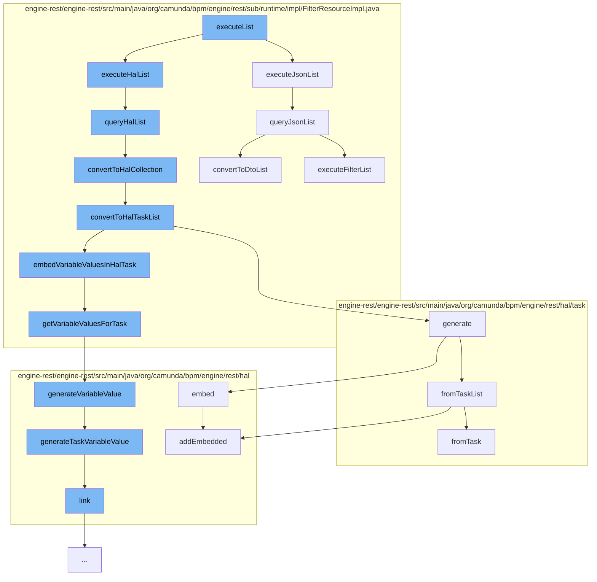

This document will cover the process of executing a list of tasks in the Camunda Platform, which includes:

 1. Executing the JSON list
 2. Executing the HAL list
 3. Querying the HAL list
 4. Converting to HAL collection
 5. Converting to HAL task list
 6. Generating the HAL task list
 7. Embedding variable values in HAL task
 8. Getting variable values for task
 9. Generating variable value
10. Linking the variable value



<SwmSnippet path="/engine-rest/engine-rest/src/main/java/org/camunda/bpm/engine/rest/sub/runtime/impl/FilterResourceImpl.java" line="221">

---

# Executing the JSON list

The `executeJsonList` function is the entry point for executing a list of tasks in JSON format. It calls the `queryJsonList` function to retrieve the tasks.

```java
  public List<Object> executeJsonList(Integer firstResult, Integer maxResults) {
    return queryJsonList(null, firstResult, maxResults);
  }
```

---

</SwmSnippet>

<SwmSnippet path="/engine-rest/engine-rest/src/main/java/org/camunda/bpm/engine/rest/sub/runtime/impl/FilterResourceImpl.java" line="253">

---

# Executing the HAL list

The `queryHalList` function is used to execute a list of tasks in HAL format. It calls the `executeFilterList` function to retrieve the tasks and the `convertToHalCollection` function to convert the tasks to HAL format.

```java
  public HalResource queryHalList(String extendingQuery, Integer firstResult, Integer maxResults) {
    List<?> entities = executeFilterList(extendingQuery, firstResult, maxResults);
    long count = executeFilterCount(extendingQuery);

    if (entities != null && !entities.isEmpty()) {
      return convertToHalCollection(entities, count);
    }
    else {
      return new EmptyHalCollection(count);
    }
  }
```

---

</SwmSnippet>

<SwmSnippet path="/engine-rest/engine-rest/src/main/java/org/camunda/bpm/engine/rest/sub/runtime/impl/FilterResourceImpl.java" line="393">

---

# Converting to HAL collection

The `convertToHalCollection` function is used to convert a list of tasks to a HAL collection. It checks if the tasks are of type `Task` and if so, calls the `convertToHalTaskList` function.

```java
  @SuppressWarnings("unchecked")
  protected HalCollectionResource convertToHalCollection(List<?> entities, long count) {
    if (isEntityOfClass(entities.get(0), Task.class)) {
      return convertToHalTaskList((List<Task>) entities, count);
    } else {
      throw unsupportedEntityClass(entities.get(0));
    }
  }
```

---

</SwmSnippet>

<SwmSnippet path="/engine-rest/engine-rest/src/main/java/org/camunda/bpm/engine/rest/sub/runtime/impl/FilterResourceImpl.java" line="402">

---

# Converting to HAL task list

The `convertToHalTaskList` function is used to convert a list of tasks to a HAL task list. It calls the `generate` function to generate the HAL task list and the `getVariableInstancesForTasks` function to retrieve the variable instances for the tasks.

```java
  @SuppressWarnings("unchecked")
  protected HalTaskList convertToHalTaskList(List<Task> tasks, long count) {
    HalTaskList halTasks = HalTaskList.generate(tasks, count, getProcessEngine());
    Map<String, List<VariableInstance>> variableInstances = getVariableInstancesForTasks(halTasks);
    if (variableInstances != null) {
      for (HalTask halTask : (List<HalTask>) halTasks.getEmbedded("task")) {
        embedVariableValuesInHalTask(halTask, variableInstances);
      }
    }
    return halTasks;
  }
```

---

</SwmSnippet>

<SwmSnippet path="/engine-rest/engine-rest/src/main/java/org/camunda/bpm/engine/rest/hal/task/HalTaskList.java" line="36">

---

# Generating the HAL task list

The `generate` function is used to generate a HAL task list from a list of tasks. It calls the `fromTaskList` function to convert the tasks to HAL format and the `embed` function to embed additional information in the tasks.

```java
  public static HalTaskList generate(List<Task> tasks, long count, ProcessEngine engine) {
    return fromTaskList(tasks, count)
      .embed(HalTask.REL_ASSIGNEE, engine)
      .embed(HalTask.REL_OWNER, engine)
      .embed(HalTask.REL_PROCESS_DEFINITION, engine)
      .embed(HalTask.REL_CASE_DEFINITION, engine);
  }
```

---

</SwmSnippet>

<SwmSnippet path="/engine-rest/engine-rest/src/main/java/org/camunda/bpm/engine/rest/sub/runtime/impl/FilterResourceImpl.java" line="431">

---

# Embedding variable values in HAL task

The `getVariableValuesForTask` function is used to retrieve the variable values for a task. It calls the `generateVariableValue` function to generate the variable value in HAL format.

```java
  protected List<HalResource<?>> getVariableValuesForTask(HalTask halTask, Map<String, List<VariableInstance>> variableInstances) {
    // converted variables values
    List<HalResource<?>> variableValues = new ArrayList<>();

    // variable scope ids to check, ordered by visibility
    LinkedHashSet<String> variableScopeIds = getVariableScopeIds(halTask);

    // names of already converted variables
    Set<String> knownVariableNames = new HashSet<>();

    for (String variableScopeId : variableScopeIds) {
      if (variableInstances.containsKey(variableScopeId)) {
        for (VariableInstance variableInstance : variableInstances.get(variableScopeId)) {
          if (!knownVariableNames.contains(variableInstance.getName())) {
            variableValues.add(HalVariableValue.generateVariableValue(variableInstance, variableScopeId));
            knownVariableNames.add(variableInstance.getName());
          }
        }
      }
    }

```

---

</SwmSnippet>

<SwmSnippet path="/engine-rest/engine-rest/src/main/java/org/camunda/bpm/engine/rest/hal/HalVariableValue.java" line="41">

---

# Generating variable value

The `generateVariableValue` function is used to generate a variable value in HAL format. It checks the scope of the variable and calls the appropriate function to generate the variable value.

```java
  public static HalVariableValue generateVariableValue(VariableInstance variableInstance, String variableScopeId) {
    if (variableScopeId.equals(variableInstance.getTaskId())) {
      return generateTaskVariableValue(variableInstance, variableScopeId);
    }
    else if (variableScopeId.equals(variableInstance.getProcessInstanceId())) {
      return generateProcessInstanceVariableValue(variableInstance, variableScopeId);
    }
    else if (variableScopeId.equals(variableInstance.getExecutionId())) {
      return generateExecutionVariableValue(variableInstance, variableScopeId);
    }
    else if (variableScopeId.equals(variableInstance.getCaseInstanceId())) {
      return generateCaseInstanceVariableValue(variableInstance, variableScopeId);
    }
    else if (variableScopeId.equals(variableInstance.getCaseExecutionId())) {
      return generateCaseExecutionVariableValue(variableInstance, variableScopeId);
    }
    else {
      throw new RestException("Variable scope id '" + variableScopeId + "' does not match with variable instance '" + variableInstance + "'");
    }
  }
```

---

</SwmSnippet>

&nbsp;

*This is an auto-generated document by Swimm AI 🌊 and has not yet been verified by a human*

<SwmMeta version="3.0.0" repo-id="Z2l0aHViJTNBJTNBQ2l0aS1jYW11bmRhJTNBJTNBZ2lsYWRuYXZvdA==" repo-name="Citi-camunda" doc-type="flows"><sup>Powered by [Swimm](/)</sup></SwmMeta>
