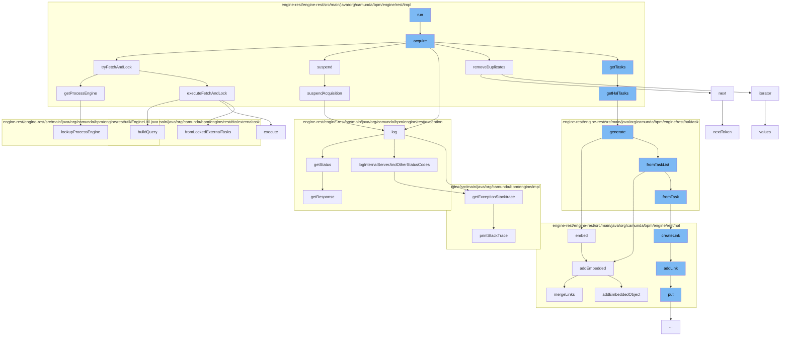

This document will cover the process of task fetching and locking in the Camunda Platform. The process includes:

1. Starting the acquisition of tasks
2. Attempting to fetch and lock tasks
3. Handling successful and unsuccessful fetch and lock attempts
4. Suspending acquisition if necessary
5. Logging exceptions and errors.



<SwmSnippet path="/engine-rest/engine-rest/src/main/java/org/camunda/bpm/engine/rest/impl/FetchAndLockHandlerImpl.java" line="89">

---

# Starting the Acquisition of Tasks

The `acquire` method initiates the process of acquiring tasks. It first drains the queue of new requests. If there are new requests, it checks if they are unique and removes duplicates if necessary. It then adds the new requests to the list of pending requests. The method then enters a loop where it attempts to fetch and lock tasks for each pending request. If the fetch and lock operation is successful and there are locked tasks or the request has expired, the method resumes and removes the request. If there are still pending requests after the loop, the method suspends acquisition for a certain period.

```java
  protected void acquire() {
    LOG.log(Level.FINEST, "Acquire start");

    queue.drainTo(newRequests);

    if (!newRequests.isEmpty()) {
      if (isUniqueWorkerRequest) {
        removeDuplicates();
      }

      pendingRequests.addAll(newRequests);
      newRequests.clear();
    }

    LOG.log(Level.FINEST, "Number of pending requests {0}", pendingRequests.size());

    long backoffTime = MAX_BACK_OFF_TIME; //timestamp

    Iterator<FetchAndLockRequest> iterator = pendingRequests.iterator();
    while (iterator.hasNext()) {

```

---

</SwmSnippet>

<SwmSnippet path="/engine-rest/engine-rest/src/main/java/org/camunda/bpm/engine/rest/impl/FetchAndLockHandlerImpl.java" line="236">

---

# Attempting to Fetch and Lock Tasks

The `tryFetchAndLock` method attempts to fetch and lock tasks for a given request. It first retrieves the process engine and sets the authentication for the identity service. It then executes the fetch and lock operation and returns the result. If an exception occurs during this process, it is caught and a failed result is returned.

```java
  protected FetchAndLockResult tryFetchAndLock(FetchAndLockRequest request) {

    ProcessEngine processEngine = null;
    IdentityService identityService = null;
    FetchAndLockResult result = null;

    try {
      processEngine = getProcessEngine(request);

      identityService = processEngine.getIdentityService();
      identityService.setAuthentication(request.getAuthentication());

      FetchExternalTasksExtendedDto fetchingDto = request.getDto();
      List<LockedExternalTaskDto> lockedTasks = executeFetchAndLock(fetchingDto, processEngine);
      result = FetchAndLockResult.successful(lockedTasks);
    }
    catch (Exception e) {
      result = FetchAndLockResult.failed(e);
    }
    finally {
      if (identityService != null) {
```

---

</SwmSnippet>

<SwmSnippet path="/engine-rest/engine-rest/src/main/java/org/camunda/bpm/engine/rest/impl/FetchAndLockHandlerImpl.java" line="118">

---

# Handling Successful and Unsuccessful Fetch and Lock Attempts

If the fetch and lock operation was successful, the method checks if there are locked tasks or if the request has expired. If either condition is met, the method resumes and removes the request. If the operation was not successful, the method resumes with the exception that caused the failure and removes the request.

```java
      if (result.wasSuccessful()) {

        List<LockedExternalTaskDto> lockedTasks = result.getTasks();

        if (!lockedTasks.isEmpty() || isExpired(pendingRequest)) {
          AsyncResponse asyncResponse = pendingRequest.getAsyncResponse();
          asyncResponse.resume(lockedTasks);

          LOG.log(Level.FINEST, "resume and remove request with {0}", lockedTasks);

          iterator.remove();
        }
        else {
          final long msUntilTimeout = pendingRequest.getTimeoutTimestamp() - ClockUtil.getCurrentTime().getTime();
          backoffTime = Math.min(backoffTime, msUntilTimeout);
        }
      }
      else {
        AsyncResponse asyncResponse = pendingRequest.getAsyncResponse();
        Throwable processEngineException = result.getThrowable();
        asyncResponse.resume(processEngineException);
```

---

</SwmSnippet>

<SwmSnippet path="/engine-rest/engine-rest/src/main/java/org/camunda/bpm/engine/rest/impl/FetchAndLockHandlerImpl.java" line="212">

---

# Suspending Acquisition if Necessary

The `suspendAcquisition` method suspends the acquisition of tasks for a certain period if the queue is empty and the handler is still running. If the handler thread is interrupted during this process, the method re-interrupts the current thread.

```java
  protected void suspendAcquisition(long millis) {
    try {
      if (queue.isEmpty() && isRunning) {
        LOG.log(Level.FINEST, "Suspend acquisition for {0}ms", millis);
        condition.await(millis);
        LOG.log(Level.FINEST, "Acquisition woke up");
      }
    }
    finally {
      if (handlerThread.isInterrupted()) {
        Thread.currentThread().interrupt();
      }
    }
  }
```

---

</SwmSnippet>

<SwmSnippet path="/engine-rest/engine-rest/src/main/java/org/camunda/bpm/engine/rest/exception/ExceptionLogger.java" line="38">

---

# Logging Exceptions and Errors

The `log` method logs exceptions and errors. It first retrieves the status of the exception. If the status code is less than 500, it logs the exception stack trace at the debug level. Otherwise, it logs the exception stack trace at the error level.

```java
  public void log(Throwable throwable) {
    Response.Status status = ExceptionHandlerHelper.getInstance().getStatus(throwable);
    int statusCode = status.getStatusCode();

    if (statusCode < 500) {
      logDebug(String.valueOf(statusCode), getExceptionStacktrace(throwable));
      return;
    }

    logInternalServerAndOtherStatusCodes(throwable, statusCode);
  }
```

---

</SwmSnippet>

&nbsp;

*This is an auto-generated document by Swimm AI 🌊 and has not yet been verified by a human*

<SwmMeta version="3.0.0" repo-id="Z2l0aHViJTNBJTNBQ2l0aS1jYW11bmRhJTNBJTNBZ2lsYWRuYXZvdA==" repo-name="Citi-camunda" doc-type="flows"><sup>Powered by [Swimm](/)</sup></SwmMeta>
