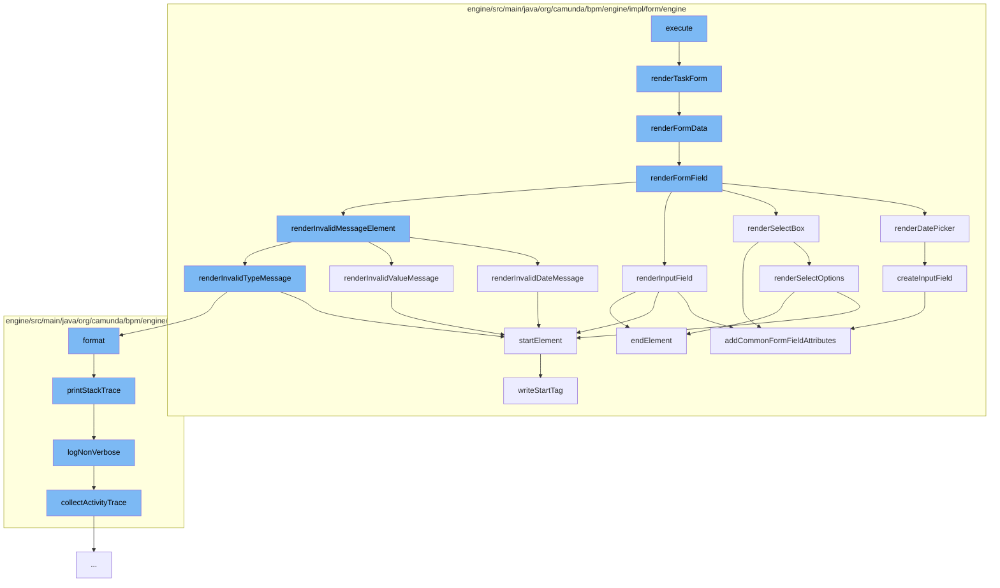

This document will cover the process of rendering a task form in the Camunda BPMN engine. The process includes the following steps:

1. Executing the main command
2. Rendering the task form
3. Rendering form data
4. Rendering form fields
5. Rendering specific form field types
6. Handling invalid form field inputs
7. Logging errors and stack traces.



<SwmSnippet path="/engine/src/main/java/org/camunda/bpm/engine/impl/cmd/GetRenderedTaskFormCmd.java" line="1">

---

# Executing the main command

The process starts with the execution of the `GetRenderedTaskFormCmd` command. This command is responsible for initiating the task form rendering process.

```java
/*
```

---

</SwmSnippet>

<SwmSnippet path="/engine/src/main/java/org/camunda/bpm/engine/impl/form/engine/HtmlFormEngine.java" line="147">

---

# Rendering the task form

`renderTaskForm` method is called to render the task form. It delegates the task to `renderFormData` method.

```java
  public Object renderTaskForm(TaskFormData taskForm) {
    return renderFormData(taskForm);
  }
```

---

</SwmSnippet>

<SwmSnippet path="/engine/src/main/java/org/camunda/bpm/engine/impl/form/engine/HtmlFormEngine.java" line="151">

---

# Rendering form data

`renderFormData` method is responsible for rendering the form data. It checks if the form data is valid and then iterates over the form fields and properties to render them.

```java
  protected String renderFormData(FormData formData) {

    if(formData == null
        || (formData.getFormFields() == null || formData.getFormFields().isEmpty())
        && (formData.getFormProperties() == null || formData.getFormProperties().isEmpty())) {
      return null;

    } else {
      HtmlElementWriter formElement = new HtmlElementWriter(FORM_ELEMENT)
          .attribute(NAME_ATTRIBUTE, GENERATED_FORM_NAME)
          .attribute(ROLE_ATTRIBUTE, FORM_ROLE);

      HtmlDocumentBuilder documentBuilder = new HtmlDocumentBuilder(formElement);

      // render fields
      for (FormField formField : formData.getFormFields()) {
        renderFormField(formField, documentBuilder);
      }

      // render deprecated form properties
      for (FormProperty formProperty : formData.getFormProperties()) {
```

---

</SwmSnippet>

<SwmSnippet path="/engine/src/main/java/org/camunda/bpm/engine/impl/form/engine/HtmlFormEngine.java" line="183">

---

# Rendering form fields

`renderFormField` method is called for each form field. It determines the type of the form field and calls the appropriate method to render it. It also handles the rendering of invalid message elements.

```java
  protected void renderFormField(FormField formField, HtmlDocumentBuilder documentBuilder) {
    // start group
    HtmlElementWriter divElement = new HtmlElementWriter(DIV_ELEMENT)
        .attribute(CLASS_ATTRIBUTE, FORM_GROUP_CLASS);

    documentBuilder.startElement(divElement);

    String formFieldId = formField.getId();
    String formFieldLabel = formField.getLabel();

    // write label
    if (formFieldLabel != null && !formFieldLabel.isEmpty()) {

      HtmlElementWriter labelElement = new HtmlElementWriter(LABEL_ELEMENT)
          .attribute(FOR_ATTRIBUTE, formFieldId)
          .textContent(formFieldLabel);

      // <label for="...">...</label>
      documentBuilder.startElement(labelElement).endElement();
    }

```

---

</SwmSnippet>

<SwmSnippet path="/engine/src/main/java/org/camunda/bpm/engine/impl/form/engine/HtmlFormEngine.java" line="235">

---

# Rendering specific form field types

Methods like `renderDatePicker`, `renderSelectBox`, `renderInputField` are used to render specific types of form fields. They create the necessary HTML elements and add the required attributes.

```java
  protected void renderDatePicker(FormField formField, HtmlDocumentBuilder documentBuilder) {
    boolean isReadOnly = isReadOnly(formField);

    // start input-group
    HtmlElementWriter inputGroupDivElement = new HtmlElementWriter(DIV_ELEMENT)
        .attribute(CLASS_ATTRIBUTE, INPUT_GROUP_CLASS);

    String formFieldId = formField.getId();

    // <div>
    documentBuilder.startElement(inputGroupDivElement);

    // input field
    HtmlElementWriter inputField = createInputField(formField);

    String dateFormat = (String) formField.getType().getInformation(DATE_PATTERN_ATTRIBUTE);
    if(!isReadOnly) {
      inputField
          .attribute(DATEPICKER_POPUP_ATTRIBUTE, dateFormat)
          .attribute(IS_OPEN_ATTRIBUTE, String.format(DATE_FIELD_OPENED_ATTRIBUTE, formFieldId));
    }
```

---

</SwmSnippet>

<SwmSnippet path="/engine/src/main/java/org/camunda/bpm/engine/impl/form/engine/HtmlFormEngine.java" line="425">

---

# Handling invalid form field inputs

`renderInvalidDateMessage` method is used to render error messages for invalid date inputs. Similar methods exist for other types of invalid inputs.

```java
  protected void renderInvalidDateMessage(FormField formField, HtmlDocumentBuilder documentBuilder) {
    String formFieldId = formField.getId();

    HtmlElementWriter firstDivElement = new HtmlElementWriter(DIV_ELEMENT);

    String firstExpression = String.format(REQUIRED_ERROR_EXPRESSION + " && !" + DATE_ERROR_EXPRESSION, formFieldId, formFieldId);

    firstDivElement
        .attribute(NG_SHOW_ATTRIBUTE, firstExpression)
        .attribute(CLASS_ATTRIBUTE, HELP_BLOCK_CLASS)
        .textContent(REQUIRED_FIELD_MESSAGE);

    documentBuilder
        .startElement(firstDivElement)
        .endElement();

    HtmlElementWriter secondDivElement = new HtmlElementWriter(DIV_ELEMENT);

    String secondExpression = String.format(DATE_ERROR_EXPRESSION, formFieldId);

    secondDivElement
```

---

</SwmSnippet>

<SwmSnippet path="/engine/src/main/java/org/camunda/bpm/engine/impl/interceptor/BpmnStackTrace.java" line="39">

---

# Logging errors and stack traces

`printStackTrace` method is used to log errors and stack traces. It provides a verbose and non-verbose mode for logging.

```java
  public void printStackTrace(boolean verbose) {
    if(perfromedInvocations.isEmpty()) {
      return;
    }

    StringWriter writer = new StringWriter();
    writer.write("BPMN Stack Trace:\n");

    if(!verbose) {
      logNonVerbose(writer);
    }
    else {
      logVerbose(writer);
    }

    LOG.bpmnStackTrace(writer.toString());

    perfromedInvocations.clear();
  }
```

---

</SwmSnippet>

&nbsp;

*This is an auto-generated document by Swimm AI 🌊 and has not yet been verified by a human*

<SwmMeta version="3.0.0" repo-id="Z2l0aHViJTNBJTNBQ2l0aS1jYW11bmRhJTNBJTNBZ2lsYWRuYXZvdA==" repo-name="Citi-camunda" doc-type="flows"><sup>Powered by [Swimm](/)</sup></SwmMeta>
