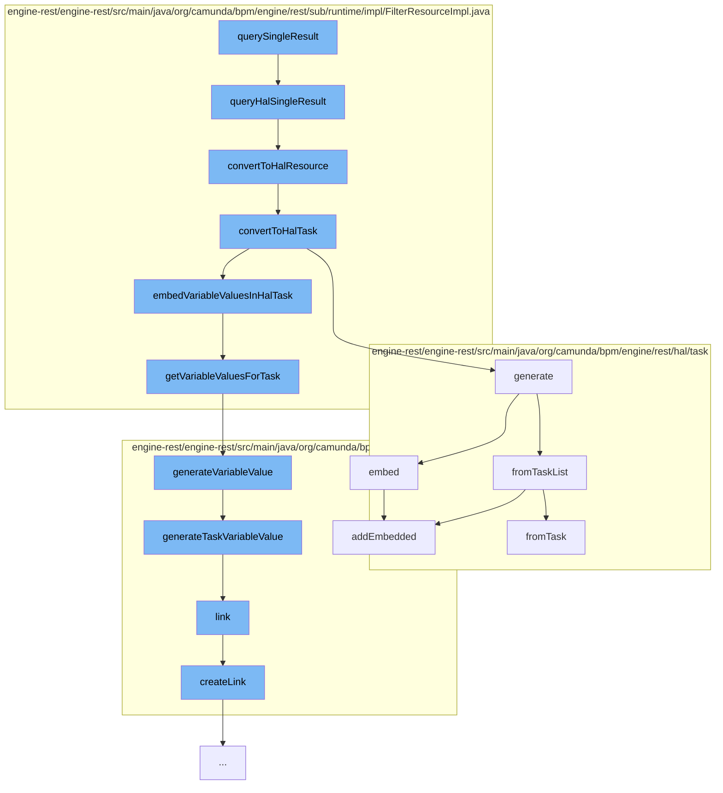

This document will cover the process of querying and handling tasks in the Camunda engine, which includes:

1. Querying a single result
2. Converting the result to a HAL resource
3. Embedding variable values in the HAL task
4. Generating a variable value
5. Linking the variable value
6. Generating a task list from the tasks
7. Embedding the tasks in the HAL resource.



<SwmSnippet path="/engine-rest/engine-rest/src/main/java/org/camunda/bpm/engine/rest/sub/runtime/impl/FilterResourceImpl.java" line="182">

---

# Querying a single result

The function `queryHalSingleResult` is used to execute a filter and get a single result. If the result is not null, it is converted to a HAL resource.

```java
  public HalResource queryHalSingleResult(String extendingQuery) {
    Object entity = executeFilterSingleResult(extendingQuery);

    if (entity != null) {
      return convertToHalResource(entity);
    }
    else {
      return EmptyHalResource.INSTANCE;
    }
  }
```

---

</SwmSnippet>

<SwmSnippet path="/engine-rest/engine-rest/src/main/java/org/camunda/bpm/engine/rest/sub/runtime/impl/FilterResourceImpl.java" line="375">

---

# Converting the result to a HAL resource

The function `convertToHalResource` checks if the entity is of class `Task`. If it is, it is converted to a HAL task.

```java
  protected HalResource<?> convertToHalResource(Object entity) {
    if (isEntityOfClass(entity, Task.class)) {
      return convertToHalTask((Task) entity);
    }
    else {
      throw unsupportedEntityClass(entity);
    }
  }
```

---

</SwmSnippet>

<SwmSnippet path="/engine-rest/engine-rest/src/main/java/org/camunda/bpm/engine/rest/sub/runtime/impl/FilterResourceImpl.java" line="384">

---

# Embedding variable values in the HAL task

The function `convertToHalTask` generates a HAL task from the task entity and gets the variable instances for the task. If there are variable instances, they are embedded in the HAL task.

```java
  protected HalTask convertToHalTask(Task task) {
    HalTask halTask = HalTask.generate(task, getProcessEngine());
    Map<String, List<VariableInstance>> variableInstances = getVariableInstancesForTasks(halTask);
    if (variableInstances != null) {
      embedVariableValuesInHalTask(halTask, variableInstances);
    }
    return halTask;
  }
```

---

</SwmSnippet>

<SwmSnippet path="/engine-rest/engine-rest/src/main/java/org/camunda/bpm/engine/rest/sub/runtime/impl/FilterResourceImpl.java" line="431">

---

# Generating a variable value

The function `getVariableValuesForTask` gets the variable values for a task and generates a HAL variable value for each variable instance.

```java
  protected List<HalResource<?>> getVariableValuesForTask(HalTask halTask, Map<String, List<VariableInstance>> variableInstances) {
    // converted variables values
    List<HalResource<?>> variableValues = new ArrayList<>();

    // variable scope ids to check, ordered by visibility
    LinkedHashSet<String> variableScopeIds = getVariableScopeIds(halTask);

    // names of already converted variables
    Set<String> knownVariableNames = new HashSet<>();

    for (String variableScopeId : variableScopeIds) {
      if (variableInstances.containsKey(variableScopeId)) {
        for (VariableInstance variableInstance : variableInstances.get(variableScopeId)) {
          if (!knownVariableNames.contains(variableInstance.getName())) {
            variableValues.add(HalVariableValue.generateVariableValue(variableInstance, variableScopeId));
            knownVariableNames.add(variableInstance.getName());
          }
        }
      }
    }

```

---

</SwmSnippet>

<SwmSnippet path="/engine-rest/engine-rest/src/main/java/org/camunda/bpm/engine/rest/hal/HalVariableValue.java" line="87">

---

# Linking the variable value

The function `link` creates a link for the variable value in the given relation.

```java
  private HalVariableValue link(HalRelation relation, String resourcePath, String resourceId, String variablesPath) {
    if (resourcePath.startsWith("/")) {
      // trim leading / because otherwise it will be encode as %2F (see CAM-3091)
      resourcePath = resourcePath.substring(1);
    }
    this.linker.createLink(relation, resourcePath, resourceId, variablesPath, this.name);
    return this;
  }
```

---

</SwmSnippet>

<SwmSnippet path="/engine-rest/engine-rest/src/main/java/org/camunda/bpm/engine/rest/hal/task/HalTaskList.java" line="36">

---

# Generating a task list from the tasks

The function `generate` generates a HAL task list from the list of tasks and embeds the tasks in the HAL resource.

```java
  public static HalTaskList generate(List<Task> tasks, long count, ProcessEngine engine) {
    return fromTaskList(tasks, count)
      .embed(HalTask.REL_ASSIGNEE, engine)
      .embed(HalTask.REL_OWNER, engine)
      .embed(HalTask.REL_PROCESS_DEFINITION, engine)
      .embed(HalTask.REL_CASE_DEFINITION, engine);
  }
```

---

</SwmSnippet>

<SwmSnippet path="/engine-rest/engine-rest/src/main/java/org/camunda/bpm/engine/rest/hal/HalResource.java" line="67">

---

# Embedding the tasks in the HAL resource

The function `addEmbedded` adds the tasks to the embedded resources of the HAL resource.

```java
  public void addEmbedded(String name, HalResource<?> embedded) {
    linker.mergeLinks(embedded);
    addEmbeddedObject(name, embedded);
  }
```

---

</SwmSnippet>

&nbsp;

*This is an auto-generated document by Swimm AI 🌊 and has not yet been verified by a human*

<SwmMeta version="3.0.0" repo-id="Z2l0aHViJTNBJTNBQ2l0aS1jYW11bmRhJTNBJTNBZ2lsYWRuYXZvdA==" repo-name="Citi-camunda" doc-type="flows"><sup>Powered by [Swimm](/)</sup></SwmMeta>
