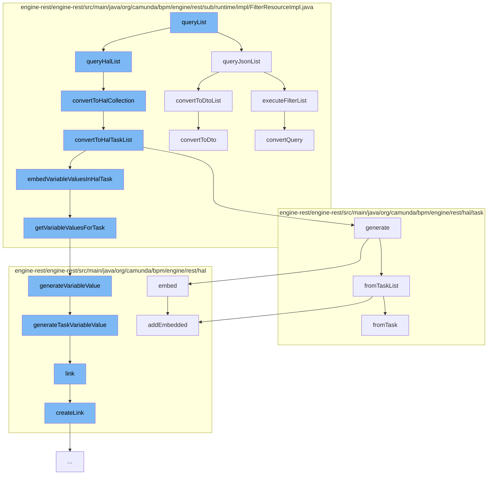

This document will cover the process of querying and processing tasks in the Camunda engine, which includes:

1. Querying tasks using JSON and HAL formats
2. Converting queried tasks to DTO and HAL formats
3. Embedding variable values in HAL tasks
4. Generating variable values for tasks
5. Creating links for HAL variable values



<SwmSnippet path="/engine-rest/engine-rest/src/main/java/org/camunda/bpm/engine/rest/sub/runtime/impl/FilterResourceImpl.java" line="238">

---

# Querying tasks using JSON and HAL formats

The function `queryJsonList` is used to execute a filter list and convert the resulting entities to a DTO list if they are not empty.

```java
  public List<Object> queryJsonList(String extendingQuery, Integer firstResult, Integer maxResults) {
    List<?> entities = executeFilterList(extendingQuery, firstResult, maxResults);

    if (entities != null && !entities.isEmpty()) {
      return convertToDtoList(entities);
    }
    else {
      return Collections.emptyList();
    }
  }
```

---

</SwmSnippet>

<SwmSnippet path="/engine-rest/engine-rest/src/main/java/org/camunda/bpm/engine/rest/sub/runtime/impl/FilterResourceImpl.java" line="393">

---

The function `convertToHalCollection` is used to convert the queried entities to a HAL collection if they are of type `Task`.

```java
  @SuppressWarnings("unchecked")
  protected HalCollectionResource convertToHalCollection(List<?> entities, long count) {
    if (isEntityOfClass(entities.get(0), Task.class)) {
      return convertToHalTaskList((List<Task>) entities, count);
    } else {
      throw unsupportedEntityClass(entities.get(0));
    }
  }
```

---

</SwmSnippet>

<SwmSnippet path="/engine-rest/engine-rest/src/main/java/org/camunda/bpm/engine/rest/sub/runtime/impl/FilterResourceImpl.java" line="402">

---

# Converting queried tasks to DTO and HAL formats

The function `convertToHalTaskList` is used to generate a HAL task list from the queried tasks and embed variable values in each HAL task.

```java
  @SuppressWarnings("unchecked")
  protected HalTaskList convertToHalTaskList(List<Task> tasks, long count) {
    HalTaskList halTasks = HalTaskList.generate(tasks, count, getProcessEngine());
    Map<String, List<VariableInstance>> variableInstances = getVariableInstancesForTasks(halTasks);
    if (variableInstances != null) {
      for (HalTask halTask : (List<HalTask>) halTasks.getEmbedded("task")) {
        embedVariableValuesInHalTask(halTask, variableInstances);
      }
    }
    return halTasks;
  }
```

---

</SwmSnippet>

<SwmSnippet path="/engine-rest/engine-rest/src/main/java/org/camunda/bpm/engine/rest/sub/runtime/impl/FilterResourceImpl.java" line="358">

---

The function `convertToDto` is used to convert an entity to a DTO if it is of type `Task`.

```java
  protected Object convertToDto(Object entity) {
    if (isEntityOfClass(entity, Task.class)) {
      return TaskDto.fromEntity((Task) entity);
    }
    else {
      throw unsupportedEntityClass(entity);
    }
  }
```

---

</SwmSnippet>

<SwmSnippet path="/engine-rest/engine-rest/src/main/java/org/camunda/bpm/engine/rest/sub/runtime/impl/FilterResourceImpl.java" line="431">

---

# Embedding variable values in HAL tasks

The function `getVariableValuesForTask` is used to get the variable values for a HAL task and generate a HAL variable value for each unique variable name.

```java
  protected List<HalResource<?>> getVariableValuesForTask(HalTask halTask, Map<String, List<VariableInstance>> variableInstances) {
    // converted variables values
    List<HalResource<?>> variableValues = new ArrayList<>();

    // variable scope ids to check, ordered by visibility
    LinkedHashSet<String> variableScopeIds = getVariableScopeIds(halTask);

    // names of already converted variables
    Set<String> knownVariableNames = new HashSet<>();

    for (String variableScopeId : variableScopeIds) {
      if (variableInstances.containsKey(variableScopeId)) {
        for (VariableInstance variableInstance : variableInstances.get(variableScopeId)) {
          if (!knownVariableNames.contains(variableInstance.getName())) {
            variableValues.add(HalVariableValue.generateVariableValue(variableInstance, variableScopeId));
            knownVariableNames.add(variableInstance.getName());
          }
        }
      }
    }

```

---

</SwmSnippet>

<SwmSnippet path="/engine-rest/engine-rest/src/main/java/org/camunda/bpm/engine/rest/hal/HalVariableValue.java" line="41">

---

# Generating variable values for tasks

The function `generateVariableValue` is used to generate a HAL variable value based on the scope of the variable instance.

```java
  public static HalVariableValue generateVariableValue(VariableInstance variableInstance, String variableScopeId) {
    if (variableScopeId.equals(variableInstance.getTaskId())) {
      return generateTaskVariableValue(variableInstance, variableScopeId);
    }
    else if (variableScopeId.equals(variableInstance.getProcessInstanceId())) {
      return generateProcessInstanceVariableValue(variableInstance, variableScopeId);
    }
    else if (variableScopeId.equals(variableInstance.getExecutionId())) {
      return generateExecutionVariableValue(variableInstance, variableScopeId);
    }
    else if (variableScopeId.equals(variableInstance.getCaseInstanceId())) {
      return generateCaseInstanceVariableValue(variableInstance, variableScopeId);
    }
    else if (variableScopeId.equals(variableInstance.getCaseExecutionId())) {
      return generateCaseExecutionVariableValue(variableInstance, variableScopeId);
    }
    else {
      throw new RestException("Variable scope id '" + variableScopeId + "' does not match with variable instance '" + variableInstance + "'");
    }
  }
```

---

</SwmSnippet>

<SwmSnippet path="/engine-rest/engine-rest/src/main/java/org/camunda/bpm/engine/rest/hal/HalVariableValue.java" line="62">

---

The function `generateTaskVariableValue` is used to generate a HAL variable value for a task variable and link it to the task.

```java
  public static HalVariableValue generateTaskVariableValue(VariableInstance variableInstance, String taskId) {
    return fromVariableInstance(variableInstance)
      .link(REL_SELF, TaskRestService.PATH, taskId, "localVariables");
  }
```

---

</SwmSnippet>

<SwmSnippet path="/engine-rest/engine-rest/src/main/java/org/camunda/bpm/engine/rest/hal/HalVariableValue.java" line="87">

---

# Creating links for HAL variable values

The function `link` is used to create a link for a HAL variable value.

```java
  private HalVariableValue link(HalRelation relation, String resourcePath, String resourceId, String variablesPath) {
    if (resourcePath.startsWith("/")) {
      // trim leading / because otherwise it will be encode as %2F (see CAM-3091)
      resourcePath = resourcePath.substring(1);
    }
    this.linker.createLink(relation, resourcePath, resourceId, variablesPath, this.name);
    return this;
  }
```

---

</SwmSnippet>

<SwmSnippet path="/engine-rest/engine-rest/src/main/java/org/camunda/bpm/engine/rest/hal/HalLinker.java" line="49">

---

The function `createLink` is used to create a link in a given relation and add it to the linked resources.

```java
  /**
   * Creates a link in a given relation.
   *
   * @param rel the {@link HalRelation} for which a link should be constructed
   * @param pathParams the path params to populate the url template with.
   * */
  public void createLink(HalRelation rel, String... pathParams) {
    if(pathParams != null && pathParams.length > 0 && pathParams[0] != null) {
      Set<String> linkedResourceIds = linkedResources.get(rel);
      if(linkedResourceIds == null) {
        linkedResourceIds = new HashSet<String>();
        linkedResources.put(rel, linkedResourceIds);
      }

      // Hmm... use the last id in the pathParams as linked resource id
      linkedResourceIds.add(pathParams[pathParams.length - 1]);

      resource.addLink(rel.relName, rel.uriTemplate.build((Object[])pathParams));
    }
  }
```

---

</SwmSnippet>

&nbsp;

*This is an auto-generated document by Swimm AI 🌊 and has not yet been verified by a human*

<SwmMeta version="3.0.0" repo-id="Z2l0aHViJTNBJTNBQ2l0aS1jYW11bmRhJTNBJTNBZ2lsYWRuYXZvdA==" repo-name="Citi-camunda" doc-type="flows"><sup>Powered by [Swimm](/)</sup></SwmMeta>
