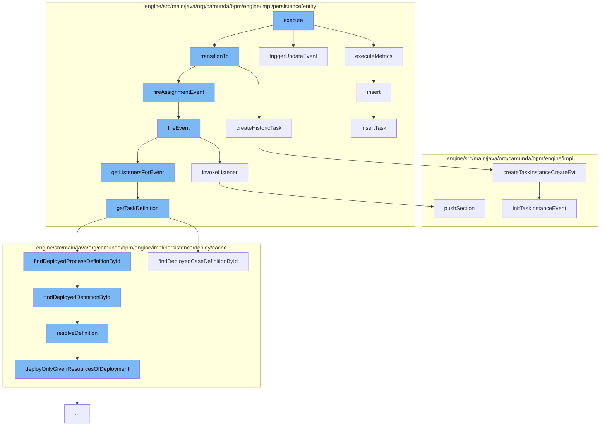

This document will cover the process of saving a task in the Camunda Platform, which includes:

1. Executing metrics and triggering update events
2. Transitioning to a new task state
3. Firing assignment events and invoking listeners
4. Fetching task definitions and resolving definitions
5. Creating historic task instances
6. Inserting the task into the task manager.



<SwmSnippet path="/engine/src/main/java/org/camunda/bpm/engine/impl/persistence/entity/TaskEntity.java" line="1714">

---

# Executing metrics and triggering update events

The `executeMetrics` function is used to execute specific metrics based on the metrics name and the process engine configuration. It also handles the case when the assignee has changed and is not null, marking a new task worker.

```java
  public void executeMetrics(String metricsName, CommandContext commandContext) {
    ProcessEngineConfigurationImpl processEngineConfiguration = Context.getProcessEngineConfiguration();
    if (Metrics.ACTIVTY_INSTANCE_START.equals(metricsName) && processEngineConfiguration.isMetricsEnabled()) {
      processEngineConfiguration.getMetricsRegistry().markOccurrence(Metrics.ACTIVTY_INSTANCE_START);
    }
    if (Metrics.UNIQUE_TASK_WORKERS.equals(metricsName) && processEngineConfiguration.isTaskMetricsEnabled() &&
        assignee != null && propertyChanges.containsKey(ASSIGNEE)) {
      // assignee has changed and is not null, so mark a new task worker
      commandContext.getMeterLogManager().insert(new TaskMeterLogEntity(assignee, ClockUtil.getCurrentTime()));
    }
  }
```

---

</SwmSnippet>

<SwmSnippet path="/engine/src/main/java/org/camunda/bpm/engine/impl/persistence/entity/TaskEntity.java" line="226">

---

# Transitioning to a new task state

The `createHistoricTask` function is used to create a historic task instance. It checks if a history event of type `TASK_INSTANCE_CREATE` is produced for the task and if so, it creates a history event.

```java
    setTenantId(execution.getTenantId());
    execution.addTask(this);
  }

  /**
   * CMMN execution constructor
   */
  public TaskEntity(CaseExecutionEntity caseExecution) {
    this(TaskState.STATE_INIT);
    setCaseExecution(caseExecution);
  }

  public void insert() {
    CommandContext commandContext = Context.getCommandContext();
    TaskManager taskManager = commandContext.getTaskManager();
```

---

</SwmSnippet>

<SwmSnippet path="/engine/src/main/java/org/camunda/bpm/engine/impl/persistence/entity/TaskEntity.java" line="1032">

---

# Firing assignment events and invoking listeners

The `fireEvent` function is used to fire a task event. It fetches the listeners for the event and invokes each listener.

```java
  /**
   * @return true if invoking the listener was successful;
   *   if not successful, either false is returned (case: BPMN error propagation)
   *   or an exception is thrown
   */
  public boolean fireEvent(String taskEventName) {

    List<TaskListener> taskEventListeners = getListenersForEvent(taskEventName);

    if (taskEventListeners != null) {
      for (TaskListener taskListener : taskEventListeners) {
        if (!invokeListener(taskEventName, taskListener)){
          return false;
        }
      }
    }

    return true;
  }
```

---

</SwmSnippet>

<SwmSnippet path="/engine/src/main/java/org/camunda/bpm/engine/impl/persistence/entity/TaskEntity.java" line="1076">

---

The `invokeListener` function is used to invoke a task listener. It handles the case when the execution is null and sets the event name.

```java
  protected boolean invokeListener(String taskEventName, TaskListener taskListener) {
    boolean popProcessDataContext = false;
    CommandInvocationContext commandInvocationContext = Context.getCommandInvocationContext();
    CoreExecution execution = getExecution();
    if (execution == null) {
      execution = getCaseExecution();
    } else {
      if (commandInvocationContext != null) {
        popProcessDataContext = commandInvocationContext.getProcessDataContext().pushSection((ExecutionEntity) execution);
      }
    }
    if (execution != null) {
      setEventName(taskEventName);
    }
    try {
      boolean result = invokeListener(execution, taskEventName, taskListener);
      if (popProcessDataContext) {
        commandInvocationContext.getProcessDataContext().popSection();
      }
      return result;
    } catch (Exception e) {
```

---

</SwmSnippet>

<SwmSnippet path="/engine/src/main/java/org/camunda/bpm/engine/impl/persistence/entity/TaskEntity.java" line="1322">

---

# Fetching task definitions and resolving definitions

The `getTaskDefinition` function is used to fetch the task definition. It checks if the task definition is null and if the task definition key is not null, it fetches the task definitions from the process definition or case definition.

```java
  public TaskDefinition getTaskDefinition() {
    if (taskDefinition==null && taskDefinitionKey!=null) {

      Map<String, TaskDefinition> taskDefinitions = null;
      if (processDefinitionId != null) {
        ProcessDefinitionEntity processDefinition = Context
            .getProcessEngineConfiguration()
            .getDeploymentCache()
            .findDeployedProcessDefinitionById(processDefinitionId);

        taskDefinitions = processDefinition.getTaskDefinitions();

      } else {
        CaseDefinitionEntity caseDefinition = Context
            .getProcessEngineConfiguration()
            .getDeploymentCache()
            .findDeployedCaseDefinitionById(caseDefinitionId);

        taskDefinitions = caseDefinition.getTaskDefinitions();
      }

```

---

</SwmSnippet>

<SwmSnippet path="/engine/src/main/java/org/camunda/bpm/engine/impl/persistence/deploy/cache/ResourceDefinitionCache.java" line="111">

---

The `resolveDefinition` function is used to resolve a definition. It checks if the definition is cached and if not, it deploys the resources of the deployment.

```java
  public T resolveDefinition(T definition) {
    String definitionId = definition.getId();
    String deploymentId = definition.getDeploymentId();
    T cachedDefinition = cache.get(definitionId);
    if (cachedDefinition == null) {
      synchronized (this) {
        cachedDefinition = cache.get(definitionId);
        if (cachedDefinition == null) {
          DeploymentEntity deployment = Context
              .getCommandContext()
              .getDeploymentManager()
              .findDeploymentById(deploymentId);
          deployment.setNew(false);
          cacheDeployer.deployOnlyGivenResourcesOfDeployment(deployment, definition.getResourceName(), definition.getDiagramResourceName());
          cachedDefinition = cache.get(definitionId);
        }
      }
      checkInvalidDefinitionWasCached(deploymentId, definitionId, cachedDefinition);
    }
    if (cachedDefinition != null) {
      cachedDefinition.updateModifiableFieldsFromEntity(definition);
```

---

</SwmSnippet>

<SwmSnippet path="/engine/src/main/java/org/camunda/bpm/engine/impl/history/producer/DefaultHistoryEventProducer.java" line="765">

---

# Creating historic task instances

The `createTaskInstanceCreateEvt` function is used to create a task instance create event. It initializes a new task instance event and sets the start time.

```java
  public HistoryEvent createTaskInstanceCreateEvt(DelegateTask task) {

    // create event instance
    HistoricTaskInstanceEventEntity evt = newTaskInstanceEventEntity(task);

    // initialize event
    initTaskInstanceEvent(evt, (TaskEntity) task, HistoryEventTypes.TASK_INSTANCE_CREATE);

    evt.setStartTime(ClockUtil.getCurrentTime());

    return evt;
  }
```

---

</SwmSnippet>

<SwmSnippet path="/engine/src/main/java/org/camunda/bpm/engine/impl/persistence/entity/TaskEntity.java" line="238">

---

# Inserting the task into the task manager

The `insert` function is used to insert the task into the task manager. It fetches the task manager from the command context and inserts the task.

```java
  public void insert() {
    CommandContext commandContext = Context.getCommandContext();
    TaskManager taskManager = commandContext.getTaskManager();
    taskManager.insertTask(this);
  }
```

---

</SwmSnippet>

&nbsp;

*This is an auto-generated document by Swimm AI 🌊 and has not yet been verified by a human*

<SwmMeta version="3.0.0" repo-id="Z2l0aHViJTNBJTNBQ2l0aS1jYW11bmRhJTNBJTNBZ2lsYWRuYXZvdA==" repo-name="Citi-camunda" doc-type="flows"><sup>Powered by [Swimm](/)</sup></SwmMeta>
