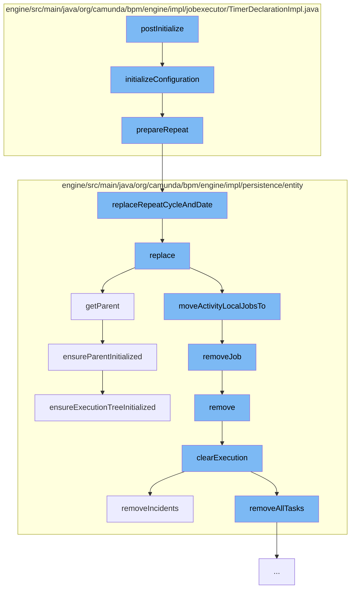

This document will cover the process of Timer Configuration and Execution in Camunda, which includes:

 1. Initialization of Timer Configuration
 2. Preparation of Repeat Cycle
 3. Replacement of Repeat Cycle and Date
 4. Execution Replacement
 5. Job Removal
 6. Execution Removal
 7. Execution Clearance
 8. Incident Removal
 9. Parent Execution Initialization
10. Execution Tree Initialization.



<SwmSnippet path="/engine/src/main/java/org/camunda/bpm/engine/impl/jobexecutor/TimerDeclarationImpl.java" line="96">

---

# Initialization of Timer Configuration

The `initializeConfiguration` function is used to set up the timer configuration. It resolves and sets the due date for the job. If the timer type is a cycle and not an intermediate event, it prepares the repeat cycle.

```java
  protected void initializeConfiguration(ExecutionEntity context, TimerEntity job) {
    String dueDateString = resolveAndSetDuedate(context, job, false);

    if (type == TimerDeclarationType.CYCLE && jobHandlerType != TimerCatchIntermediateEventJobHandler.TYPE) {

      // See ACT-1427: A boundary timer with a cancelActivity='true', doesn't need to repeat itself
      if (!isInterruptingTimer) {
        String prepared = prepareRepeat(dueDateString);
        job.setRepeat(prepared);
      }
    }
  }
```

---

</SwmSnippet>

<SwmSnippet path="/engine/src/main/java/org/camunda/bpm/engine/impl/jobexecutor/TimerDeclarationImpl.java" line="159">

---

# Preparation of Repeat Cycle

The `prepareRepeat` function checks if the due date starts with 'R' and replaces the repeat cycle and date accordingly.

```java
  protected String prepareRepeat(String dueDate) {
    if (dueDate.startsWith("R")) {
      return TimerEntity.replaceRepeatCycleAndDate(dueDate);
    }
    return dueDate;
  }
```

---

</SwmSnippet>

<SwmSnippet path="/engine/src/main/java/org/camunda/bpm/engine/impl/persistence/entity/TimerEntity.java" line="178">

---

# Replacement of Repeat Cycle and Date

The `replaceRepeatCycleAndDate` function replaces the repeat cycle and date in the repeat expression.

```java
  public static String replaceRepeatCycleAndDate(String repeatExpression) {
    if (repeatExpression.split("/").length == 2) {
      return repeatExpression.replace("/", "/" + SIMPLE_DATE_FORMAT.format(ClockUtil.getCurrentTime()) + "/");
    }
    return repeatExpression; // expression include start date
  }
```

---

</SwmSnippet>

<SwmSnippet path="/engine/src/main/java/org/camunda/bpm/engine/impl/persistence/entity/ExecutionEntity.java" line="1123">

---

# Execution Replacement

The `replace` function replaces the current execution with a new one. It moves tasks, external tasks, and jobs related to the current activity to the new execution.

```java
  @Override
  public void replace(PvmExecutionImpl execution) {
    ExecutionEntity replacedExecution = (ExecutionEntity) execution;

    setListenerIndex(replacedExecution.getListenerIndex());
    replacedExecution.setListenerIndex(0);

    // update the related tasks
    replacedExecution.moveTasksTo(this);

    replacedExecution.moveExternalTasksTo(this);

    // update those jobs that are directly related to the argument execution's
    // current activity
    replacedExecution.moveActivityLocalJobsTo(this);

    if (!replacedExecution.isEnded()) {
      // on compaction, move all variables
      if (replacedExecution.getParent() == this) {
        replacedExecution.moveVariablesTo(this);
      }
```

---

</SwmSnippet>

<SwmSnippet path="/engine/src/main/java/org/camunda/bpm/engine/impl/persistence/entity/ExecutionEntity.java" line="1544">

---

# Job Removal

The `removeJob` function removes a job from the internal jobs list.

```java
  public void removeJob(JobEntity job) {
    getJobsInternal().remove(job);
  }
```

---

</SwmSnippet>

<SwmSnippet path="/engine/src/main/java/org/camunda/bpm/engine/impl/persistence/entity/ExecutionEntity.java" line="1022">

---

# Execution Removal

The `remove` function removes the execution. It clears the execution, removes event subscriptions, and deletes the execution from the execution manager.

```java
  public void remove() {
    super.remove();

    // removes jobs, incidents and tasks, and
    // clears the variable store
    clearExecution();

    // remove all event subscriptions for this scope, if the scope has event
    // subscriptions:
    removeEventSubscriptions();

    // finally delete this execution
    Context.getCommandContext().getExecutionManager().deleteExecution(this);
  }
```

---

</SwmSnippet>

<SwmSnippet path="/engine/src/main/java/org/camunda/bpm/engine/impl/persistence/entity/ExecutionEntity.java" line="531">

---

# Execution Clearance

The `clearExecution` function clears the execution. It removes all tasks, variables, jobs, and incidents.

```java
  protected void clearExecution() {
    //call the onRemove method of the execution observers
    //so they can do some clean up before
    for (ExecutionObserver observer : executionObservers) {
      observer.onClear(this);
    }

    // delete all the tasks and external tasks
    removeAllTasks();

    // delete all the variable instances
    removeVariablesLocalInternal();

    // remove all jobs
    removeJobs();

    // remove all incidents
    removeIncidents();
  }
```

---

</SwmSnippet>

<SwmSnippet path="/engine/src/main/java/org/camunda/bpm/engine/impl/persistence/entity/ExecutionEntity.java" line="1067">

---

# Incident Removal

The `removeIncidents` function removes all incidents. If the execution is replaced by a parent, it sets the execution of the incident to the replaced execution.

```java
  private void removeIncidents() {
    for (IncidentEntity incident : getIncidents()) {
      if (isReplacedByParent()) {
        incident.setExecution(getReplacedBy());
      } else {
        IncidentContext incidentContext = createIncidentContext(incident.getConfiguration());
        IncidentHandling.removeIncidents(incident.getIncidentType(), incidentContext, false);
      }
    }

    for (IncidentEntity incident : getIncidents()) {
      // if the handler doesn't take care of it,
      // make sure the incident is deleted nevertheless
      incident.delete();
    }
  }
```

---

</SwmSnippet>

<SwmSnippet path="/engine/src/main/java/org/camunda/bpm/engine/impl/persistence/entity/ExecutionEntity.java" line="882">

---

# Parent Execution Initialization

The `getParent` function ensures the parent execution is initialized.

```java
  @Override
  public ExecutionEntity getParent() {
    ensureParentInitialized();
    return parent;
  }
```

---

</SwmSnippet>

<SwmSnippet path="/engine/src/main/java/org/camunda/bpm/engine/impl/persistence/entity/ExecutionEntity.java" line="1259">

---

# Execution Tree Initialization

The `ensureExecutionTreeInitialized` function fetches all the executions inside the same process instance and reconstructs the complete execution tree.

```java
  /**
   * Fetch all the executions inside the same process instance as list and then
   * reconstruct the complete execution tree.
   *
   * In many cases this is an optimization over fetching the execution tree
   * lazily. Usually we need all executions anyway and it is preferable to fetch
   * more data in a single query (maybe even too much data) then to run multiple
   * queries, each returning a fraction of the data.
   *
   * The most important consideration here is network roundtrip: If the process
   * engine and database run on separate hosts, network roundtrip has to be
   * added to each query. Economizing on the number of queries economizes on
   * network roundtrip. The tradeoff here is network roundtrip vs. throughput:
   * multiple roundtrips carrying small chucks of data vs. a single roundtrip
   * carrying more data.
   *
   */
  protected void ensureExecutionTreeInitialized() {
    List<ExecutionEntity> executions = Context.getCommandContext()
      .getExecutionManager()
      .findExecutionsByProcessInstanceId(processInstanceId);
```

---

</SwmSnippet>

&nbsp;

*This is an auto-generated document by Swimm AI 🌊 and has not yet been verified by a human*

<SwmMeta version="3.0.0" repo-id="Z2l0aHViJTNBJTNBQ2l0aS1jYW11bmRhJTNBJTNBZ2lsYWRuYXZvdA==" repo-name="Citi-camunda" doc-type="flows"><sup>Powered by [Swimm](/)</sup></SwmMeta>
