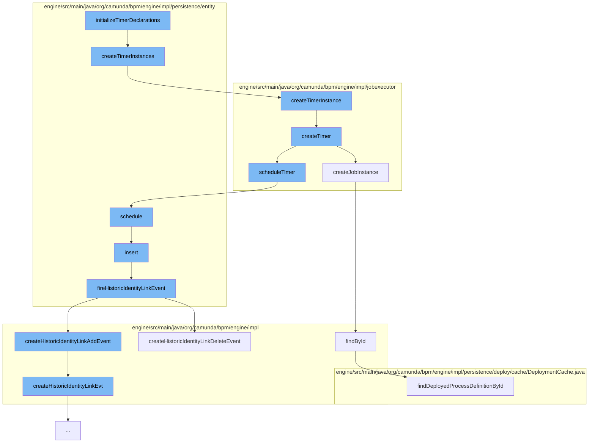

This document will cover the process of Timer Initialization and Scheduling in the Camunda BPMN engine. The process includes:

1. Initializing Timer Declarations
2. Creating Timer Instances
3. Scheduling the Timer
4. Inserting Identity Link
5. Firing Historic Identity Link Event



<SwmSnippet path="/engine/src/main/java/org/camunda/bpm/engine/impl/persistence/entity/ExecutionEntity.java" line="416">

---

# Initializing Timer Declarations

The function `initializeTimerDeclarations` starts the process. It calls `createTimerInstances` to create timer instances for each timer declaration.

```java
  protected void createTimerInstances(Collection<TimerDeclarationImpl> timerDeclarations) {
    for (TimerDeclarationImpl timerDeclaration : timerDeclarations) {
      timerDeclaration.createTimerInstance(this);
    }
  }
```

---

</SwmSnippet>

<SwmSnippet path="/engine/src/main/java/org/camunda/bpm/engine/impl/jobexecutor/TimerDeclarationImpl.java" line="166">

---

# Creating Timer Instances

`createTimerInstances` calls `createTimerInstance` which in turn calls `createTimer` to create a timer entity.

```java
  public TimerEntity createTimerInstance(ExecutionEntity execution) {
    return createTimer(execution);
  }
```

---

</SwmSnippet>

<SwmSnippet path="/engine/src/main/java/org/camunda/bpm/engine/impl/jobexecutor/TimerDeclarationImpl.java" line="174">

---

# Scheduling the Timer

`createTimer` creates a timer entity and schedules it by calling `scheduleTimer`.

```java
  public TimerEntity createTimer(String deploymentId) {
    TimerEntity timer = super.createJobInstance((ExecutionEntity) null);
    timer.setDeploymentId(deploymentId);
    scheduleTimer(timer);
    return timer;
  }
```

---

</SwmSnippet>

<SwmSnippet path="/engine/src/main/java/org/camunda/bpm/engine/impl/persistence/entity/JobManager.java" line="110">

---

# Inserting Identity Link

`scheduleTimer` calls `schedule` which inserts an Identity Link by calling `insert`.

```java
  public void schedule(TimerEntity timer) {
    Date duedate = timer.getDuedate();
    ensureNotNull("duedate", duedate);
    timer.insert();
    hintJobExecutorIfNeeded(timer, duedate);
  }
```

---

</SwmSnippet>

<SwmSnippet path="/engine/src/main/java/org/camunda/bpm/engine/impl/persistence/entity/IdentityLinkEntity.java" line="204">

---

# Firing Historic Identity Link Event

`insert` fires a Historic Identity Link Event by calling `fireHistoricIdentityLinkEvent`.

```java
  public void fireHistoricIdentityLinkEvent(final HistoryEventType eventType) {
    ProcessEngineConfigurationImpl processEngineConfiguration = Context.getProcessEngineConfiguration();

    HistoryLevel historyLevel = processEngineConfiguration.getHistoryLevel();
    if(historyLevel.isHistoryEventProduced(eventType, this)) {

      HistoryEventProcessor.processHistoryEvents(new HistoryEventProcessor.HistoryEventCreator() {
        @Override
        public HistoryEvent createHistoryEvent(HistoryEventProducer producer) {
          HistoryEvent event = null;
          if (HistoryEvent.IDENTITY_LINK_ADD.equals(eventType.getEventName())) {
            event = producer.createHistoricIdentityLinkAddEvent(IdentityLinkEntity.this);
          } else if (HistoryEvent.IDENTITY_LINK_DELETE.equals(eventType.getEventName())) {
            event = producer.createHistoricIdentityLinkDeleteEvent(IdentityLinkEntity.this);
          }
          return event;
        }
      });

    }
  }
```

---

</SwmSnippet>

&nbsp;

*This is an auto-generated document by Swimm AI 🌊 and has not yet been verified by a human*

<SwmMeta version="3.0.0" repo-id="Z2l0aHViJTNBJTNBQ2l0aS1jYW11bmRhJTNBJTNBZ2lsYWRuYXZvdA==" repo-name="Citi-camunda" doc-type="flows"><sup>Powered by [Swimm](/)</sup></SwmMeta>
