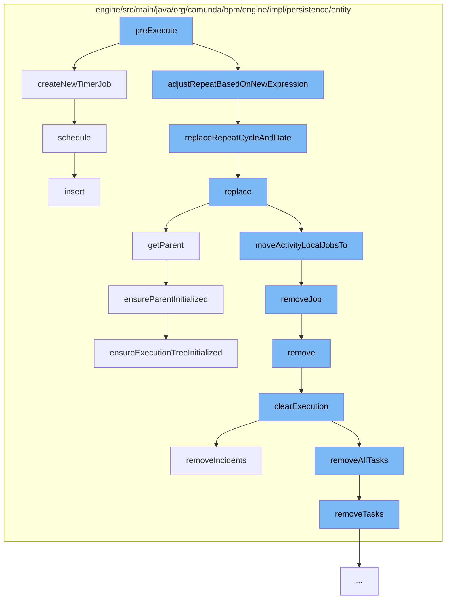

This document will cover the process of Timer Job Execution in Camunda, which includes:

1. Pre-execution of the timer job
2. Creation of a new timer job
3. Adjusting the repeat cycle based on new expression
4. Replacing the repeat cycle and date
5. Replacing the execution
6. Removing the job
7. Clearing the execution
8. Ensuring the parent is initialized
9. Scheduling the job



<SwmSnippet path="/engine/src/main/java/org/camunda/bpm/engine/impl/persistence/entity/TimerEntity.java" line="189">

---

# Pre-execution of the timer job

The `preExecute` function is the starting point of the timer job execution process. It calls the `createNewTimerJob` and `adjustRepeatBasedOnNewExpression` functions.

```java
  public void createNewTimerJob(Date dueDate) {
    // create new timer job
    TimerEntity newTimer = new TimerEntity(this);
    newTimer.setDuedate(dueDate);
    Context
      .getCommandContext()
      .getJobManager()
      .schedule(newTimer);
  }
```

---

</SwmSnippet>

<SwmSnippet path="/engine/src/main/java/org/camunda/bpm/engine/impl/persistence/entity/TimerEntity.java" line="189">

---

# Creation of a new timer job

The `createNewTimerJob` function creates a new timer job and schedules it using the `schedule` function.

```java
  public void createNewTimerJob(Date dueDate) {
    // create new timer job
    TimerEntity newTimer = new TimerEntity(this);
    newTimer.setDuedate(dueDate);
    Context
      .getCommandContext()
      .getJobManager()
      .schedule(newTimer);
  }
```

---

</SwmSnippet>

<SwmSnippet path="/engine/src/main/java/org/camunda/bpm/engine/impl/persistence/entity/TimerEntity.java" line="178">

---

# Adjusting the repeat cycle based on new expression

The `adjustRepeatBasedOnNewExpression` function adjusts the repeat cycle of the timer job based on a new expression. It calls the `replaceRepeatCycleAndDate` function.

```java
  public static String replaceRepeatCycleAndDate(String repeatExpression) {
    if (repeatExpression.split("/").length == 2) {
      return repeatExpression.replace("/", "/" + SIMPLE_DATE_FORMAT.format(ClockUtil.getCurrentTime()) + "/");
    }
    return repeatExpression; // expression include start date
  }
```

---

</SwmSnippet>

<SwmSnippet path="/engine/src/main/java/org/camunda/bpm/engine/impl/persistence/entity/TimerEntity.java" line="178">

---

# Replacing the repeat cycle and date

The `replaceRepeatCycleAndDate` function replaces the repeat cycle and date in the timer job's repeat expression.

```java
  public static String replaceRepeatCycleAndDate(String repeatExpression) {
    if (repeatExpression.split("/").length == 2) {
      return repeatExpression.replace("/", "/" + SIMPLE_DATE_FORMAT.format(ClockUtil.getCurrentTime()) + "/");
    }
    return repeatExpression; // expression include start date
  }
```

---

</SwmSnippet>

<SwmSnippet path="/engine/src/main/java/org/camunda/bpm/engine/impl/persistence/entity/ExecutionEntity.java" line="1123">

---

# Replacing the execution

The `replace` function replaces the current execution with a new one. It calls the `getParent` and `moveActivityLocalJobsTo` functions.

```java
  @Override
  public void replace(PvmExecutionImpl execution) {
    ExecutionEntity replacedExecution = (ExecutionEntity) execution;

    setListenerIndex(replacedExecution.getListenerIndex());
    replacedExecution.setListenerIndex(0);

    // update the related tasks
    replacedExecution.moveTasksTo(this);

    replacedExecution.moveExternalTasksTo(this);

    // update those jobs that are directly related to the argument execution's
    // current activity
    replacedExecution.moveActivityLocalJobsTo(this);

    if (!replacedExecution.isEnded()) {
      // on compaction, move all variables
      if (replacedExecution.getParent() == this) {
        replacedExecution.moveVariablesTo(this);
      }
```

---

</SwmSnippet>

<SwmSnippet path="/engine/src/main/java/org/camunda/bpm/engine/impl/persistence/entity/ExecutionEntity.java" line="1544">

---

# Removing the job

The `removeJob` function removes the job from the execution.

```java
  public void removeJob(JobEntity job) {
    getJobsInternal().remove(job);
  }
```

---

</SwmSnippet>

<SwmSnippet path="/engine/src/main/java/org/camunda/bpm/engine/impl/persistence/entity/ExecutionEntity.java" line="531">

---

# Clearing the execution

The `clearExecution` function clears the execution by removing tasks, variables, jobs, and incidents. It calls the `removeIncidents` and `removeAllTasks` functions.

```java
  protected void clearExecution() {
    //call the onRemove method of the execution observers
    //so they can do some clean up before
    for (ExecutionObserver observer : executionObservers) {
      observer.onClear(this);
    }

    // delete all the tasks and external tasks
    removeAllTasks();

    // delete all the variable instances
    removeVariablesLocalInternal();

    // remove all jobs
    removeJobs();

    // remove all incidents
    removeIncidents();
  }
```

---

</SwmSnippet>

<SwmSnippet path="/engine/src/main/java/org/camunda/bpm/engine/impl/persistence/entity/ExecutionEntity.java" line="879">

---

# Ensuring the parent is initialized

The `ensureParentInitialized` function ensures that the parent of the execution is initialized.

```java
  // parent ///////////////////////////////////////////////////////////////////

  /** ensures initialization and returns the parent */
  @Override
  public ExecutionEntity getParent() {
    ensureParentInitialized();
    return parent;
  }

  protected void ensureParentInitialized() {
    if (parent == null && parentId != null) {
      if (isExecutionTreePrefetchEnabled()) {
        ensureExecutionTreeInitialized();

      } else {
        parent = Context.getCommandContext().getExecutionManager().findExecutionById(parentId);
      }
    }
  }
```

---

</SwmSnippet>

<SwmSnippet path="/engine/src/main/java/org/camunda/bpm/engine/impl/persistence/entity/JobManager.java" line="110">

---

# Scheduling the job

The `schedule` function schedules the timer job for execution.

```java
  public void schedule(TimerEntity timer) {
    Date duedate = timer.getDuedate();
    ensureNotNull("duedate", duedate);
    timer.insert();
    hintJobExecutorIfNeeded(timer, duedate);
  }
```

---

</SwmSnippet>

&nbsp;

*This is an auto-generated document by Swimm AI 🌊 and has not yet been verified by a human*

<SwmMeta version="3.0.0" repo-id="Z2l0aHViJTNBJTNBQ2l0aS1jYW11bmRhJTNBJTNBZ2lsYWRuYXZvdA==" repo-name="Citi-camunda" doc-type="flows"><sup>Powered by [Swimm](/)</sup></SwmMeta>
