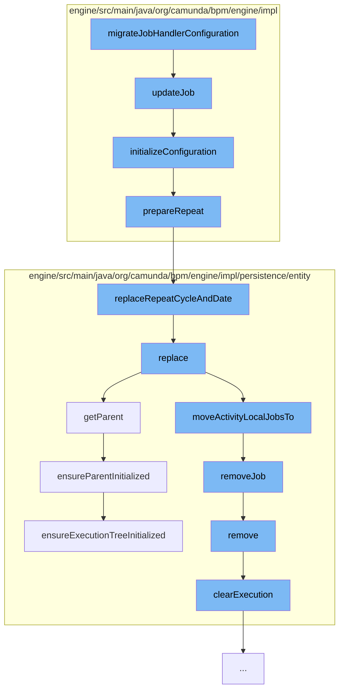

This document will cover the process of Timer Job Migration in the Camunda BPM engine. The process includes the following steps:

1. Migrating Job Handler Configuration
2. Updating the Job
3. Initializing the Configuration
4. Preparing the Repeat Cycle
5. Replacing the Repeat Cycle and Date
6. Replacing the Execution Entity
7. Removing the Job
8. Clearing the Execution



<SwmSnippet path="/engine/src/main/java/org/camunda/bpm/engine/impl/migration/instance/MigratingTimerJobInstance.java" line="1">

---

# Migrating Job Handler Configuration

The process starts with the `migrateJobHandlerConfiguration` function which is responsible for initiating the migration of the job handler configuration.

```java
/*
 * Copyright Camunda Services GmbH and/or licensed to Camunda Services GmbH
 * under one or more contributor license agreements. See the NOTICE file
 * distributed with this work for additional information regarding copyright
 * ownership. Camunda licenses this file to you under the Apache License,
 * Version 2.0; you may not use this file except in compliance with the License.
 * You may obtain a copy of the License at
 *
 *     http://www.apache.org/licenses/LICENSE-2.0
 *
```

---

</SwmSnippet>

<SwmSnippet path="/engine/src/main/java/org/camunda/bpm/engine/impl/jobexecutor/TimerDeclarationImpl.java" line="92">

---

# Updating the Job

The `updateJob` function is called next, which updates the timer job by initializing its configuration.

```java
  public void updateJob(TimerEntity timer) {
    initializeConfiguration(timer.getExecution(), timer);
  }
```

---

</SwmSnippet>

<SwmSnippet path="/engine/src/main/java/org/camunda/bpm/engine/impl/jobexecutor/TimerDeclarationImpl.java" line="96">

---

# Initializing the Configuration

The `initializeConfiguration` function is responsible for setting up the configuration of the timer job. If the timer is of type CYCLE and not a TimerCatchIntermediateEventJobHandler, it prepares the repeat cycle.

```java
  protected void initializeConfiguration(ExecutionEntity context, TimerEntity job) {
    String dueDateString = resolveAndSetDuedate(context, job, false);

    if (type == TimerDeclarationType.CYCLE && jobHandlerType != TimerCatchIntermediateEventJobHandler.TYPE) {

      // See ACT-1427: A boundary timer with a cancelActivity='true', doesn't need to repeat itself
      if (!isInterruptingTimer) {
        String prepared = prepareRepeat(dueDateString);
        job.setRepeat(prepared);
      }
    }
  }
```

---

</SwmSnippet>

<SwmSnippet path="/engine/src/main/java/org/camunda/bpm/engine/impl/jobexecutor/TimerDeclarationImpl.java" line="159">

---

# Preparing the Repeat Cycle

The `prepareRepeat` function checks if the due date starts with 'R' and if so, it replaces the repeat cycle and date.

```java
  protected String prepareRepeat(String dueDate) {
    if (dueDate.startsWith("R")) {
      return TimerEntity.replaceRepeatCycleAndDate(dueDate);
    }
    return dueDate;
  }
```

---

</SwmSnippet>

<SwmSnippet path="/engine/src/main/java/org/camunda/bpm/engine/impl/persistence/entity/TimerEntity.java" line="178">

---

# Replacing the Repeat Cycle and Date

The `replaceRepeatCycleAndDate` function replaces the repeat cycle and date in the repeat expression.

```java
  public static String replaceRepeatCycleAndDate(String repeatExpression) {
    if (repeatExpression.split("/").length == 2) {
      return repeatExpression.replace("/", "/" + SIMPLE_DATE_FORMAT.format(ClockUtil.getCurrentTime()) + "/");
    }
    return repeatExpression; // expression include start date
  }
```

---

</SwmSnippet>

<SwmSnippet path="/engine/src/main/java/org/camunda/bpm/engine/impl/persistence/entity/ExecutionEntity.java" line="1123">

---

# Replacing the Execution Entity

The `replace` function replaces the execution entity. It updates the related tasks and jobs.

```java
  @Override
  public void replace(PvmExecutionImpl execution) {
    ExecutionEntity replacedExecution = (ExecutionEntity) execution;

    setListenerIndex(replacedExecution.getListenerIndex());
    replacedExecution.setListenerIndex(0);

    // update the related tasks
    replacedExecution.moveTasksTo(this);

    replacedExecution.moveExternalTasksTo(this);

    // update those jobs that are directly related to the argument execution's
    // current activity
    replacedExecution.moveActivityLocalJobsTo(this);

    if (!replacedExecution.isEnded()) {
      // on compaction, move all variables
      if (replacedExecution.getParent() == this) {
        replacedExecution.moveVariablesTo(this);
      }
```

---

</SwmSnippet>

<SwmSnippet path="/engine/src/main/java/org/camunda/bpm/engine/impl/persistence/entity/ExecutionEntity.java" line="1544">

---

# Removing the Job

The `removeJob` function removes the job from the execution entity.

```java
  public void removeJob(JobEntity job) {
    getJobsInternal().remove(job);
  }
```

---

</SwmSnippet>

<SwmSnippet path="/engine/src/main/java/org/camunda/bpm/engine/impl/persistence/entity/ExecutionEntity.java" line="1022">

---

# Clearing the Execution

Finally, the `clearExecution` function is called to remove jobs, incidents, tasks, and clear the variable store.

```java
  public void remove() {
    super.remove();

    // removes jobs, incidents and tasks, and
    // clears the variable store
    clearExecution();

    // remove all event subscriptions for this scope, if the scope has event
    // subscriptions:
    removeEventSubscriptions();

    // finally delete this execution
    Context.getCommandContext().getExecutionManager().deleteExecution(this);
  }
```

---

</SwmSnippet>

&nbsp;

*This is an auto-generated document by Swimm AI 🌊 and has not yet been verified by a human*

<SwmMeta version="3.0.0" repo-id="Z2l0aHViJTNBJTNBQ2l0aS1jYW11bmRhJTNBJTNBZ2lsYWRuYXZvdA==" repo-name="Citi-camunda" doc-type="flows"><sup>Powered by [Swimm](/)</sup></SwmMeta>
