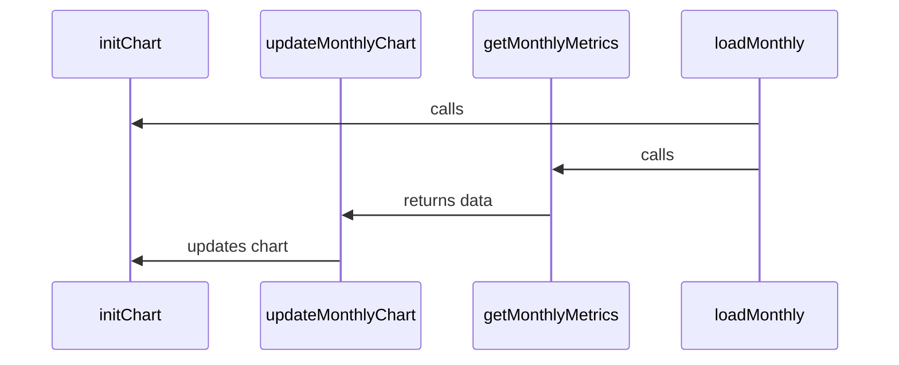

Execution Metrics in Citi-camunda refers to the measurement of certain aspects of the process execution within the Camunda BPMN engine. It provides insights into the performance and behavior of the processes, tasks, and decisions in the system. This includes metrics like the number of process instances, decision instances, task users, flow node instances, and executed decision elements. These metrics are aggregated over time and can be visualized in a chart for easy understanding and analysis. They are crucial for monitoring the health and efficiency of the system, identifying bottlenecks, and making informed decisions for process optimization.

<SwmSnippet path="/webapps/frontend/ui/admin/client/scripts/pages/execution-metrics.js" line="34">

---

# Execution Metrics Code Overview

The `metrics` constant defines the types of metrics that can be tracked, including process instances (`PI`), decision instances (`DI`), task users (`TU`), flow node instances (`FNI`), and executed decision elements (`EDE`).

```javascript
const metrics = {
  PI: 'process-instances',
  DI: 'decision-instances',
  TU: 'task-users',
  FNI: 'flow-node-instances',
  EDE: 'executed-decision-elements'
};
```

---

</SwmSnippet>

<SwmSnippet path="/webapps/frontend/ui/admin/client/scripts/pages/execution-metrics.js" line="238">

---

# Metrics Data Retrieval

The `getMonthlyMetrics` function retrieves the metrics data for a given date range. It uses the `PluginMetricsResource.getAggregated` method to fetch the aggregated metrics data from the backend.

```javascript
    const getMonthlyMetrics = (metrics, startDate, endDate) => {
      return new Promise((resolve, reject) => {
        PluginMetricsResource.getAggregated({
          subscriptionStartDate: $scope.startDate,
          groupBy: 'month',
          metrics: Array.from(metrics).toString(),
          startDate,
          endDate
        }).$promise.then(
          monthlyMetrics => {
            prepareTableData(monthlyMetrics, fmtMonth, monthlyMetricUsageMap);
            resolve();
          },
          err => reject(err)
        );
      });
    };
```

---

</SwmSnippet>

<SwmSnippet path="/webapps/frontend/ui/admin/client/scripts/pages/execution-metrics.js" line="108">

---

# Metrics Data Visualization

The `initChart` function initializes the chart for displaying the metrics data. It uses the Chart.js library to create a bar chart with the metrics data.

```javascript
    const initChart = () => {
      const $canvas = angular.element('canvas#monthly-metrics-chart-canvas');
      const ctx = $canvas[0].getContext('2d');
      Chart.Chart.register(
        Chart.BarController,
        Chart.BarElement,
        Chart.LinearScale,
        Chart.CategoryScale,
        Chart.Legend,
        Chart.Tooltip
      );
      $scope.chart = new Chart.Chart(ctx, {
        type: 'bar',
        data: {
          labels: [],
          datasets: []
        },
        options: {
          responsive: true,
          maintainAspectRatio: false,
          interaction: {
```

---

</SwmSnippet>

<SwmSnippet path="/webapps/frontend/ui/admin/client/scripts/pages/execution-metrics.js" line="136">

---

# Metrics Data Update

The `updateMonthlyChart` function updates the chart with the latest metrics data. It creates a dataset for each metric type and updates the chart's data and labels.

```javascript
    const updateMonthlyChart = monthlyMetrics => {
      const createDataset = metricsKey => {
        let data = [];
        for (const monthlyMetric of monthlyMetrics) {
          data.push(monthlyMetric[metrics[metricsKey]]?.sum || 0);
        }
        return {
          label: metricsKey,
          data: data,
          backgroundColor: datasetMetricColors[metricsKey]
        };
      };

      let datasets = [];
      datasets.push(createDataset('PI'));
      datasets.push(createDataset('DI'));
      datasets.push(createDataset('TU'));
      if ($scope.displayLegacyMetrics) {
        datasets.push(createDataset('FNI'));
        datasets.push(createDataset('EDE'));
      }
```

---

</SwmSnippet>

# Execution Metrics Functions

The 'execution-metrics.js' file contains several functions that handle the retrieval, calculation, and display of execution metrics in the Camunda Platform.

<SwmSnippet path="/webapps/frontend/ui/admin/client/scripts/pages/execution-metrics.js" line="108">

---

## initChart Function

The `initChart` function initializes a chart to display the metrics. It creates a new Chart instance with a 'bar' type and sets up the chart's basic configuration, such as responsiveness and interaction mode.

```javascript
    const initChart = () => {
      const $canvas = angular.element('canvas#monthly-metrics-chart-canvas');
      const ctx = $canvas[0].getContext('2d');
      Chart.Chart.register(
        Chart.BarController,
        Chart.BarElement,
        Chart.LinearScale,
        Chart.CategoryScale,
        Chart.Legend,
        Chart.Tooltip
      );
      $scope.chart = new Chart.Chart(ctx, {
        type: 'bar',
        data: {
          labels: [],
          datasets: []
        },
        options: {
          responsive: true,
          maintainAspectRatio: false,
          interaction: {
```

---

</SwmSnippet>

<SwmSnippet path="/webapps/frontend/ui/admin/client/scripts/pages/execution-metrics.js" line="136">

---

## updateMonthlyChart Function

The `updateMonthlyChart` function updates the chart with the monthly metrics data. It creates datasets for each metric and updates the chart's labels and datasets.

```javascript
    const updateMonthlyChart = monthlyMetrics => {
      const createDataset = metricsKey => {
        let data = [];
        for (const monthlyMetric of monthlyMetrics) {
          data.push(monthlyMetric[metrics[metricsKey]]?.sum || 0);
        }
        return {
          label: metricsKey,
          data: data,
          backgroundColor: datasetMetricColors[metricsKey]
        };
      };

      let datasets = [];
      datasets.push(createDataset('PI'));
      datasets.push(createDataset('DI'));
      datasets.push(createDataset('TU'));
      if ($scope.displayLegacyMetrics) {
        datasets.push(createDataset('FNI'));
        datasets.push(createDataset('EDE'));
      }
```

---

</SwmSnippet>

<SwmSnippet path="/webapps/frontend/ui/admin/client/scripts/pages/execution-metrics.js" line="238">

---

## getMonthlyMetrics Function

The `getMonthlyMetrics` function retrieves the monthly metrics data from the PluginMetricsResource. It returns a promise that resolves when the data is successfully fetched.

```javascript
    const getMonthlyMetrics = (metrics, startDate, endDate) => {
      return new Promise((resolve, reject) => {
        PluginMetricsResource.getAggregated({
          subscriptionStartDate: $scope.startDate,
          groupBy: 'month',
          metrics: Array.from(metrics).toString(),
          startDate,
          endDate
        }).$promise.then(
          monthlyMetrics => {
            prepareTableData(monthlyMetrics, fmtMonth, monthlyMetricUsageMap);
            resolve();
          },
          err => reject(err)
        );
      });
    };
```

---

</SwmSnippet>

<SwmSnippet path="/webapps/frontend/ui/admin/client/scripts/pages/execution-metrics.js" line="306">

---

## loadMonthly Function

The `loadMonthly` function loads the monthly metrics data. It initializes the monthly data, calculates the query dates, and fetches the metrics data. If the data is successfully fetched, it prepares the data for the table and updates the chart. If an error occurs, it sets the loading state to 'ERROR' and updates the error message.

```javascript
    const loadMonthly = () => {
      $scope.loadingStateMonthly = 'LOADING';

      initializeMonthlyData();

      // calculate query dates
      const prevSubStart = $scope.activeYear
        .clone()
        .subtract(1, 'year')
        .format(fmtRequest);
      const curSubStart = $scope.activeYear.format(fmtRequest);
      let requestMetrics = [metrics.PI, metrics.DI];
      if ($scope.displayLegacyMetrics) {
        requestMetrics.push(metrics.FNI, metrics.EDE);
      }

      let series = [
        // load regular metrics (non-TU)
        getMonthlyMetrics(requestMetrics, prevSubStart),
        // load TU metrics for current and last subscription year
        getMonthlyMetrics([metrics.TU], curSubStart),
```

---

</SwmSnippet>



&nbsp;

*This is an auto-generated document by Swimm AI 🌊 and has not yet been verified by a human*

<SwmMeta version="3.0.0" repo-id="Z2l0aHViJTNBJTNBQ2l0aS1jYW11bmRhJTNBJTNBZ2lsYWRuYXZvdA==" repo-name="Citi-camunda" doc-type="overview"><sup>Powered by [Swimm](/)</sup></SwmMeta>
