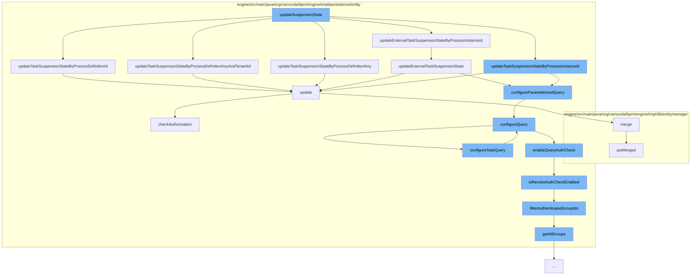

This document will cover the process of updating the suspension state in the Camunda BPM engine, which includes:

1. The initial call to `updateSuspensionState`
2. Updating task suspension state by various parameters
3. Configuring and executing the query
4. Authorization checks
5. Updating the database.



<SwmSnippet path="/engine/src/main/java/org/camunda/bpm/engine/impl/cmd/AbstractSetProcessInstanceStateCmd.java" line="1">

---

# Initial call to `updateSuspensionState`

The process starts with a call to `updateSuspensionState` in `AbstractSetProcessInstanceStateCmd.java`. This function is responsible for updating the suspension state of a process instance.

```java
/*
```

---

</SwmSnippet>

<SwmSnippet path="/engine/src/main/java/org/camunda/bpm/engine/impl/persistence/entity/TaskManager.java" line="160">

---

# Updating task suspension state by various parameters

`updateSuspensionState` calls several functions in `TaskManager.java` to update the task suspension state based on different parameters such as process definition ID, process definition key, and process instance ID.

```java
  public void updateTaskSuspensionStateByProcessDefinitionId(String processDefinitionId, SuspensionState suspensionState) {
    Map<String, Object> parameters = new HashMap<String, Object>();
    parameters.put("processDefinitionId", processDefinitionId);
    parameters.put("suspensionState", suspensionState.getStateCode());
    getDbEntityManager().update(TaskEntity.class, "updateTaskSuspensionStateByParameters", configureParameterizedQuery(parameters));
  }
```

---

</SwmSnippet>

<SwmSnippet path="/engine/src/main/java/org/camunda/bpm/engine/impl/persistence/entity/TaskManager.java" line="209">

---

# Configuring and executing the query

The `configureQuery` function in `TaskManager.java` is called to configure the task query. This function calls `configureTaskQuery` in `AuthorizationManager.java` to further configure the query.

```java
  protected void configureQuery(TaskQueryImpl query) {
    getAuthorizationManager().configureTaskQuery(query);
    getTenantManager().configureQuery(query);
  }
```

---

</SwmSnippet>

<SwmSnippet path="/engine/src/main/java/org/camunda/bpm/engine/impl/persistence/entity/AuthorizationManager.java" line="193">

---

# Authorization checks

The `checkAuthorization` function in `AuthorizationManager.java` is called to perform authorization checks. If the user is not authorized, an `AuthorizationException` is thrown.

```java
  // authorization checks ///////////////////////////////////////////

  public void checkAuthorization(CompositePermissionCheck compositePermissionCheck) {
    if(isAuthCheckExecuted()) {

      Authentication currentAuthentication = getCurrentAuthentication();
      String userId = currentAuthentication.getUserId();

      boolean isAuthorized = isAuthorized(compositePermissionCheck);
      if (!isAuthorized) {

        List<MissingAuthorization> missingAuthorizations = new ArrayList<>();

        for (PermissionCheck check: compositePermissionCheck.getAllPermissionChecks()) {
          missingAuthorizations.add(new MissingAuthorization(
              check.getPermission().getName(),
              check.getResource().resourceName(),
              check.getResourceId()));
        }

        throw new AuthorizationException(userId, missingAuthorizations);
```

---

</SwmSnippet>

<SwmSnippet path="/engine/src/main/java/org/camunda/bpm/engine/impl/db/entitymanager/DbEntityManager.java" line="175">

---

# Updating the database

Finally, the `merge` function in `DbEntityManager.java` is called to update the database with the new suspension state.

```java
  @SuppressWarnings("unchecked")
  public List selectListWithRawParameter(String statement, Object parameter, int firstResult, int maxResults) {
    if(firstResult == -1 ||  maxResults==-1) {
      return Collections.EMPTY_LIST;
    }
    List loadedObjects = persistenceSession.selectList(statement, parameter);
    return filterLoadedObjects(loadedObjects);
  }

  public Object selectOne(String statement, Object parameter) {
    Object result = persistenceSession.selectOne(statement, parameter);
    if (result instanceof DbEntity) {
      DbEntity loadedObject = (DbEntity) result;
      result = cacheFilter(loadedObject);
```

---

</SwmSnippet>

&nbsp;

*This is an auto-generated document by Swimm AI 🌊 and has not yet been verified by a human*

<SwmMeta version="3.0.0" repo-id="Z2l0aHViJTNBJTNBQ2l0aS1jYW11bmRhJTNBJTNBZ2lsYWRuYXZvdA==" repo-name="Citi-camunda" doc-type="flows"><sup>Powered by [Swimm](/)</sup></SwmMeta>
