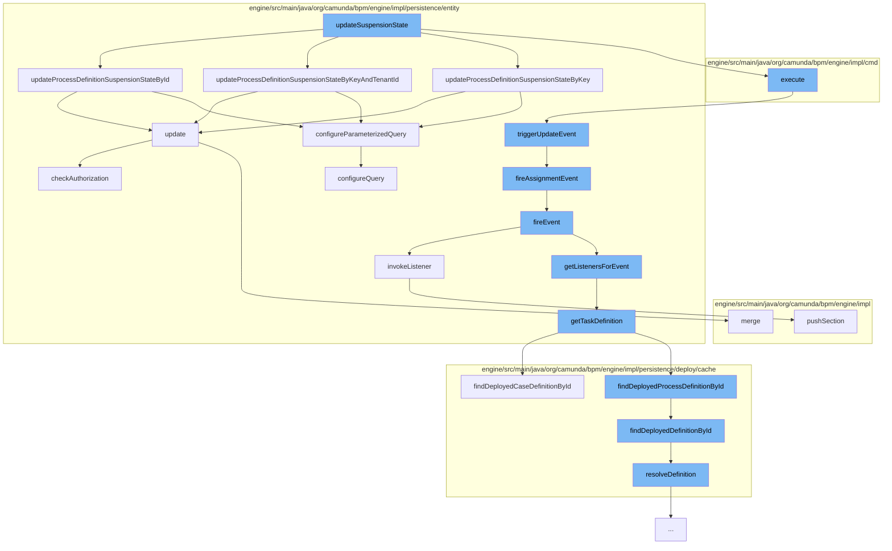

This document will cover the process of updating the suspension state in the Camunda BPMN engine. The steps include:

1. Updating the process definition suspension state
2. Triggering an update event
3. Firing an assignment event
4. Invoking a listener
5. Checking authorization and updating the authorization entity.



<SwmSnippet path="/engine/src/main/java/org/camunda/bpm/engine/impl/persistence/entity/ProcessDefinitionManager.java" line="214">

---

# Updating the process definition suspension state

The function `updateProcessDefinitionSuspensionStateById` is used to update the suspension state of a process definition by its ID. It takes the process definition ID and the new suspension state as parameters, and updates the state in the database.

```java
  public void updateProcessDefinitionSuspensionStateById(String processDefinitionId, SuspensionState suspensionState) {
    Map<String, Object> parameters = new HashMap<String, Object>();
    parameters.put("processDefinitionId", processDefinitionId);
    parameters.put("suspensionState", suspensionState.getStateCode());
    getDbEntityManager().update(ProcessDefinitionEntity.class, "updateProcessDefinitionSuspensionStateByParameters", configureParameterizedQuery(parameters));
  }
```

---

</SwmSnippet>

<SwmSnippet path="/engine/src/main/java/org/camunda/bpm/engine/impl/persistence/entity/TaskEntity.java" line="1202">

---

# Triggering an update event

The function `triggerUpdateEvent` is used to trigger an update event for a task. If the task is in the 'created' state, it registers a command context close listener, updates the last updated time, sets the task state to 'updated', and fires an update event and an assignment event.

```java
  public boolean triggerUpdateEvent() {
    if (lifecycleState == TaskState.STATE_CREATED) {
      registerCommandContextCloseListener();
      setLastUpdated(ClockUtil.getCurrentTime());
      setTaskState(TaskState.STATE_UPDATED.taskState);
      return fireEvent(TaskListener.EVENTNAME_UPDATE) && fireAssignmentEvent();
    }
    else {
      // silently ignore; no events are triggered in the other states
      return true;
    }
  }
```

---

</SwmSnippet>

<SwmSnippet path="/engine/src/main/java/org/camunda/bpm/engine/impl/persistence/entity/TaskEntity.java" line="1229">

---

# Firing an assignment event

The function `fireAssignmentEvent` is used to fire an assignment event for a task. It checks if there has been a change in the assignee property of the task, and if so, fires an assignment event.

```java
  protected boolean fireAssignmentEvent() {
    PropertyChange assigneePropertyChange = propertyChanges.get(ASSIGNEE);
    if (assigneePropertyChange != null) {
      return fireEvent(TaskListener.EVENTNAME_ASSIGNMENT);
    }

    return true;
  }
```

---

</SwmSnippet>

<SwmSnippet path="/engine/src/main/java/org/camunda/bpm/engine/impl/persistence/entity/TaskEntity.java" line="1076">

---

# Invoking a listener

The function `invokeListener` is used to invoke a task listener for a given task event. It pushes a new section to the process data context, sets the event name, and invokes the listener. If an exception occurs during the invocation, it throws an exception.

```java
  protected boolean invokeListener(String taskEventName, TaskListener taskListener) {
    boolean popProcessDataContext = false;
    CommandInvocationContext commandInvocationContext = Context.getCommandInvocationContext();
    CoreExecution execution = getExecution();
    if (execution == null) {
      execution = getCaseExecution();
    } else {
      if (commandInvocationContext != null) {
        popProcessDataContext = commandInvocationContext.getProcessDataContext().pushSection((ExecutionEntity) execution);
      }
    }
    if (execution != null) {
      setEventName(taskEventName);
    }
    try {
      boolean result = invokeListener(execution, taskEventName, taskListener);
      if (popProcessDataContext) {
        commandInvocationContext.getProcessDataContext().popSection();
      }
      return result;
    } catch (Exception e) {
```

---

</SwmSnippet>

<SwmSnippet path="/engine/src/main/java/org/camunda/bpm/engine/impl/persistence/entity/AuthorizationManager.java" line="181">

---

# Checking authorization and updating the authorization entity

The function `update` is used to check the authorization for updating an authorization entity and then update the entity in the database. It takes an `AuthorizationEntity` as a parameter.

```java
  public void update(AuthorizationEntity authorization) {
    checkAuthorization(UPDATE, AUTHORIZATION, authorization.getId());
    getDbEntityManager().merge(authorization);
  }
```

---

</SwmSnippet>

&nbsp;

*This is an auto-generated document by Swimm AI 🌊 and has not yet been verified by a human*

<SwmMeta version="3.0.0" repo-id="Z2l0aHViJTNBJTNBQ2l0aS1jYW11bmRhJTNBJTNBZ2lsYWRuYXZvdA==" repo-name="Citi-camunda" doc-type="flows"><sup>Powered by [Swimm](/)</sup></SwmMeta>
