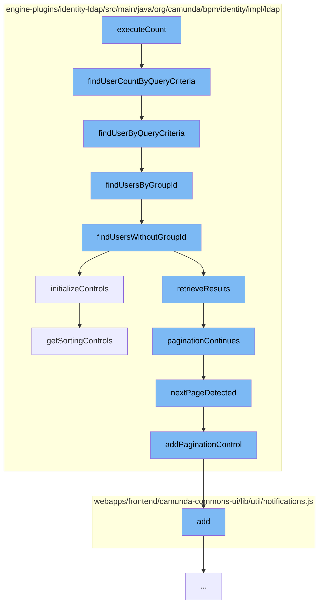

This document will cover the process of executing a user count query in the LDAP identity provider session, which includes:

1. Executing the count query
2. Finding users by query criteria
3. Handling group and non-group users
4. Initializing controls for the query
5. Handling pagination and sorting controls.



<SwmSnippet path="/engine-plugins/identity-ldap/src/main/java/org/camunda/bpm/identity/impl/ldap/LdapUserQueryImpl.java" line="110">

---

# Executing the count query

The `executeCount` function initiates the process by calling `findUserCountByQueryCriteria` function, which returns the size of the user list that matches the query criteria.

```java

```

---

</SwmSnippet>

<SwmSnippet path="/engine-plugins/identity-ldap/src/main/java/org/camunda/bpm/identity/impl/ldap/LdapIdentityProviderSession.java" line="115">

---

# Finding users by query criteria

The `findUserByQueryCriteria` function takes the query and checks if there is a group ID. If there is, it calls `findUsersByGroupId`, otherwise it calls `findUsersWithoutGroupId`.

```java
  public List<User> findUserByQueryCriteria(LdapUserQueryImpl query) {
    ldapClient.ensureContextInitialized();

    // convert DB wildcards to LDAP wildcards if necessary
    if (query.getEmailLike() != null) {
      query.userEmailLike(query.getEmailLike().replaceAll(DB_QUERY_WILDCARD, LDAP_QUERY_WILDCARD));
    }
    if (query.getFirstNameLike() != null) {
      query.userFirstNameLike(query.getFirstNameLike().replaceAll(DB_QUERY_WILDCARD, LDAP_QUERY_WILDCARD));
    }
    if (query.getLastNameLike() != null) {
      query.userLastNameLike(query.getLastNameLike().replaceAll(DB_QUERY_WILDCARD, LDAP_QUERY_WILDCARD));
    }

    if (query.getGroupId() != null) {
      // if restriction on groupId is provided, we need to search in group tree first, look for the group and then further restrict on the members
      return findUsersByGroupId(query);
    } else {
      String userBaseDn = composeDn(ldapConfiguration.getUserSearchBase(), ldapConfiguration.getBaseDn());
      return findUsersWithoutGroupId(query, userBaseDn, false);
    }
```

---

</SwmSnippet>

<SwmSnippet path="/engine-plugins/identity-ldap/src/main/java/org/camunda/bpm/identity/impl/ldap/LdapIdentityProviderSession.java" line="142">

---

# Handling group and non-group users

The `findUsersByGroupId` function finds users that belong to a specific group. It initializes controls for the query and retrieves the results. If the group has more members than the maximum results specified in the query, it continues to the next page of results.

```java
  protected List<User> findUsersByGroupId(LdapUserQueryImpl query) {
    String baseDn = getDnForGroup(query.getGroupId());

    // compose group search filter
    String groupSearchFilter = "(& " + ldapConfiguration.getGroupSearchFilter() + ")";

    initializeControls(query);

    List<String> groupMembers = new ArrayList<>();
    int resultCount = 0;

    do {
      try (LdapSearchResults searchResults = ldapClient.search(baseDn, groupSearchFilter)) {
        // first find group
        while (searchResults.hasMoreElements()) {
          String groupMemberAttribute = ldapConfiguration.getGroupMemberAttribute();
          NamingEnumeration<String> allGroupMembers = LdapClient.getAllMembers(groupMemberAttribute, searchResults);
          if (allGroupMembers != null) {
            // iterate group members
            while (allGroupMembers.hasMoreElements()) {
              if (resultCount >= query.getFirstResult()) {
```

---

</SwmSnippet>

<SwmSnippet path="/engine-plugins/identity-ldap/src/main/java/org/camunda/bpm/identity/impl/ldap/LdapIdentityProviderSession.java" line="292">

---

The `findUsersWithoutGroupId` function finds users that do not belong to a specific group. It initializes controls for the query and retrieves the results.

```java
  public List<User> findUsersWithoutGroupId(LdapUserQueryImpl query, String userBaseDn, boolean ignorePagination) {
    initializeControls(query);

    return retrieveResults(userBaseDn,
        getUserSearchFilter(query),
        this::transformUser,
        this::isAuthenticatedAndAuthorized,
        query.getMaxResults(),
        query.getFirstResult(),
        ignorePagination);
  }
```

---

</SwmSnippet>

<SwmSnippet path="/engine-plugins/identity-ldap/src/main/java/org/camunda/bpm/identity/impl/ldap/LdapIdentityProviderSession.java" line="611">

---

# Initializing controls for the query

The `initializeControls` function sets up the necessary controls for the query, including pagination and sorting controls.

```java
  /**
   * Initializes paged results and sort controls. Might not be supported by all LDAP implementations.
   */
  protected void initializeControls(AbstractQuery<?, ?> query) {
    List<Control> listControls = new ArrayList<>();
    if (ldapConfiguration.isSortControlSupported()) {
      listControls.addAll(getSortingControls(query));
    }

    try {
      if (isPaginationSupported()) {
        LdapClient.addPaginationControl(listControls, null, getPageSize());
      }
    } catch (IdentityProviderException ignored) {
      // Ignore exception when pagination is not supported
    } finally {
      if (!listControls.isEmpty()) {
        ldapClient.setRequestControls(listControls);
      }
    }
  }
```

---

</SwmSnippet>

<SwmSnippet path="/engine-plugins/identity-ldap/src/main/java/org/camunda/bpm/identity/impl/ldap/LdapIdentityProviderSession.java" line="633">

---

# Handling pagination and sorting controls

The `nextPageDetected` function checks if there is a next page of results. If there is, it adds a pagination control to the list of controls.

```java
  /**
   * Check in the context if we reach the last page on the query
   *
   * @return new page detected
   */
  protected boolean nextPageDetected() {
    // if the pagination is not activated, there isn't a next page.
    if (!isPaginationSupported()) {
      return false;
    }

    Control[] controls = ldapClient.getResponseControls();
    if (controls == null) {
      return false;
    }

    List<Control> newControlList = new ArrayList<>();
    boolean newPageDetected = false;
    for (Control control : controls) {
      if (control instanceof PagedResultsResponseControl) {
        PagedResultsResponseControl prrc = (PagedResultsResponseControl) control;
```

---

</SwmSnippet>

<SwmSnippet path="/engine-plugins/identity-ldap/src/main/java/org/camunda/bpm/identity/impl/ldap/LdapClient.java" line="137">

---

The `addPaginationControl` function adds a pagination control to the list of controls.

```java
  public static void addPaginationControl(List<Control> listControls, byte[] cookie, Integer pageSize) {
    try {
      listControls.add(new PagedResultsControl(pageSize, cookie, Control.NONCRITICAL));
    } catch (IOException e) {
      throw new IdentityProviderException("Pagination couldn't be enabled.", e);
    }
  }
```

---

</SwmSnippet>

<SwmSnippet path="/engine-plugins/identity-ldap/src/main/java/org/camunda/bpm/identity/impl/ldap/LdapIdentityProviderSession.java" line="489">

---

The `getSortingControls` function adds sorting controls to the list of controls based on the ordering properties specified in the query.

```java
  /**
   * Return the list of Controls requested in the query. Query may be run on USERS or on GROUP
   *
   * @param query query asks, contains the order by requested
   * @return list of control to send to LDAP
   */
  protected List<Control> getSortingControls(AbstractQuery<?, ?> query) {
    List<Control> controls = new ArrayList<>();

    List<QueryOrderingProperty> orderBy = query.getOrderingProperties();
    if (orderBy != null) {
      for (QueryOrderingProperty orderingProperty : orderBy) {
        String propertyName = orderingProperty.getQueryProperty().getName();
        SortKey sortKey = getSortKey(query, propertyName, orderingProperty);

        if (sortKey != null) {
          LdapClient.addSortKey(sortKey, controls);
        }
      }
    }

```

---

</SwmSnippet>

&nbsp;

*This is an auto-generated document by Swimm AI 🌊 and has not yet been verified by a human*

<SwmMeta version="3.0.0" repo-id="Z2l0aHViJTNBJTNBQ2l0aS1jYW11bmRhJTNBJTNBZ2lsYWRuYXZvdA==" repo-name="Citi-camunda" doc-type="flows"><sup>Powered by [Swimm](/)</sup></SwmMeta>
