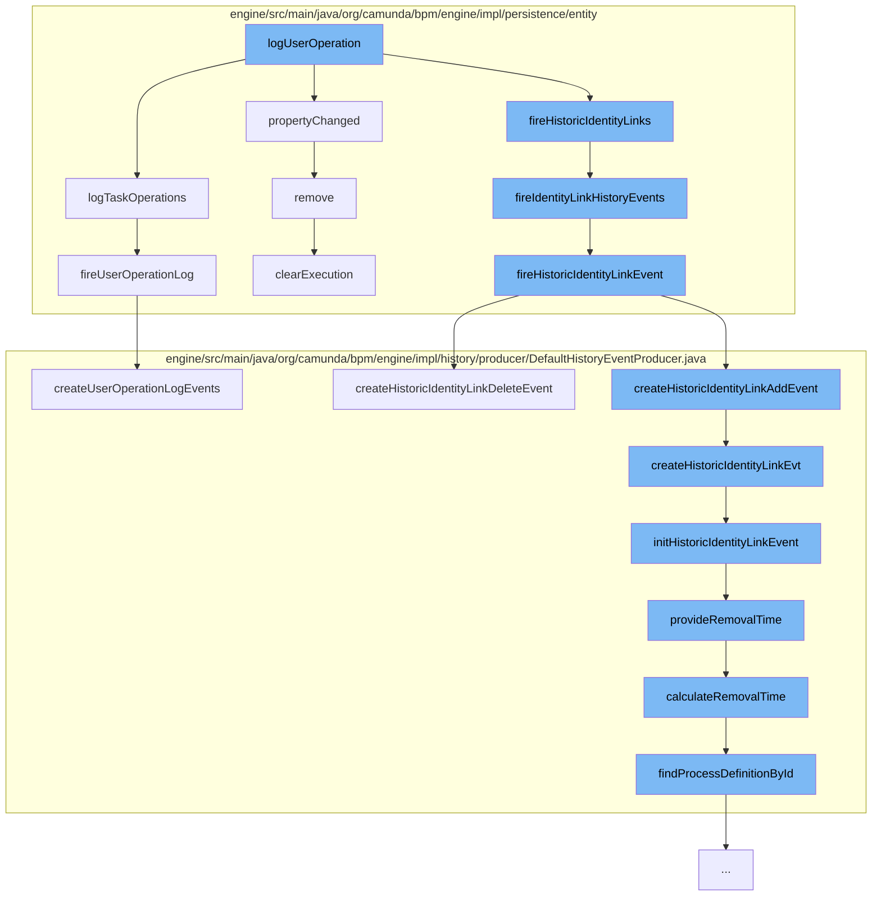

This document will cover the process of logging user operations in the Citi-camunda project. We'll cover:

1. The initiation of the logging process
2. The creation of identity link history events
3. The calculation of removal time
4. The removal of execution entities
5. The creation of user operation log events.



<SwmSnippet path="/engine/src/main/java/org/camunda/bpm/engine/impl/persistence/entity/UserOperationLogManager.java" line="220">

---

# Initiation of the Logging Process

The function `logTaskOperations` is the entry point for logging user operations. It creates a new `UserOperationLogContext` and adds an entry to it. The `fireUserOperationLog` function is then called with this context.

```java
  public void logTaskOperations(String operation, TaskEntity task, List<PropertyChange> propertyChanges) {
    if (isUserOperationLogEnabled()) {
      UserOperationLogContext context = new UserOperationLogContext();
      UserOperationLogContextEntryBuilder entryBuilder =
          UserOperationLogContextEntryBuilder.entry(operation, EntityTypes.TASK)
            .category(UserOperationLogEntry.CATEGORY_TASK_WORKER)
            .inContextOf(task, propertyChanges);

      context.addEntry(entryBuilder.create());
      fireUserOperationLog(context);
    }
  }
```

---

</SwmSnippet>

<SwmSnippet path="/engine/src/main/java/org/camunda/bpm/engine/impl/persistence/entity/TaskEntity.java" line="739">

---

# Creation of Identity Link History Events

The function `fireIdentityLinkHistoryEvents` is responsible for creating identity link history events. It creates a new `IdentityLinkEntity` and fires a historic identity link event.

```java
  public void fireIdentityLinkHistoryEvents(String userId, String groupId, String type, HistoryEventTypes historyEventType) {
    IdentityLinkEntity identityLinkEntity = newIdentityLink(userId, groupId, type);
    identityLinkEntity.fireHistoricIdentityLinkEvent(historyEventType);
  }
```

---

</SwmSnippet>

<SwmSnippet path="/engine/src/main/java/org/camunda/bpm/engine/impl/history/producer/DefaultHistoryEventProducer.java" line="1285">

---

# Calculation of Removal Time

The function `calculateRemovalTime` calculates the removal time for a history event. It fetches the process definition for the event and uses the `HistoryRemovalTimeProvider` to calculate the removal time.

```java
  protected Date calculateRemovalTime(HistoryEvent historyEvent) {
    String processDefinitionId = historyEvent.getProcessDefinitionId();
    ProcessDefinition processDefinition = findProcessDefinitionById(processDefinitionId);

    return Context.getProcessEngineConfiguration()
      .getHistoryRemovalTimeProvider()
      .calculateRemovalTime((HistoricProcessInstanceEventEntity) historyEvent, processDefinition);
  }
```

---

</SwmSnippet>

<SwmSnippet path="/engine/src/main/java/org/camunda/bpm/engine/impl/persistence/entity/ExecutionEntity.java" line="1019">

---

# Removal of Execution Entities

The function `remove` is responsible for removing execution entities. It clears the execution, removes event subscriptions, and finally deletes the execution.

```java
  // customized persistence behavior /////////////////////////////////////////

  @Override
  public void remove() {
    super.remove();

    // removes jobs, incidents and tasks, and
    // clears the variable store
    clearExecution();

    // remove all event subscriptions for this scope, if the scope has event
    // subscriptions:
    removeEventSubscriptions();

    // finally delete this execution
    Context.getCommandContext().getExecutionManager().deleteExecution(this);
  }
```

---

</SwmSnippet>

<SwmSnippet path="/engine/src/main/java/org/camunda/bpm/engine/impl/history/producer/DefaultHistoryEventProducer.java" line="820">

---

# Creation of User Operation Log Events

The function `createUserOperationLogEvents` creates user operation log events. It initializes a new `UserOperationLogEntryEventEntity` for each property change in the context and adds it to the history events.

```java
  // User Operation Logs ///////////////////////////

  public List<HistoryEvent> createUserOperationLogEvents(UserOperationLogContext context) {
    List<HistoryEvent> historyEvents = new ArrayList<HistoryEvent>();

    String operationId = Context.getCommandContext().getOperationId();
    context.setOperationId(operationId);

    for (UserOperationLogContextEntry entry : context.getEntries()) {
      for (PropertyChange propertyChange : entry.getPropertyChanges()) {
        UserOperationLogEntryEventEntity evt = new UserOperationLogEntryEventEntity();

        initUserOperationLogEvent(evt, context, entry, propertyChange);

        historyEvents.add(evt);
      }
    }

    return historyEvents;
  }
```

---

</SwmSnippet>

&nbsp;

*This is an auto-generated document by Swimm AI 🌊 and has not yet been verified by a human*

<SwmMeta version="3.0.0" repo-id="Z2l0aHViJTNBJTNBQ2l0aS1jYW11bmRhJTNBJTNBZ2lsYWRuYXZvdA==" repo-name="Citi-camunda" doc-type="flows"><sup>Powered by [Swimm](/)</sup></SwmMeta>
