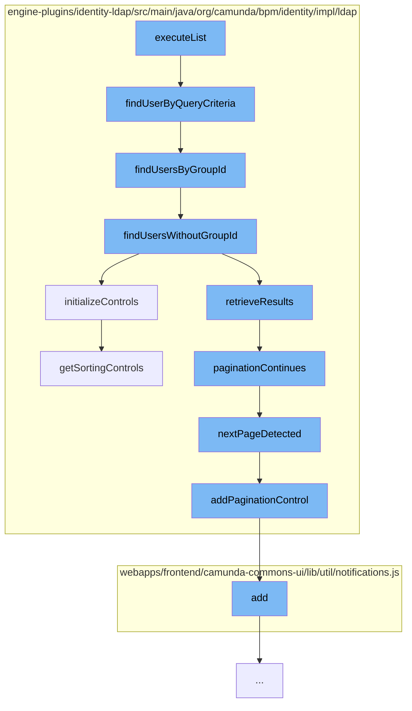

This document will cover the process of executing a user query in the LDAP identity provider plugin, which includes:

1. Executing the list of users
2. Finding users by query criteria
3. Finding users by group ID
4. Finding users without a group ID
5. Initializing controls for the query
6. Checking if pagination continues
7. Detecting the next page
8. Adding pagination control
9. Getting sorting controls.



<SwmSnippet path="/engine-plugins/identity-ldap/src/main/java/org/camunda/bpm/identity/impl/ldap/LdapUserQueryImpl.java" line="1">

---

# Executing the list of users

The `executeList` function is the entry point for executing a user query. It calls the `findUserByQueryCriteria` function to start the process.

```java
/*
```

---

</SwmSnippet>

<SwmSnippet path="/engine-plugins/identity-ldap/src/main/java/org/camunda/bpm/identity/impl/ldap/LdapIdentityProviderSession.java" line="115">

---

# Finding users by query criteria

The `findUserByQueryCriteria` function takes a `LdapUserQueryImpl` object as input and uses it to find users. If a group ID is provided in the query, it calls `findUsersByGroupId`, otherwise it calls `findUsersWithoutGroupId`.

```java
  public List<User> findUserByQueryCriteria(LdapUserQueryImpl query) {
    ldapClient.ensureContextInitialized();

    // convert DB wildcards to LDAP wildcards if necessary
    if (query.getEmailLike() != null) {
      query.userEmailLike(query.getEmailLike().replaceAll(DB_QUERY_WILDCARD, LDAP_QUERY_WILDCARD));
    }
    if (query.getFirstNameLike() != null) {
      query.userFirstNameLike(query.getFirstNameLike().replaceAll(DB_QUERY_WILDCARD, LDAP_QUERY_WILDCARD));
    }
    if (query.getLastNameLike() != null) {
      query.userLastNameLike(query.getLastNameLike().replaceAll(DB_QUERY_WILDCARD, LDAP_QUERY_WILDCARD));
    }

    if (query.getGroupId() != null) {
      // if restriction on groupId is provided, we need to search in group tree first, look for the group and then further restrict on the members
      return findUsersByGroupId(query);
    } else {
      String userBaseDn = composeDn(ldapConfiguration.getUserSearchBase(), ldapConfiguration.getBaseDn());
      return findUsersWithoutGroupId(query, userBaseDn, false);
    }
```

---

</SwmSnippet>

<SwmSnippet path="/engine-plugins/identity-ldap/src/main/java/org/camunda/bpm/identity/impl/ldap/LdapIdentityProviderSession.java" line="142">

---

# Finding users by group ID

The `findUsersByGroupId` function finds users that belong to a specific group. It initializes controls for the query and retrieves the results.

```java
  protected List<User> findUsersByGroupId(LdapUserQueryImpl query) {
    String baseDn = getDnForGroup(query.getGroupId());

    // compose group search filter
    String groupSearchFilter = "(& " + ldapConfiguration.getGroupSearchFilter() + ")";

    initializeControls(query);

    List<String> groupMembers = new ArrayList<>();
    int resultCount = 0;

    do {
      try (LdapSearchResults searchResults = ldapClient.search(baseDn, groupSearchFilter)) {
        // first find group
        while (searchResults.hasMoreElements()) {
          String groupMemberAttribute = ldapConfiguration.getGroupMemberAttribute();
          NamingEnumeration<String> allGroupMembers = LdapClient.getAllMembers(groupMemberAttribute, searchResults);
          if (allGroupMembers != null) {
            // iterate group members
            while (allGroupMembers.hasMoreElements()) {
              if (resultCount >= query.getFirstResult()) {
```

---

</SwmSnippet>

<SwmSnippet path="/engine-plugins/identity-ldap/src/main/java/org/camunda/bpm/identity/impl/ldap/LdapIdentityProviderSession.java" line="292">

---

# Finding users without a group ID

The `findUsersWithoutGroupId` function finds users that do not belong to a specific group. It initializes controls for the query and retrieves the results.

```java
  public List<User> findUsersWithoutGroupId(LdapUserQueryImpl query, String userBaseDn, boolean ignorePagination) {
    initializeControls(query);

    return retrieveResults(userBaseDn,
        getUserSearchFilter(query),
        this::transformUser,
        this::isAuthenticatedAndAuthorized,
        query.getMaxResults(),
        query.getFirstResult(),
        ignorePagination);
  }
```

---

</SwmSnippet>

<SwmSnippet path="/engine-plugins/identity-ldap/src/main/java/org/camunda/bpm/identity/impl/ldap/LdapIdentityProviderSession.java" line="611">

---

# Initializing controls for the query

The `initializeControls` function initializes paged results and sort controls for the query.

```java
  /**
   * Initializes paged results and sort controls. Might not be supported by all LDAP implementations.
   */
  protected void initializeControls(AbstractQuery<?, ?> query) {
    List<Control> listControls = new ArrayList<>();
    if (ldapConfiguration.isSortControlSupported()) {
      listControls.addAll(getSortingControls(query));
    }

    try {
      if (isPaginationSupported()) {
        LdapClient.addPaginationControl(listControls, null, getPageSize());
      }
    } catch (IdentityProviderException ignored) {
      // Ignore exception when pagination is not supported
    } finally {
      if (!listControls.isEmpty()) {
        ldapClient.setRequestControls(listControls);
      }
    }
  }
```

---

</SwmSnippet>

<SwmSnippet path="/engine-plugins/identity-ldap/src/main/java/org/camunda/bpm/identity/impl/ldap/LdapIdentityProviderSession.java" line="138">

---

# Checking if pagination continues

The `paginationContinues` function checks if there are more pages of results to be retrieved.

```java
  protected boolean paginationContinues(int currentSize, int maxResults) {
    return nextPageDetected() && currentSize < maxResults;
  }
```

---

</SwmSnippet>

<SwmSnippet path="/engine-plugins/identity-ldap/src/main/java/org/camunda/bpm/identity/impl/ldap/LdapIdentityProviderSession.java" line="633">

---

# Detecting the next page

The `nextPageDetected` function checks if there is a next page of results and updates the request controls if there is.

```java
  /**
   * Check in the context if we reach the last page on the query
   *
   * @return new page detected
   */
  protected boolean nextPageDetected() {
    // if the pagination is not activated, there isn't a next page.
    if (!isPaginationSupported()) {
      return false;
    }

    Control[] controls = ldapClient.getResponseControls();
    if (controls == null) {
      return false;
    }

    List<Control> newControlList = new ArrayList<>();
    boolean newPageDetected = false;
    for (Control control : controls) {
      if (control instanceof PagedResultsResponseControl) {
        PagedResultsResponseControl prrc = (PagedResultsResponseControl) control;
```

---

</SwmSnippet>

<SwmSnippet path="/engine-plugins/identity-ldap/src/main/java/org/camunda/bpm/identity/impl/ldap/LdapClient.java" line="137">

---

# Adding pagination control

The `addPaginationControl` function adds a pagination control to the list of controls.

```java
  public static void addPaginationControl(List<Control> listControls, byte[] cookie, Integer pageSize) {
    try {
      listControls.add(new PagedResultsControl(pageSize, cookie, Control.NONCRITICAL));
    } catch (IOException e) {
      throw new IdentityProviderException("Pagination couldn't be enabled.", e);
    }
  }
```

---

</SwmSnippet>

<SwmSnippet path="/engine-plugins/identity-ldap/src/main/java/org/camunda/bpm/identity/impl/ldap/LdapIdentityProviderSession.java" line="489">

---

# Getting sorting controls

The `getSortingControls` function returns a list of controls for sorting the query results.

```java
  /**
   * Return the list of Controls requested in the query. Query may be run on USERS or on GROUP
   *
   * @param query query asks, contains the order by requested
   * @return list of control to send to LDAP
   */
  protected List<Control> getSortingControls(AbstractQuery<?, ?> query) {
    List<Control> controls = new ArrayList<>();

    List<QueryOrderingProperty> orderBy = query.getOrderingProperties();
    if (orderBy != null) {
      for (QueryOrderingProperty orderingProperty : orderBy) {
        String propertyName = orderingProperty.getQueryProperty().getName();
        SortKey sortKey = getSortKey(query, propertyName, orderingProperty);

        if (sortKey != null) {
          LdapClient.addSortKey(sortKey, controls);
        }
      }
    }

```

---

</SwmSnippet>

&nbsp;

*This is an auto-generated document by Swimm AI 🌊 and has not yet been verified by a human*

<SwmMeta version="3.0.0" repo-id="Z2l0aHViJTNBJTNBQ2l0aS1jYW11bmRhJTNBJTNBZ2lsYWRuYXZvdA==" repo-name="Citi-camunda" doc-type="flows"><sup>Powered by [Swimm](/)</sup></SwmMeta>
