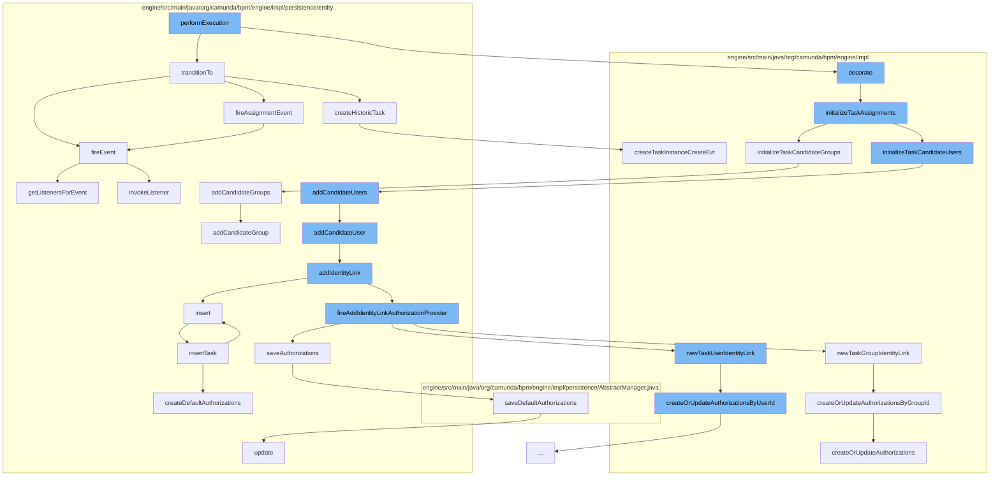

This document will cover the process of User Task Execution in Camunda, which includes:

1. Execution of User Task
2. Transition of Task State
3. Initialization of Task Assignments
4. Adding Candidate Users and Groups
5. Identity Link Creation
6. Authorization Management
7. Event Firing and Handling.



<SwmSnippet path="/engine/src/main/java/org/camunda/bpm/engine/impl/bpmn/behavior/UserTaskActivityBehavior.java" line="1">

---

# Execution of User Task

The `performExecution` function in `UserTaskActivityBehavior.java` is the entry point for executing a user task in Camunda. It orchestrates the entire flow of user task execution.

```java
/*
 * Copyright Camunda Services GmbH and/or licensed to Camunda Services GmbH
 * under one or more contributor license agreements. See the NOTICE file
 * distributed with this work for additional information regarding copyright
 * ownership. Camunda licenses this file to you under the Apache License,
 * Version 2.0; you may not use this file except in compliance with the License.
 * You may obtain a copy of the License at
 *
 *     http://www.apache.org/licenses/LICENSE-2.0
 *
 * Unless required by applicable law or agreed to in writing, software
 * distributed under the License is distributed on an "AS IS" BASIS,
 * WITHOUT WARRANTIES OR CONDITIONS OF ANY KIND, either express or implied.
 * See the License for the specific language governing permissions and
 * limitations under the License.
 */
package org.camunda.bpm.engine.impl.bpmn.behavior;

import java.util.Collection;

import org.camunda.bpm.engine.impl.el.ExpressionManager;
```

---

</SwmSnippet>

<SwmSnippet path="/engine/src/main/java/org/camunda/bpm/engine/impl/persistence/entity/TaskEntity.java" line="1178">

---

# Transition of Task State

The `transitionTo` function in `TaskEntity.java` is responsible for transitioning the state of a task. It handles different states like CREATED, COMPLETED, DELETED, and INIT.

```java
  public boolean transitionTo(TaskState state) {
    this.lifecycleState = state;
    this.taskState = this.lifecycleState.taskState;

    switch (state) {
    case STATE_CREATED:
      CommandContext commandContext = Context.getCommandContext();
      if (commandContext != null) {
        commandContext.getHistoricTaskInstanceManager().createHistoricTask(this);
      }
      return fireEvent(TaskListener.EVENTNAME_CREATE) && fireAssignmentEvent();

    case STATE_COMPLETED:
      return fireEvent(TaskListener.EVENTNAME_COMPLETE) && TaskState.STATE_COMPLETED.equals(this.lifecycleState);

    case STATE_DELETED:
      return fireEvent(EVENTNAME_DELETE);

    case STATE_INIT:
    default:
      throw new ProcessEngineException(String.format("Task %s cannot transition into state %s.", id, state));
```

---

</SwmSnippet>

<SwmSnippet path="/engine/src/main/java/org/camunda/bpm/engine/impl/task/TaskDecorator.java" line="145">

---

# Initialization of Task Assignments

The `initializeTaskAssignments` function in `TaskDecorator.java` initializes task assignments including assignee, candidate users, and candidate groups.

```java
  protected void initializeTaskAssignments(TaskEntity task, VariableScope variableScope) {
    // assignee
    initializeTaskAssignee(task, variableScope);
    // candidateUsers
    initializeTaskCandidateUsers(task, variableScope);
    // candidateGroups
    initializeTaskCandidateGroups(task, variableScope);
  }
```

---

</SwmSnippet>

<SwmSnippet path="/engine/src/main/java/org/camunda/bpm/engine/impl/persistence/entity/TaskEntity.java" line="794">

---

# Adding Candidate Users and Groups

The `addCandidateUsers` and `addCandidateGroups` functions in `TaskEntity.java` are used to add candidate users and groups to a task.

```java
  @Override
  public void addCandidateUsers(Collection<String> candidateUsers) {
    for (String candidateUser : candidateUsers) {
      addCandidateUser(candidateUser);
    }
  }

  @Override
  public void addCandidateGroup(String groupId) {
    addIdentityLink(null, groupId, IdentityLinkType.CANDIDATE);
  }

  @Override
  public void addCandidateGroups(Collection<String> candidateGroups) {
    for (String candidateGroup : candidateGroups) {
      addCandidateGroup(candidateGroup);
    }
  }
```

---

</SwmSnippet>

<SwmSnippet path="/engine/src/main/java/org/camunda/bpm/engine/impl/persistence/entity/TaskEntity.java" line="726">

---

# Identity Link Creation

The `addIdentityLink` function in `TaskEntity.java` is used to create an identity link for a task. An identity link is a link between a task and a user or group.

```java
  // task assignment //////////////////////////////////////////////////////////

  public IdentityLinkEntity addIdentityLink(String userId, String groupId, String type) {
    ensureTaskActive();

    IdentityLinkEntity identityLink = newIdentityLink(userId, groupId, type);
    identityLink.insert();
    getIdentityLinks().add(identityLink);

    fireAddIdentityLinkAuthorizationProvider(type, userId, groupId);
    return identityLink;
  }
```

---

</SwmSnippet>

<SwmSnippet path="/engine/src/main/java/org/camunda/bpm/engine/impl/cfg/auth/DefaultAuthorizationProvider.java" line="261">

---

# Authorization Management

The `createOrUpdateAuthorizations` function in `DefaultAuthorizationProvider.java` is used to create or update authorizations for a task. It handles both runtime and historic instance permissions.

```java
  /**
   * (1) Fetch existing runtime & history authorizations
   * (2) Update authorizations:
   *     (2a) fetched authorization == null
   *         ->  create a new runtime authorization (with READ, (UPDATE/TASK_WORK) permission,
   *             and READ_VARIABLE if enabled)
   *         ->  create a new history authorization (with READ on HISTORIC_TASK)
   *     (2b) fetched authorization != null
   *         ->  Add READ, (UPDATE/TASK_WORK) permission, and READ_VARIABLE if enabled
   *             UPDATE or TASK_WORK permission is configurable in camunda.cfg.xml and by default,
   *             UPDATE permission is provided
   *         ->  Add READ on HISTORIC_TASK
   */
  protected AuthorizationEntity[] createOrUpdateAuthorizations(Task task, String groupId,
                                                               String userId) {

    boolean enforceSpecificVariablePermission = isEnforceSpecificVariablePermission();

    Permission[] runtimeTaskPermissions = getRuntimePermissions(enforceSpecificVariablePermission);

    AuthorizationEntity runtimeAuthorization = createOrUpdateAuthorization(task, userId, groupId,
```

---

</SwmSnippet>

<SwmSnippet path="/engine/src/main/java/org/camunda/bpm/engine/impl/persistence/entity/TaskEntity.java" line="1032">

---

# Event Firing and Handling

The `fireEvent` function in `TaskEntity.java` is used to fire events and handle them. It gets the listeners for an event and invokes them.

```java
  /**
   * @return true if invoking the listener was successful;
   *   if not successful, either false is returned (case: BPMN error propagation)
   *   or an exception is thrown
   */
  public boolean fireEvent(String taskEventName) {

    List<TaskListener> taskEventListeners = getListenersForEvent(taskEventName);

    if (taskEventListeners != null) {
      for (TaskListener taskListener : taskEventListeners) {
        if (!invokeListener(taskEventName, taskListener)){
          return false;
        }
      }
    }

    return true;
  }
```

---

</SwmSnippet>

&nbsp;

*This is an auto-generated document by Swimm AI 🌊 and has not yet been verified by a human*

<SwmMeta version="3.0.0" repo-id="Z2l0aHViJTNBJTNBQ2l0aS1jYW11bmRhJTNBJTNBZ2lsYWRuYXZvdA==" repo-name="Citi-camunda" doc-type="flows"><sup>Powered by [Swimm](/)</sup></SwmMeta>
