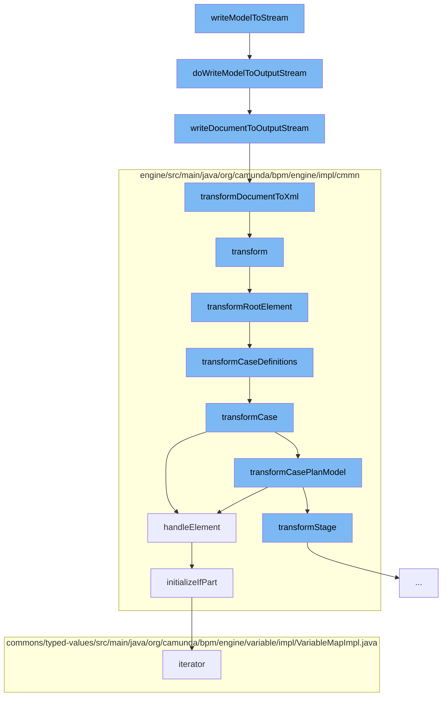

This document will cover the process of writing a BPMN model to a stream in the Citi-camunda repository. The process includes the following steps:

1. Writing the model to an output stream
2. Transforming the model to XML
3. Transforming the XML to a case definition
4. Handling the sentry element of the case definition
5. Initializing the 'if' part of the sentry element



<SwmSnippet path="/model-api/bpmn-model/src/main/java/org/camunda/bpm/model/bpmn/Bpmn.java" line="434">

---

# Writing the model to an output stream

The function `doWriteModelToOutputStream` is used to write the BPMN model instance to an output stream. It first validates the model instance and then writes the XML document of the model instance to the output stream.

```java
  protected void doWriteModelToOutputStream(OutputStream os, BpmnModelInstance modelInstance) {
    // validate DOM document
    doValidateModel(modelInstance);
    // write XML
    IoUtil.writeDocumentToOutputStream(modelInstance.getDocument(), os);
  }
```

---

</SwmSnippet>

<SwmSnippet path="/model-api/xml-model/src/main/java/org/camunda/bpm/model/xml/impl/util/IoUtil.java" line="113">

---

# Transforming the model to XML

The function `writeDocumentToOutputStream` is used to write the DOM document to an output stream by transforming the DOM to XML.

```java
  public static void writeDocumentToOutputStream(DomDocument document, OutputStream outputStream) {
    StreamResult result = new StreamResult(outputStream);
    transformDocumentToXml(document, result);
  }
```

---

</SwmSnippet>

<SwmSnippet path="/engine/src/main/java/org/camunda/bpm/engine/impl/cmmn/transformer/CmmnTransform.java" line="98">

---

# Transforming the XML to a case definition

The function `transform` is used to transform the XML to a list of case definitions. It reads the model from the input stream, sets the model and deployment in the context, and then transforms the root element of the model.

```java
  public List<CaseDefinitionEntity> transform() {
    // get name of resource
    String resourceName = resource.getName();

    // create an input stream
    byte[] bytes = resource.getBytes();
    ByteArrayInputStream inputStream = new ByteArrayInputStream(bytes);

    try {
      // read input stream
      model = Cmmn.readModelFromStream(inputStream);

    } catch (CmmnModelException e) {
      throw LOG.transformResourceException(resourceName, e);
    }

    // TODO: use model API to validate (ie.
    // semantic and execution validation) model

    context.setModel(model);
    context.setDeployment(deployment);
```

---

</SwmSnippet>

<SwmSnippet path="/engine/src/main/java/org/camunda/bpm/engine/impl/cmmn/handler/SentryHandler.java" line="55">

---

# Handling the sentry element of the case definition

The function `handleElement` is used to handle the sentry element of the case definition. It initializes the 'if' part and the variable on parts of the sentry declaration immediately, while the on parts are initialized later because their references cannot be set in this step.

```java
  public CmmnSentryDeclaration handleElement(Sentry element, CmmnHandlerContext context) {

    String id = element.getId();
    Collection<OnPart> onParts = element.getOnParts();
    IfPart ifPart = element.getIfPart();
    List<CamundaVariableOnPart> variableOnParts = queryExtensionElementsByClass(element, CamundaVariableOnPart.class);

    if ((ifPart == null || ifPart.getConditions().isEmpty()) && variableOnParts.isEmpty()) {

      if (onParts == null || onParts.isEmpty()) {
        LOG.ignoredSentryWithMissingCondition(id);
        return null;
      } else {
        boolean atLeastOneOnPartsValid = false;

        for (OnPart onPart : onParts) {
          if (onPart instanceof PlanItemOnPart) {
            PlanItemOnPart planItemOnPart = (PlanItemOnPart) onPart;
            if (planItemOnPart.getSource() != null && planItemOnPart.getStandardEvent() != null) {
              atLeastOneOnPartsValid = true;
              break;
```

---

</SwmSnippet>

<SwmSnippet path="/engine/src/main/java/org/camunda/bpm/engine/impl/cmmn/handler/SentryHandler.java" line="165">

---

# Initializing the 'if' part of the sentry element

The function `initializeIfPart` is used to initialize the 'if' part of the sentry declaration. If the 'if' part is not null, it creates an expression from the condition text and sets it as the condition of the 'if' part declaration.

```java
  protected void initializeIfPart(IfPart ifPart, CmmnSentryDeclaration sentryDeclaration, CmmnHandlerContext context) {
    if (ifPart == null) {
      return;
    }

    Collection<ConditionExpression> conditions = ifPart.getConditions();

    if (conditions.size() > 1) {
      String id = sentryDeclaration.getId();
      LOG.multipleIgnoredConditions(id);
    }

    ExpressionManager expressionManager = context.getExpressionManager();
    ConditionExpression condition = conditions.iterator().next();
    Expression conditionExpression = expressionManager.createExpression(condition.getText());

    CmmnIfPartDeclaration ifPartDeclaration = new CmmnIfPartDeclaration();
    ifPartDeclaration.setCondition(conditionExpression);
    sentryDeclaration.setIfPart(ifPartDeclaration);
  }
```

---

</SwmSnippet>

&nbsp;

*This is an auto-generated document by Swimm AI 🌊 and has not yet been verified by a human*

<SwmMeta version="3.0.0" repo-id="Z2l0aHViJTNBJTNBQ2l0aS1jYW11bmRhJTNBJTNBZ2lsYWRuYXZvdA==" repo-name="Citi-camunda" doc-type="flows"><sup>Powered by [Swimm](/)</sup></SwmMeta>
