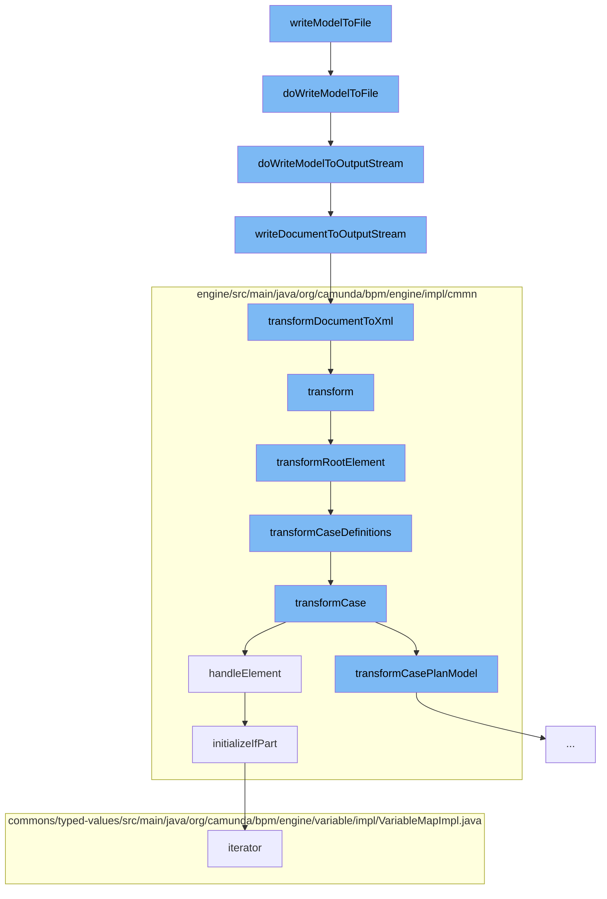

This document will cover the process of writing a CMMN model to a file in the Citi-camunda project. The process includes the following steps:

 1. Writing the model to a file
 2. Writing the model to an output stream
 3. Writing the DOM document to an output stream
 4. Transforming the DOM document to XML
 5. Transforming the CMMN model
 6. Transforming the root element of the CMMN model
 7. Transforming the case definitions of the CMMN model
 8. Transforming a case of the CMMN model
 9. Handling a sentry element in the CMMN model
10. Initializing the if part of a sentry
11. Iterating over the variables in the if part



<SwmSnippet path="/model-api/cmmn-model/src/main/java/org/camunda/bpm/model/cmmn/Cmmn.java" line="260">

---

# Writing the model to a file

The `doWriteModelToFile` function is responsible for writing the CMMN model to a file. It creates a new `FileOutputStream` for the file and calls `doWriteModelToOutputStream` to write the model to this stream.

```java
  protected void doWriteModelToFile(File file, CmmnModelInstance modelInstance) {
    OutputStream os = null;
    try {
      os = new FileOutputStream(file);
      doWriteModelToOutputStream(os, modelInstance);
    }
    catch (FileNotFoundException e) {
      throw new CmmnModelException("Cannot write model to file "+file+": file does not exist.");
    } finally {
      IoUtil.closeSilently(os);
    }
  }
```

---

</SwmSnippet>

<SwmSnippet path="/model-api/cmmn-model/src/main/java/org/camunda/bpm/model/cmmn/Cmmn.java" line="273">

---

# Writing the model to an output stream

The `doWriteModelToOutputStream` function writes the CMMN model to an output stream. It first validates the model and then calls `IoUtil.writeDocumentToOutputStream` to write the model's document to the stream.

```java
  protected void doWriteModelToOutputStream(OutputStream os, CmmnModelInstance modelInstance) {
    // validate DOM document
    doValidateModel(modelInstance);
    // write XML
    IoUtil.writeDocumentToOutputStream(modelInstance.getDocument(), os);
  }
```

---

</SwmSnippet>

<SwmSnippet path="/model-api/xml-model/src/main/java/org/camunda/bpm/model/xml/impl/util/IoUtil.java" line="113">

---

# Writing the DOM document to an output stream

The `writeDocumentToOutputStream` function writes a DOM document to an output stream by transforming the DOM to XML using the `transformDocumentToXml` function.

```java
  public static void writeDocumentToOutputStream(DomDocument document, OutputStream outputStream) {
    StreamResult result = new StreamResult(outputStream);
    transformDocumentToXml(document, result);
  }
```

---

</SwmSnippet>

<SwmSnippet path="/model-api/xml-model/src/main/java/org/camunda/bpm/model/xml/impl/util/IoUtil.java" line="124">

---

# Transforming the DOM document to XML

The `transformDocumentToXml` function transforms a DOM document to XML output. It creates a new `Transformer` and sets its output properties before transforming the document to XML.

```java
  public static void transformDocumentToXml(DomDocument document, StreamResult result) {
    TransformerFactory transformerFactory = TransformerFactory.newInstance();
    try {
      Transformer transformer = transformerFactory.newTransformer();
      transformer.setOutputProperty(OutputKeys.ENCODING, "UTF-8");
      transformer.setOutputProperty(OutputKeys.INDENT, "yes");
      transformer.setOutputProperty("{http://xml.apache.org/xslt}indent-amount", "2");

      synchronized(document) {
        transformer.transform(document.getDomSource(), result);
      }
    } catch (TransformerConfigurationException e) {
      throw new ModelIoException("Unable to create a transformer for the model", e);
    } catch (TransformerException e) {
      throw new ModelIoException("Unable to transform model to xml", e);
    }
  }
```

---

</SwmSnippet>

<SwmSnippet path="/engine/src/main/java/org/camunda/bpm/engine/impl/cmmn/transformer/CmmnTransform.java" line="98">

---

# Transforming the CMMN model

The `transform` function transforms the CMMN model. It reads the model from an input stream and sets it in the context. Then it calls `transformRootElement` to transform the root element of the model.

```java
  public List<CaseDefinitionEntity> transform() {
    // get name of resource
    String resourceName = resource.getName();

    // create an input stream
    byte[] bytes = resource.getBytes();
    ByteArrayInputStream inputStream = new ByteArrayInputStream(bytes);

    try {
      // read input stream
      model = Cmmn.readModelFromStream(inputStream);

    } catch (CmmnModelException e) {
      throw LOG.transformResourceException(resourceName, e);
    }

    // TODO: use model API to validate (ie.
    // semantic and execution validation) model

    context.setModel(model);
    context.setDeployment(deployment);
```

---

</SwmSnippet>

<SwmSnippet path="/engine/src/main/java/org/camunda/bpm/engine/impl/cmmn/transformer/CmmnTransform.java" line="134">

---

# Transforming the root element of the CMMN model

The `transformRootElement` function transforms the root element of the CMMN model. It transforms the imports and case definitions of the model.

```java
  protected void transformRootElement() {

    transformImports();
    transformCaseDefinitions();

    Definitions definitions = model.getDefinitions();
    for (CmmnTransformListener transformListener : transformListeners) {
      transformListener.transformRootElement(definitions, caseDefinitions);
    }

  }
```

---

</SwmSnippet>

<SwmSnippet path="/engine/src/main/java/org/camunda/bpm/engine/impl/cmmn/transformer/CmmnTransform.java" line="150">

---

# Transforming the case definitions of the CMMN model

The `transformCaseDefinitions` function transforms the case definitions of the CMMN model. It gets the cases from the model's definitions and transforms each case using the `transformCase` function.

```java
  protected void transformCaseDefinitions() {
    Definitions definitions = model.getDefinitions();

    Collection<Case> cases = definitions.getCases();

    for (Case currentCase : cases) {
      context.setCaseDefinition(null);
      context.setParent(null);
      CmmnCaseDefinition caseDefinition = transformCase(currentCase);
      caseDefinitions.add((CaseDefinitionEntity) caseDefinition);
    }
  }
```

---

</SwmSnippet>

<SwmSnippet path="/engine/src/main/java/org/camunda/bpm/engine/impl/cmmn/transformer/CmmnTransform.java" line="163">

---

# Transforming a case of the CMMN model

The `transformCase` function transforms a case of the CMMN model. It gets a handler for the case and uses it to handle the case element. Then it transforms the case plan model of the case.

```java
  protected CaseDefinitionEntity transformCase(Case element) {
    // get CaseTransformer
    CmmnElementHandler<Case, CmmnActivity> caseTransformer = getDefinitionHandler(Case.class);
    CmmnActivity definition = caseTransformer.handleElement(element, context);

    context.setCaseDefinition((CmmnCaseDefinition) definition);
    context.setParent(definition);

    CasePlanModel casePlanModel = element.getCasePlanModel();
    transformCasePlanModel(casePlanModel);

    for (CmmnTransformListener transformListener : transformListeners) {
      transformListener.transformCase(element, (CmmnCaseDefinition) definition);
    }

    return (CaseDefinitionEntity) definition;
  }
```

---

</SwmSnippet>

<SwmSnippet path="/engine/src/main/java/org/camunda/bpm/engine/impl/cmmn/handler/SentryHandler.java" line="55">

---

# Handling a sentry element in the CMMN model

The `handleElement` function handles a sentry element in the CMMN model. It gets the on parts and if part of the sentry and initializes the if part using the `initializeIfPart` function.

```java
  public CmmnSentryDeclaration handleElement(Sentry element, CmmnHandlerContext context) {

    String id = element.getId();
    Collection<OnPart> onParts = element.getOnParts();
    IfPart ifPart = element.getIfPart();
    List<CamundaVariableOnPart> variableOnParts = queryExtensionElementsByClass(element, CamundaVariableOnPart.class);

    if ((ifPart == null || ifPart.getConditions().isEmpty()) && variableOnParts.isEmpty()) {

      if (onParts == null || onParts.isEmpty()) {
        LOG.ignoredSentryWithMissingCondition(id);
        return null;
      } else {
        boolean atLeastOneOnPartsValid = false;

        for (OnPart onPart : onParts) {
          if (onPart instanceof PlanItemOnPart) {
            PlanItemOnPart planItemOnPart = (PlanItemOnPart) onPart;
            if (planItemOnPart.getSource() != null && planItemOnPart.getStandardEvent() != null) {
              atLeastOneOnPartsValid = true;
              break;
```

---

</SwmSnippet>

<SwmSnippet path="/engine/src/main/java/org/camunda/bpm/engine/impl/cmmn/handler/SentryHandler.java" line="165">

---

# Initializing the if part of a sentry

The `initializeIfPart` function initializes the if part of a sentry. It creates an expression for the condition of the if part and sets it in a new `CmmnIfPartDeclaration`.

```java
  protected void initializeIfPart(IfPart ifPart, CmmnSentryDeclaration sentryDeclaration, CmmnHandlerContext context) {
    if (ifPart == null) {
      return;
    }

    Collection<ConditionExpression> conditions = ifPart.getConditions();

    if (conditions.size() > 1) {
      String id = sentryDeclaration.getId();
      LOG.multipleIgnoredConditions(id);
    }

    ExpressionManager expressionManager = context.getExpressionManager();
    ConditionExpression condition = conditions.iterator().next();
    Expression conditionExpression = expressionManager.createExpression(condition.getText());

    CmmnIfPartDeclaration ifPartDeclaration = new CmmnIfPartDeclaration();
    ifPartDeclaration.setCondition(conditionExpression);
    sentryDeclaration.setIfPart(ifPartDeclaration);
  }
```

---

</SwmSnippet>

<SwmSnippet path="/commons/typed-values/src/main/java/org/camunda/bpm/engine/variable/impl/VariableMapImpl.java" line="176">

---

# Iterating over the variables in the if part

The `iterator` function is used to iterate over the variables in the if part. It returns an iterator that iterates over the values of the variables.

```java
      public Iterator<Object> iterator() {

        // wrapped iterator. Must be local to the iterator() method
        final Iterator<TypedValue> iterator = variables.values().iterator();

        return new Iterator<Object>() {
          public boolean hasNext() {
            return iterator.hasNext();
          }
          public Object next() {
            return iterator.next().getValue();
          }
          public void remove() {
            iterator.remove();
          }
        };
      }
```

---

</SwmSnippet>

&nbsp;

*This is an auto-generated document by Swimm AI 🌊 and has not yet been verified by a human*

<SwmMeta version="3.0.0" repo-id="Z2l0aHViJTNBJTNBQ2l0aS1jYW11bmRhJTNBJTNBZ2lsYWRuYXZvdA==" repo-name="Citi-camunda" doc-type="flows"><sup>Powered by [Swimm](/)</sup></SwmMeta>
