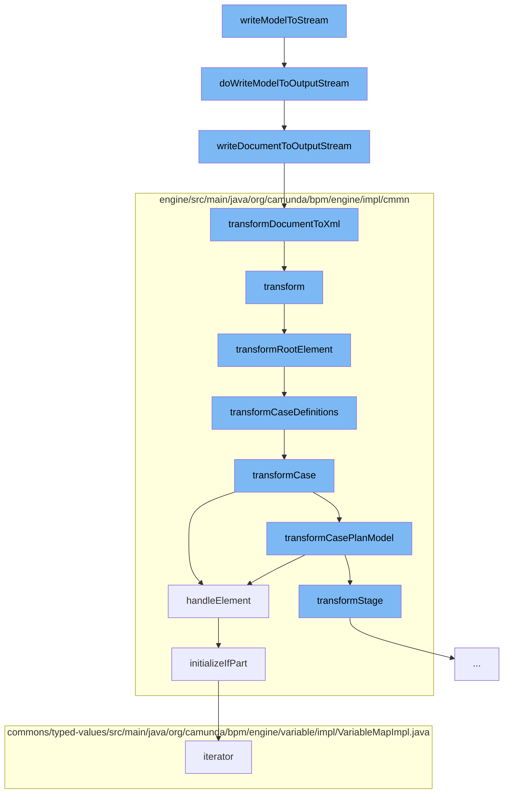

This document will cover the process of writing a Decision Model and Notation (DMN) model to a stream in the Citi-camunda project. The process includes the following steps:

1. Writing the model to an output stream
2. Writing the DOM document to an output stream
3. Transforming the DOM document to XML
4. Transforming the CMMN model
5. Transforming the root element of the CMMN model
6. Transforming the case definitions of the CMMN model
7. Handling the sentry element of the CMMN model
8. Initializing the 'if' part of the sentry element



<SwmSnippet path="/model-api/dmn-model/src/main/java/org/camunda/bpm/model/dmn/Dmn.java" line="267">

---

# Writing the model to an output stream

The function `doWriteModelToOutputStream` is used to write the DMN model instance to an output stream. It first validates the model instance and then writes the XML document of the model instance to the output stream.

```java
  protected void doWriteModelToOutputStream(OutputStream os, DmnModelInstance modelInstance) {
    // validate DOM document
    doValidateModel(modelInstance);
    // write XML
    IoUtil.writeDocumentToOutputStream(modelInstance.getDocument(), os);
  }
```

---

</SwmSnippet>

<SwmSnippet path="/model-api/xml-model/src/main/java/org/camunda/bpm/model/xml/impl/util/IoUtil.java" line="113">

---

# Writing the DOM document to an output stream

The function `writeDocumentToOutputStream` is used to write the DOM document to an output stream by transforming the DOM to XML.

```java
  public static void writeDocumentToOutputStream(DomDocument document, OutputStream outputStream) {
    StreamResult result = new StreamResult(outputStream);
    transformDocumentToXml(document, result);
  }
```

---

</SwmSnippet>

<SwmSnippet path="/model-api/xml-model/src/main/java/org/camunda/bpm/model/xml/impl/util/IoUtil.java" line="124">

---

# Transforming the DOM document to XML

The function `transformDocumentToXml` is used to transform the DOM document to XML output. It creates a new transformer and sets the output properties for the transformer. Then it uses the transformer to transform the DOM source to the result.

```java
  public static void transformDocumentToXml(DomDocument document, StreamResult result) {
    TransformerFactory transformerFactory = TransformerFactory.newInstance();
    try {
      Transformer transformer = transformerFactory.newTransformer();
      transformer.setOutputProperty(OutputKeys.ENCODING, "UTF-8");
      transformer.setOutputProperty(OutputKeys.INDENT, "yes");
      transformer.setOutputProperty("{http://xml.apache.org/xslt}indent-amount", "2");

      synchronized(document) {
        transformer.transform(document.getDomSource(), result);
      }
    } catch (TransformerConfigurationException e) {
      throw new ModelIoException("Unable to create a transformer for the model", e);
    } catch (TransformerException e) {
      throw new ModelIoException("Unable to transform model to xml", e);
    }
  }
```

---

</SwmSnippet>

<SwmSnippet path="/engine/src/main/java/org/camunda/bpm/engine/impl/cmmn/transformer/CmmnTransform.java" line="98">

---

# Transforming the CMMN model

The function `transform` is used to transform the CMMN model. It reads the model from an input stream and sets the model, deployment, and expression manager in the context. Then it transforms the root element of the model.

```java
  public List<CaseDefinitionEntity> transform() {
    // get name of resource
    String resourceName = resource.getName();

    // create an input stream
    byte[] bytes = resource.getBytes();
    ByteArrayInputStream inputStream = new ByteArrayInputStream(bytes);

    try {
      // read input stream
      model = Cmmn.readModelFromStream(inputStream);

    } catch (CmmnModelException e) {
      throw LOG.transformResourceException(resourceName, e);
    }

    // TODO: use model API to validate (ie.
    // semantic and execution validation) model

    context.setModel(model);
    context.setDeployment(deployment);
```

---

</SwmSnippet>

<SwmSnippet path="/engine/src/main/java/org/camunda/bpm/engine/impl/cmmn/transformer/CmmnTransform.java" line="134">

---

# Transforming the root element of the CMMN model

The function `transformRootElement` is used to transform the root element of the CMMN model. It transforms the imports and case definitions of the model.

```java
  protected void transformRootElement() {

    transformImports();
    transformCaseDefinitions();

    Definitions definitions = model.getDefinitions();
    for (CmmnTransformListener transformListener : transformListeners) {
      transformListener.transformRootElement(definitions, caseDefinitions);
    }

  }
```

---

</SwmSnippet>

<SwmSnippet path="/engine/src/main/java/org/camunda/bpm/engine/impl/cmmn/transformer/CmmnTransform.java" line="150">

---

# Transforming the case definitions of the CMMN model

The function `transformCaseDefinitions` is used to transform the case definitions of the CMMN model. It gets the cases from the definitions and transforms each case.

```java
  protected void transformCaseDefinitions() {
    Definitions definitions = model.getDefinitions();

    Collection<Case> cases = definitions.getCases();

    for (Case currentCase : cases) {
      context.setCaseDefinition(null);
      context.setParent(null);
      CmmnCaseDefinition caseDefinition = transformCase(currentCase);
      caseDefinitions.add((CaseDefinitionEntity) caseDefinition);
    }
  }
```

---

</SwmSnippet>

<SwmSnippet path="/engine/src/main/java/org/camunda/bpm/engine/impl/cmmn/handler/SentryHandler.java" line="55">

---

# Handling the sentry element of the CMMN model

The function `handleElement` is used to handle the sentry element of the CMMN model. It initializes the 'if' part and the variable on parts of the sentry declaration.

```java
  public CmmnSentryDeclaration handleElement(Sentry element, CmmnHandlerContext context) {

    String id = element.getId();
    Collection<OnPart> onParts = element.getOnParts();
    IfPart ifPart = element.getIfPart();
    List<CamundaVariableOnPart> variableOnParts = queryExtensionElementsByClass(element, CamundaVariableOnPart.class);

    if ((ifPart == null || ifPart.getConditions().isEmpty()) && variableOnParts.isEmpty()) {

      if (onParts == null || onParts.isEmpty()) {
        LOG.ignoredSentryWithMissingCondition(id);
        return null;
      } else {
        boolean atLeastOneOnPartsValid = false;

        for (OnPart onPart : onParts) {
          if (onPart instanceof PlanItemOnPart) {
            PlanItemOnPart planItemOnPart = (PlanItemOnPart) onPart;
            if (planItemOnPart.getSource() != null && planItemOnPart.getStandardEvent() != null) {
              atLeastOneOnPartsValid = true;
              break;
```

---

</SwmSnippet>

<SwmSnippet path="/engine/src/main/java/org/camunda/bpm/engine/impl/cmmn/handler/SentryHandler.java" line="165">

---

# Initializing the 'if' part of the sentry element

The function `initializeIfPart` is used to initialize the 'if' part of the sentry declaration. It creates an expression from the condition text and sets the condition in the 'if' part declaration.

```java
  protected void initializeIfPart(IfPart ifPart, CmmnSentryDeclaration sentryDeclaration, CmmnHandlerContext context) {
    if (ifPart == null) {
      return;
    }

    Collection<ConditionExpression> conditions = ifPart.getConditions();

    if (conditions.size() > 1) {
      String id = sentryDeclaration.getId();
      LOG.multipleIgnoredConditions(id);
    }

    ExpressionManager expressionManager = context.getExpressionManager();
    ConditionExpression condition = conditions.iterator().next();
    Expression conditionExpression = expressionManager.createExpression(condition.getText());

    CmmnIfPartDeclaration ifPartDeclaration = new CmmnIfPartDeclaration();
    ifPartDeclaration.setCondition(conditionExpression);
    sentryDeclaration.setIfPart(ifPartDeclaration);
  }
```

---

</SwmSnippet>

&nbsp;

*This is an auto-generated document by Swimm AI 🌊 and has not yet been verified by a human*

<SwmMeta version="3.0.0" repo-id="Z2l0aHViJTNBJTNBQ2l0aS1jYW11bmRhJTNBJTNBZ2lsYWRuYXZvdA==" repo-name="Citi-camunda" doc-type="flows"><sup>Powered by [Swimm](/)</sup></SwmMeta>
