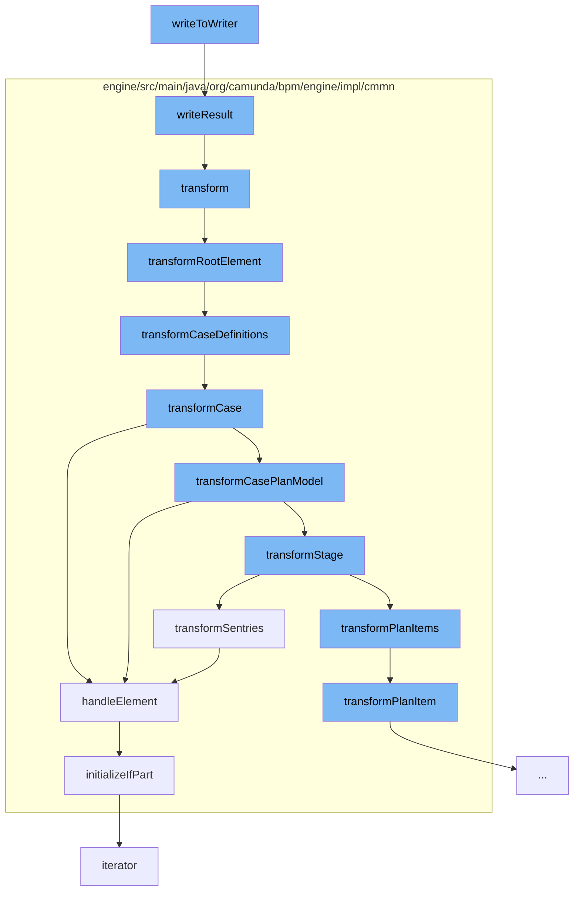

This document will cover the process of XML data transformation and case definition transformation in the Camunda Platform. The process includes:

1. Writing XML data to a stream
2. Transforming the XML data
3. Transforming the root element
4. Transforming case definitions
5. Transforming case plan model
6. Transforming stages
7. Transforming plan items
8. Handling sentry elements
9. Initializing 'if' parts of sentry elements.



<SwmSnippet path="/spin/dataformat-xml-dom/src/main/java/org/camunda/spin/impl/xml/dom/format/DomXmlDataFormatWriter.java" line="60">

---

# Writing XML data to a stream

The `writeToWriter` function takes XML data as input and writes it to a stream. If the `domXmlDataFormat` is set to pretty print, it uses a formatting transformer; otherwise, it uses a regular transformer.

```java
  protected void writeResult(StreamResult streamResult, Object input) {
    Node node = (Node) input;
    DOMSource domSource = new DOMSource(node);
    try {
      if (domXmlDataFormat.isPrettyPrint()) {
        getFormattingTransformer().transform(domSource, streamResult);
      } else {
        getTransformer().transform(domSource, streamResult);
      }
    } catch (TransformerException e) {
      throw LOG.unableToTransformElement(node, e);
    }
  }
```

---

</SwmSnippet>

<SwmSnippet path="/engine/src/main/java/org/camunda/bpm/engine/impl/cmmn/transformer/CmmnTransform.java" line="98">

---

# Transforming the XML data

The `transform` function reads the XML data from the input stream and sets it as the model in the context. It then calls the `transformRootElement` function to start the transformation process.

```java
  public List<CaseDefinitionEntity> transform() {
    // get name of resource
    String resourceName = resource.getName();

    // create an input stream
    byte[] bytes = resource.getBytes();
    ByteArrayInputStream inputStream = new ByteArrayInputStream(bytes);

    try {
      // read input stream
      model = Cmmn.readModelFromStream(inputStream);

    } catch (CmmnModelException e) {
      throw LOG.transformResourceException(resourceName, e);
    }

    // TODO: use model API to validate (ie.
    // semantic and execution validation) model

    context.setModel(model);
    context.setDeployment(deployment);
```

---

</SwmSnippet>

<SwmSnippet path="/engine/src/main/java/org/camunda/bpm/engine/impl/cmmn/transformer/CmmnTransform.java" line="134">

---

# Transforming the root element

The `transformRootElement` function transforms the imports and case definitions of the root element.

```java
  protected void transformRootElement() {

    transformImports();
    transformCaseDefinitions();

    Definitions definitions = model.getDefinitions();
    for (CmmnTransformListener transformListener : transformListeners) {
      transformListener.transformRootElement(definitions, caseDefinitions);
    }

  }
```

---

</SwmSnippet>

<SwmSnippet path="/engine/src/main/java/org/camunda/bpm/engine/impl/cmmn/transformer/CmmnTransform.java" line="150">

---

# Transforming case definitions

The `transformCaseDefinitions` function iterates over the cases in the definitions and transforms each case using the `transformCase` function.

```java
  protected void transformCaseDefinitions() {
    Definitions definitions = model.getDefinitions();

    Collection<Case> cases = definitions.getCases();

    for (Case currentCase : cases) {
      context.setCaseDefinition(null);
      context.setParent(null);
      CmmnCaseDefinition caseDefinition = transformCase(currentCase);
      caseDefinitions.add((CaseDefinitionEntity) caseDefinition);
    }
  }
```

---

</SwmSnippet>

<SwmSnippet path="/engine/src/main/java/org/camunda/bpm/engine/impl/cmmn/transformer/CmmnTransform.java" line="163">

---

# Transforming case plan model

The `transformCase` function handles the case element and transforms the case plan model of the case.

```java
  protected CaseDefinitionEntity transformCase(Case element) {
    // get CaseTransformer
    CmmnElementHandler<Case, CmmnActivity> caseTransformer = getDefinitionHandler(Case.class);
    CmmnActivity definition = caseTransformer.handleElement(element, context);

    context.setCaseDefinition((CmmnCaseDefinition) definition);
    context.setParent(definition);

    CasePlanModel casePlanModel = element.getCasePlanModel();
    transformCasePlanModel(casePlanModel);

    for (CmmnTransformListener transformListener : transformListeners) {
      transformListener.transformCase(element, (CmmnCaseDefinition) definition);
    }

    return (CaseDefinitionEntity) definition;
  }
```

---

</SwmSnippet>

<SwmSnippet path="/engine/src/main/java/org/camunda/bpm/engine/impl/cmmn/transformer/CmmnTransform.java" line="223">

---

# Transforming stages

The `transformSentries` function transforms the sentries of the stage.

```java
  protected void transformSentries(Stage stage) {
    Collection<Sentry> sentries = stage.getSentrys();

    if (sentries != null && !sentries.isEmpty()) {
      SentryHandler handler = getSentryHandler();
      for (Sentry sentry : sentries) {
        handler.handleElement(sentry, context);
      }
    }
  }
```

---

</SwmSnippet>

<SwmSnippet path="/engine/src/main/java/org/camunda/bpm/engine/impl/cmmn/transformer/CmmnTransform.java" line="259">

---

# Transforming plan items

The `transformPlanItem` function transforms the plan item based on its definition type.

```java
  protected void transformPlanItem(PlanItem planItem, CmmnActivity parent) {
    PlanItemDefinition definition = planItem.getDefinition();

    ItemHandler planItemTransformer = null;

    if (definition instanceof HumanTask) {
      planItemTransformer = getPlanItemHandler(HumanTask.class);
    } else if (definition instanceof ProcessTask) {
      planItemTransformer = getPlanItemHandler(ProcessTask.class);
    } else if (definition instanceof CaseTask) {
      planItemTransformer = getPlanItemHandler(CaseTask.class);
    } else if (definition instanceof DecisionTask) {
      planItemTransformer = getPlanItemHandler(DecisionTask.class);
    } else if (definition instanceof Task) {
      planItemTransformer = getPlanItemHandler(Task.class);
    } else if (definition instanceof Stage) {
      planItemTransformer = getPlanItemHandler(Stage.class);
    } else if (definition instanceof Milestone) {
      planItemTransformer = getPlanItemHandler(Milestone.class);
    } else if (definition instanceof EventListener) {
      planItemTransformer = getPlanItemHandler(EventListener.class);
```

---

</SwmSnippet>

<SwmSnippet path="/engine/src/main/java/org/camunda/bpm/engine/impl/cmmn/handler/SentryHandler.java" line="55">

---

# Handling sentry elements

The `handleElement` function handles the sentry element. It initializes the 'if' part and the variable on parts of the sentry immediately, while the on parts are initialized later.

```java
  public CmmnSentryDeclaration handleElement(Sentry element, CmmnHandlerContext context) {

    String id = element.getId();
    Collection<OnPart> onParts = element.getOnParts();
    IfPart ifPart = element.getIfPart();
    List<CamundaVariableOnPart> variableOnParts = queryExtensionElementsByClass(element, CamundaVariableOnPart.class);

    if ((ifPart == null || ifPart.getConditions().isEmpty()) && variableOnParts.isEmpty()) {

      if (onParts == null || onParts.isEmpty()) {
        LOG.ignoredSentryWithMissingCondition(id);
        return null;
      } else {
        boolean atLeastOneOnPartsValid = false;

        for (OnPart onPart : onParts) {
          if (onPart instanceof PlanItemOnPart) {
            PlanItemOnPart planItemOnPart = (PlanItemOnPart) onPart;
            if (planItemOnPart.getSource() != null && planItemOnPart.getStandardEvent() != null) {
              atLeastOneOnPartsValid = true;
              break;
```

---

</SwmSnippet>

<SwmSnippet path="/engine/src/main/java/org/camunda/bpm/engine/impl/cmmn/handler/SentryHandler.java" line="165">

---

# Initializing 'if' parts of sentry elements

The `initializeIfPart` function initializes the 'if' part of the sentry. It creates an expression from the condition text and sets it as the condition of the 'if' part declaration.

```java
  protected void initializeIfPart(IfPart ifPart, CmmnSentryDeclaration sentryDeclaration, CmmnHandlerContext context) {
    if (ifPart == null) {
      return;
    }

    Collection<ConditionExpression> conditions = ifPart.getConditions();

    if (conditions.size() > 1) {
      String id = sentryDeclaration.getId();
      LOG.multipleIgnoredConditions(id);
    }

    ExpressionManager expressionManager = context.getExpressionManager();
    ConditionExpression condition = conditions.iterator().next();
    Expression conditionExpression = expressionManager.createExpression(condition.getText());

    CmmnIfPartDeclaration ifPartDeclaration = new CmmnIfPartDeclaration();
    ifPartDeclaration.setCondition(conditionExpression);
    sentryDeclaration.setIfPart(ifPartDeclaration);
  }
```

---

</SwmSnippet>

&nbsp;

*This is an auto-generated document by Swimm AI 🌊 and has not yet been verified by a human*

<SwmMeta version="3.0.0" repo-id="Z2l0aHViJTNBJTNBQ2l0aS1jYW11bmRhJTNBJTNBZ2lsYWRuYXZvdA==" repo-name="Citi-camunda" doc-type="flows"><sup>Powered by [Swimm](/)</sup></SwmMeta>
