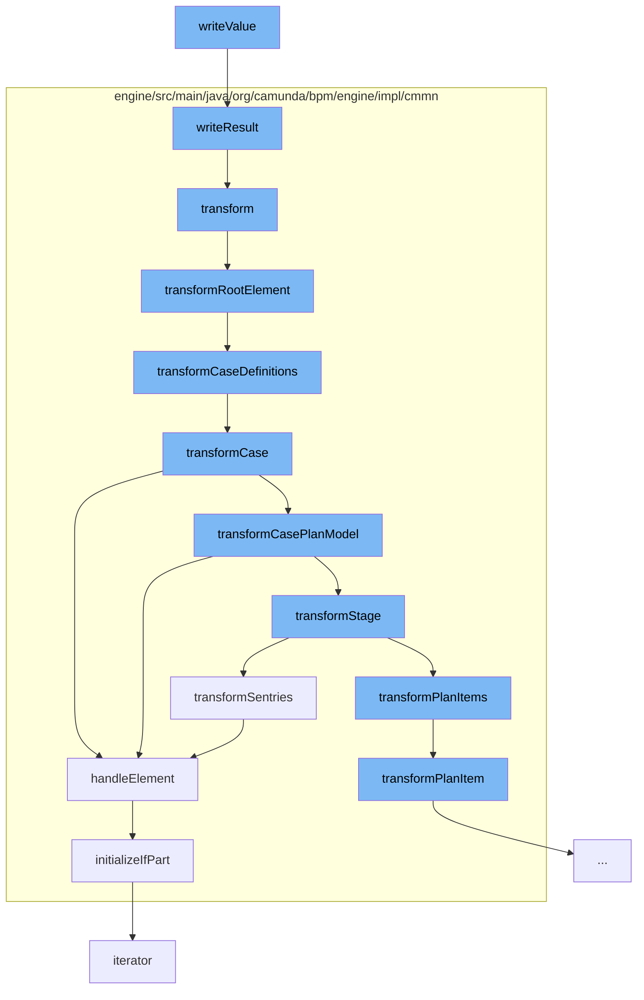

This document will cover the process of XML data transformation in the Camunda BPM platform, which includes:

1. Writing XML data
2. Transforming CMMN model
3. Handling Sentry elements
4. Initializing IfPart conditions



<SwmSnippet path="/clients/java/client/src/main/java/org/camunda/bpm/client/variable/impl/format/xml/DomXmlDataFormat.java" line="149">

---

# Writing XML data

The `writeValue` function starts the process by writing XML data. It takes a `StreamResult` and an `Object` as input, converts the input into a `Node`, and then transforms it into a `DOMSource`. This `DOMSource` is then transformed into the `StreamResult` using a transformer.

```java
  protected void writeResult(StreamResult streamResult, Object input) {
    Node node = (Node) input;
    DOMSource domSource = new DOMSource(node);
    try {
      getTransformer().transform(domSource, streamResult);
    }
    catch (TransformerException e) {
      throw LOG.unableToTransformElement(node, e);
    }
  }
```

---

</SwmSnippet>

<SwmSnippet path="/engine/src/main/java/org/camunda/bpm/engine/impl/cmmn/transformer/CmmnTransform.java" line="98">

---

# Transforming CMMN model

The `transform` function is responsible for transforming the CMMN model. It reads the model from an input stream, sets the model and deployment in the context, and then calls `transformRootElement` to start the transformation process.

```java
  public List<CaseDefinitionEntity> transform() {
    // get name of resource
    String resourceName = resource.getName();

    // create an input stream
    byte[] bytes = resource.getBytes();
    ByteArrayInputStream inputStream = new ByteArrayInputStream(bytes);

    try {
      // read input stream
      model = Cmmn.readModelFromStream(inputStream);

    } catch (CmmnModelException e) {
      throw LOG.transformResourceException(resourceName, e);
    }

    // TODO: use model API to validate (ie.
    // semantic and execution validation) model

    context.setModel(model);
    context.setDeployment(deployment);
```

---

</SwmSnippet>

<SwmSnippet path="/engine/src/main/java/org/camunda/bpm/engine/impl/cmmn/handler/SentryHandler.java" line="55">

---

# Handling Sentry elements

The `handleElement` function handles Sentry elements in the CMMN model. It checks the conditions of the Sentry and if they are valid, it creates a `CmmnSentryDeclaration` and initializes its `IfPart` and `variableOnParts`.

```java
  public CmmnSentryDeclaration handleElement(Sentry element, CmmnHandlerContext context) {

    String id = element.getId();
    Collection<OnPart> onParts = element.getOnParts();
    IfPart ifPart = element.getIfPart();
    List<CamundaVariableOnPart> variableOnParts = queryExtensionElementsByClass(element, CamundaVariableOnPart.class);

    if ((ifPart == null || ifPart.getConditions().isEmpty()) && variableOnParts.isEmpty()) {

      if (onParts == null || onParts.isEmpty()) {
        LOG.ignoredSentryWithMissingCondition(id);
        return null;
      } else {
        boolean atLeastOneOnPartsValid = false;

        for (OnPart onPart : onParts) {
          if (onPart instanceof PlanItemOnPart) {
            PlanItemOnPart planItemOnPart = (PlanItemOnPart) onPart;
            if (planItemOnPart.getSource() != null && planItemOnPart.getStandardEvent() != null) {
              atLeastOneOnPartsValid = true;
              break;
```

---

</SwmSnippet>

<SwmSnippet path="/engine/src/main/java/org/camunda/bpm/engine/impl/cmmn/handler/SentryHandler.java" line="165">

---

# Initializing IfPart conditions

The `initializeIfPart` function is responsible for initializing the `IfPart` of a Sentry. It creates an expression from the condition of the `IfPart` and sets it in a `CmmnIfPartDeclaration`, which is then set in the Sentry declaration.

```java
  protected void initializeIfPart(IfPart ifPart, CmmnSentryDeclaration sentryDeclaration, CmmnHandlerContext context) {
    if (ifPart == null) {
      return;
    }

    Collection<ConditionExpression> conditions = ifPart.getConditions();

    if (conditions.size() > 1) {
      String id = sentryDeclaration.getId();
      LOG.multipleIgnoredConditions(id);
    }

    ExpressionManager expressionManager = context.getExpressionManager();
    ConditionExpression condition = conditions.iterator().next();
    Expression conditionExpression = expressionManager.createExpression(condition.getText());

    CmmnIfPartDeclaration ifPartDeclaration = new CmmnIfPartDeclaration();
    ifPartDeclaration.setCondition(conditionExpression);
    sentryDeclaration.setIfPart(ifPartDeclaration);
  }
```

---

</SwmSnippet>

&nbsp;

*This is an auto-generated document by Swimm AI 🌊 and has not yet been verified by a human*

<SwmMeta version="3.0.0" repo-id="Z2l0aHViJTNBJTNBQ2l0aS1jYW11bmRhJTNBJTNBZ2lsYWRuYXZvdA==" repo-name="Citi-camunda" doc-type="flows"><sup>Powered by [Swimm](/)</sup></SwmMeta>
